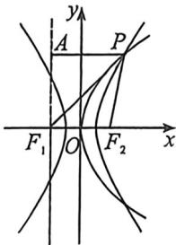

> [!faq]- 例题解析
>
> > [!success]- **【答案】** A
>
> > [!note]- **【解析】**
> > 解析 三一: 根据题意可设 $F_{2}\left(\frac{p}{2},0\right)$ , 双曲线的半焦距为 $c, P(x_{0},y_{0})$ , 则 $p=2c$ , 过 $F_{1}$ 作 $x$ 轴的垂线 $l$ , 过 $P$ 作 $l$ 的垂线, 垂足为 $A$ , 显然直线 $AF_{1}$ 为抛物线的准线, 则 $|PA|=|PF_{2}|$ , 由双曲线的定义及已知条件可知 $\left\{\begin{array}{l}|PF_{1}|-|PF_{2}|=2a \\ |PF_{1}|+|PF_{2}|=6c\end{array}\right.$ , 则 $\left\{\begin{array}{l}|PF_{1}|=3c+a \\ |PF_{2}|=3c-a=|PA|\end{array}\right.$ , 由勾股定理可知 $|AF_{1}|^{2}=y_{0}^{2}=|PF_{1}|^{2}-|PA|^{2}=12ac$ , 易知 $y_{0}^{2}=4cx_{0}$ , 所以 $x_{0}=3a$ , 即 $\frac{x_{0}^{2}}{a^{2}}-\frac{y_{0}^{2}}{b^{2}}=\frac{9a^{2}}{a^{2}}-\frac{12ac}{c^{2}-a^{2}}=1$ , 整理得 $2c^{2}-3ac-2a^{2}=0=(2c+a)(c-2a)$ , 所以 $c=2a$ ,
> >
> > 
> >
> > 法二: 利用焦半径公式, $\left|PF_{2}\right|=ex_{P}-a=\frac{p}{2a}x_{P}-a=x_{P}+\frac{p}{2}$ , $\left|PF_{1}\right|=ex_{P}+a=\frac{p}{2a}x_{P}+a$ , $\left|PF_{1}\right|+\left|PF_{2}\right|=3$ $\left|F_{1}F_{2}\right|\Rightarrow\frac{p}{a}x_{P}=3p\Rightarrow x_{P}=3a$ ,
> >
> > 所以 $\left|PF_{2}\right|=\frac{p}{2a}x_{P}-a=x_{P}+\frac{p}{2}\Rightarrow\frac{3}{2}p=4a+\frac{p}{2}\Rightarrow p=2c=4a$ ，所以c=2a，即离心率为2.
> >
> > 故选 **A**.
