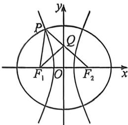

> [!faq]- 例题解析
>
> > [!success]- **【答案】** D
>
> > [!note]- **【解析】**
> > 解析 根据定义， $\left|PF_{1}\right|+\left|PF_{2}\right|=4,\left|F_{1}F_{2}\right|=2,\left|PF_{2}\right|-\left|PF_{1}\right|=2a$ ，所以， $\left|PF_{1}\right|=2-a,\left|PF_{2}\right|=2+a$ ，设 $\angle PF_{1}F_{2}=2\theta$ ，因为 $PF_{2}$ 交 y 轴于点 Q，且 $QF_{1}$ 平分 $\angle PF_{1}F_{2}$ ，所以 $\angle QF_{2}F_{1}=\angle QF_{1}F_{2}=\theta$ ，
> >
> > 
> >
> > 利用倍角三角形定理, 当 A=2B 时, 一定有 $a^{2}=b(b+c)$ , 对应本题, $\left|PF_{2}\right|^{2}=\left|PF_{1}\right|\cdot\left(\left|PF_{1}\right|+\left|F_{1}F_{2}\right|\right)$ , 所以 $(2+a)^{2}=(2-a)(4-a)$ , 解得 $a=\frac{2}{5}$ , 因此, 双曲线的离心率为 $\frac{1}{a}=\frac{5}{2}$ .
> >
> > 故选 **D**.
