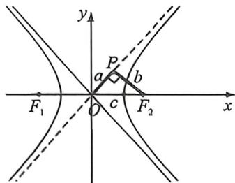
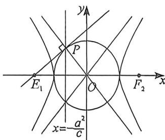
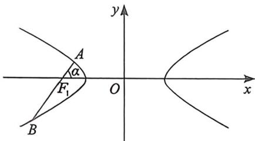
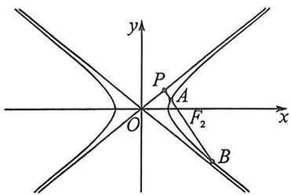
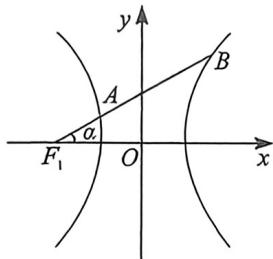
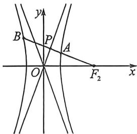
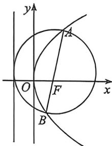
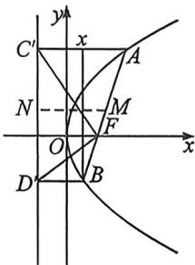
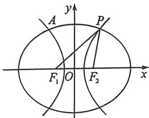

## 考点一_圆锥曲线之间交点

## 一、双曲线+圆

1. 焦点到渐近线距离构造特征三角形

双曲线 $\frac{x^2}{a^2} -\frac{y^2}{b^2} = 1(a > 0,b > 0)$ 的焦点到渐近线的距离为定值 $b$ ，如左图所示，由于渐近线 $OP$ 的斜率为 $\frac{b}{a}$ ，又 $\left|OF_3\right| = c,a^2 +b^2 = c^2$ ，显然 $PF_{2}$ 的长度是定值 $b$

如右图所示, 过双曲线 $\frac{x^2}{a^2} - \frac{y^2}{b^2} = 1 (a > 0, b > 0)$ 的左焦点 $F_1(-c, 0) (c > 0)$ 作圆 $x^2 + y^2 = a^2$ 的切线, 切点为 $P$ , 那么, 点 $P$ 在渐近线 $y = -\frac{b}{a} x$ 上, 也在左准线 $x = -\frac{a^2}{c}$ 上, 即点 $P\left(-\frac{a^2}{c}, \frac{ab}{c}\right)$ .

![[高中/总复习/二轮/2026版高中《MST新思路思维拓展》二轮复习专题/下册/板块1_不等式/考点一_圆锥曲线之间交点/questions/Q00093355.md]]
![[高中/总复习/二轮/2026版高中《MST新思路思维拓展》二轮复习专题/下册/板块1_不等式/考点一_圆锥曲线之间交点/questions/Q00093356.md]]
![[高中/总复习/二轮/2026版高中《MST新思路思维拓展》二轮复习专题/下册/板块1_不等式/考点一_圆锥曲线之间交点/questions/Q00093357.md]]
![[高中/总复习/二轮/2026版高中《MST新思路思维拓展》二轮复习专题/下册/板块1_不等式/考点一_圆锥曲线之间交点/questions/Q00093358.md]]
![[高中/总复习/二轮/2026版高中《MST新思路思维拓展》二轮复习专题/下册/板块1_不等式/考点一_圆锥曲线之间交点/questions/Q00093359.md]]

## 3. 隐藏小圆与焦长结合

A、B 是双曲线 $\frac{x^{2}}{a^{2}} - \frac{y^{2}}{b^{2}} = 1$ 左支上两点， $F_{1}$ 是左焦点， $\angle AF_{1}O$ 为 $\alpha, AB$ 过 $F_{1}, c$ 是双曲线半焦距，如左图，则 $\left|AF_{1}\right| = \frac{b^{2}}{a + c\cos\alpha}$ ①； $\left|BF_{1}\right| = \frac{b^{2}}{a - c\cos\alpha}$ ②；

由于 $\cos \alpha = \frac{b}{c}$ ，如右图所示， $|AF_2| = \frac{b^2}{a + c\cos\alpha} = \frac{b^2}{a + b}, |BF_2| = \frac{b^2}{a - c\cos\alpha} = \frac{b^2}{a - b};$

A 是双曲线 $\frac{x^{2}}{a^{2}} - \frac{y^{2}}{b^{2}} = 1$ 左支上一点，B 是双曲线右支上一点， $F_{1}$ 是左焦点， $\angle AF_{1}O$ 为 $\alpha, AB$ 过 $F_{1}, c$ 是双曲线半焦距，如图，由于交两支时，有 $|k| < \frac{b}{a}$ ，平方得： $\tan^{2}\alpha < \frac{b^{2}}{a^{2}}$ ，即 $\cos\alpha > \frac{a}{c}$ ，故 $a - c\cos\alpha < 0$

$|AF_{1}| = \frac{b^{2}}{a + c\cos\alpha}$ ①； $|BF_{1}| = \frac{b^{2}}{c\cos\alpha - a}$ ②；（根据长减短加判断符号）

由于 $\cos \alpha = \frac{b}{c}$ ，如右图所示， $|AF_2| = \frac{b^2}{a + c\cos\alpha} = \frac{b^2}{a + b}$ ， $|BF_2| = \frac{b^2}{c\cos\alpha - a} = \frac{b^2}{b - a}$ .

![[高中/总复习/二轮/2026版高中《MST新思路思维拓展》二轮复习专题/下册/板块1_不等式/考点一_圆锥曲线之间交点/questions/Q00093360.md]]

## 二、抛物线+圆

如图, 抛物线 $E: y^{2} = 2px$ 的焦点为 $F$ , 过 $F$ 的直线与 $E$ 交于 $A, B$ , 过 $A, B$ 分别向准线 $l$ 作垂线, 垂足为 $C, D$ .

①以 AB 为直径的圆与准线 l 相切；

②记 $AB$ 中点为 $M$ , 过 $M$ 作 $MN$ 垂直准线 $l$ 于 $N$ , 则 $MN = \frac{1}{2} AB, AN, BN$ 分别平分 $\angle CAB, \angle DBA$ , $FN \perp AB, \angle CFD = 90^\circ$ ;

证明:①由于 $|AB|=x_{A}+x_{B}+p=|AC|+|BD|=2|MN|$ ，所以 $AN\perp BN$ ，以M为圆心，MN为半径的圆与准线CD相切；

$AC//MN \Rightarrow \angle CAN = \angle ANM$ ② $AM = MN \Rightarrow \angle ANM = \angle MAN$ $\Rightarrow \angle CAN = \angle MAN$ , 易证 $\triangle ACN \cong \triangle AFN(SAS)$ , 所以 $CN = NF = ND, FN \perp AB$ , 所以 $\angle CFD = 90^\circ$ .

![[高中/总复习/二轮/2026版高中《MST新思路思维拓展》二轮复习专题/下册/板块1_不等式/考点一_圆锥曲线之间交点/questions/Q00093361.md]]
![[高中/总复习/二轮/2026版高中《MST新思路思维拓展》二轮复习专题/下册/板块1_不等式/考点一_圆锥曲线之间交点/questions/Q00093362.md]]
![[高中/总复习/二轮/2026版高中《MST新思路思维拓展》二轮复习专题/下册/板块1_不等式/考点一_圆锥曲线之间交点/questions/Q00093363.md]]

## 三、椭圆(或双曲线)+抛物线

双曲线焦半径 设 $P(x_0, y_0)$ 为双曲线上的一点，

①焦点在 $x$ 轴： $P$ 在左支 $\left\{ \begin{array}{l} |PF_1| = -a - ex_0 \\ |PF_2| = a - ex_0 \end{array} \right.$ ， $P$ 在右支 $\left\{ \begin{array}{l} |PF_1| = a + ex_0 \\ |PF_2| = -a + ex_0 \end{array} \right.$ ；
②焦点在 $y$ 轴： $P$ 在下支 $\left\{ \begin{array}{l} |PF_1| = -a - ey_0 \\ |PF_2| = a - ey_0 \end{array} \right.$ ， $P$ 在上支 $\left\{ \begin{array}{l} |PF|_1 = a + ey_0 \\ |PF|_2 = -a + ey_0 \end{array} \right.$ 。

焦半径公式和焦长焦比都是解挖掘圆锥曲线几何性质的常见招数,那么什么时候用焦长焦比,什么时候用焦半径呢?

如今的圆锥曲线体系,方法众多,什么时候选择用什么成为了重中之重,焦长焦比强调共线,强调角度和比值,而焦半径强调和积,不注重共线,强调点的坐标,当然很多时候,尤其在高考题当中,焦长焦比与焦半径是相通的,我们从以下例题中找寻答案.

![[高中/总复习/二轮/2026版高中《MST新思路思维拓展》二轮复习专题/下册/板块1_不等式/考点一_圆锥曲线之间交点/questions/Q00093364.md]]
![[高中/总复习/二轮/2026版高中《MST新思路思维拓展》二轮复习专题/下册/板块1_不等式/考点一_圆锥曲线之间交点/questions/Q00093365.md]]
![[高中/总复习/二轮/2026版高中《MST新思路思维拓展》二轮复习专题/下册/板块1_不等式/考点一_圆锥曲线之间交点/questions/Q00093366.md]]
![[高中/总复习/二轮/2026版高中《MST新思路思维拓展》二轮复习专题/下册/板块1_不等式/考点一_圆锥曲线之间交点/questions/Q00093367.md]]

## 四、椭圆+双曲线共焦点

如图，椭圆 $\frac{x^2}{a_1^2} +\frac{y^2}{b_1^2} = 1$ 和双曲线 $\frac{x^2}{a_2^2} -\frac{y^2}{b_2^2} = 1$ 共焦点，设 $|PF_{1}| > |PF_{2}|$ ，则一定有

$$
① \mid P F _ {1} \mid = a _ {1} + a _ {2}, \mid P F _ {2} \mid = a _ {1} - a _ {2};
$$

证明：因为 $\left\{ \begin{array}{l} |PF_1| + |PF_2| = 2a_1 \\ |PF_1| - |PF_2| = 2a_2 \end{array} \right.$ ，所以 $\left\{ \begin{array}{l} |PF_1| = a_1 + a_2 \\ |PF_2| = a_1 - a_2 \end{array} \right.$ ；

②当 $\angle F_{1}PF_{2} = \alpha$ 时，一定有 $\frac{\sin^2\frac{\alpha}{2}}{e_1^2} +\frac{\cos^2\frac{\alpha}{2}}{e_2^2} = 1.$

$$
S _ {\triangle F _ {1} P F _ {2}} = b _ {1} ^ {2} \cdot \frac {\sin \alpha}{1 + \cos \alpha} = b _ {2} ^ {2} \cdot \frac {\sin \alpha}{1 - \cos \alpha}, \frac {a _ {1} ^ {2} - c ^ {2}}{1 + \cos \alpha} = \frac {c ^ {2} - a _ {2} ^ {2}}{1 - \cos \alpha} \Rightarrow \frac {\frac {1}{e _ {1} ^ {2}} - 1}{2 \cos^ {2} \frac {\alpha}{2}} = \frac {1 - \frac {1}{e _ {2} ^ {2}}}{2 \sin^ {2} \frac {\alpha}{2}} \Rightarrow \frac {\sin^ {2} \frac {\alpha}{2}}{e _ {1} ^ {2}} + \frac {\cos^ {2} \frac {\alpha}{2}}{e _ {2} ^ {2}} = 1.
$$

![[高中/总复习/二轮/2026版高中《MST新思路思维拓展》二轮复习专题/下册/板块1_不等式/考点一_圆锥曲线之间交点/questions/Q00093368.md]]
![[高中/总复习/二轮/2026版高中《MST新思路思维拓展》二轮复习专题/下册/板块1_不等式/考点一_圆锥曲线之间交点/questions/Q00093369.md]]
![[高中/总复习/二轮/2026版高中《MST新思路思维拓展》二轮复习专题/下册/板块1_不等式/考点一_圆锥曲线之间交点/questions/Q00093370.md]]
![[高中/总复习/二轮/2026版高中《MST新思路思维拓展》二轮复习专题/下册/板块1_不等式/考点一_圆锥曲线之间交点/questions/Q00093566.md]]
