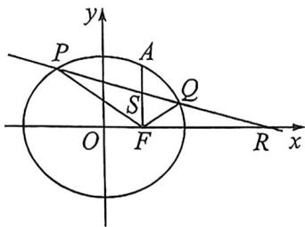

<!-- question-source:start -->
例7 (2025·南京六校联合体8月调研,T18)已知椭圆 $C: \frac{x^2}{a^2} + \frac{y^2}{b^2} = 1 (a > b > 0)$ 过点 $A\left(1, \frac{3}{2}\right)$ , 且 $C$ 的右焦点为 $F(1,0)$ .

(1) 求 $C$ 的方程;

(2)设过点(4,0)的一条直线与 $C$ 交于 $P, Q$ 两点, 且与线段 $AF$ 交于点 $S$ .

(1)求 $\triangle FPQ$ 面积的最大值;

(Ⅱ)证明:S 到直线 FP 和 FQ 的距离相等.
<!-- question-source:end -->

![[高中/总复习/二轮/2026版高中《MST新思路思维拓展》二轮复习专题/下册/板块1_不等式/考点一_弦长面积与向量乘积的计算/questions/answers/Q00093409A1.md]]
