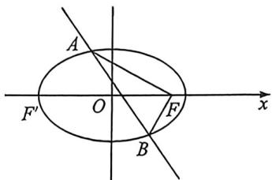

<!-- question-source:start -->
例9 (2026届江浙皖发展共同体高三10月联考·T18)设椭圆 $C: \frac{x^{2}}{a^{2}} + \frac{y^{2}}{b^{2}} = 1 (a > b > 0)$ 的离心率为 $\frac{1}{2}, F$

(1,0)是 C 的右焦点.

(1)求椭圆 C 的标准方程;

(2)已知点 A, B 是 C 上的两点, 且 $\angle AFB = 90^{\circ}$ .

(1)设直线 AB 的斜率为 $-\frac{3}{2}$ ，求直线 AB 的方程；

(Ⅱ)求 $\triangle ABF$ 面积的最大值与最小值.

<!-- question-source:end -->

![[高中/总复习/二轮/2026版高中《MST新思路思维拓展》二轮复习专题/下册/板块1_不等式/考点一_弦长面积与向量乘积的计算/questions/answers/Q00093411A1.md]]
