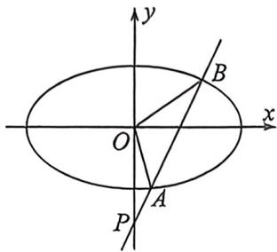

> [!faq]- 例题解析
>
> > [!success]- **【答案】** 详见解析
>
> > [!note]- **【解析】**
> > 解析 (1)由题可得 $2a = 4, e = \frac{c}{a} = \frac{\sqrt{2}}{2}, b = \sqrt{a^2 - c^2} = \sqrt{2}$ , 可得椭圆 $C$ 的方程为 $\frac{x^2}{4} + \frac{y^2}{2} = 1$ .
> >
> > 
> >
> > (2)设直线 $l:y = kx - 2$ ，点 $P(0, - 2),A(x_1,y_1),B(x_2,y_2)$ ，联立 $\left\{ \begin{array}{l}\frac{x^2}{4} +\frac{y^2}{2} = 1\\ y = kx - 2 \end{array} \right.$ 可得： $(2k^{2} + 1)x^{2} - 8kx + 4 = 0,\Delta =$ $32k^{2} - 16 > 0\Rightarrow k > \frac{\sqrt{2}}{2}$ 或 $k <   - \frac{\sqrt{2}}{2},$
> >
> > 由韦达定理 $x_{1} + x_{2} = \frac{8k}{2k^{2} + 1}, x_{1}x_{2} = \frac{4}{2k^{2} + 1}$ ，以 $S_{\triangle OAB} = S_{\triangle OPB} - S_{\triangle OPA} = \frac{1}{2}\times 2|x_2| - \frac{1}{2}\times 2|x_1| = |x_2 - x_1| =$ $\frac{\sqrt{32k^2 - 16}}{2k^2 + 1} = \sqrt{2}$ ，解得： $k^2 = \frac{3}{2}$ ，因此 $|AB| = \sqrt{k^2 + 1}|x_2 - x_1| = \sqrt{5}$ .
