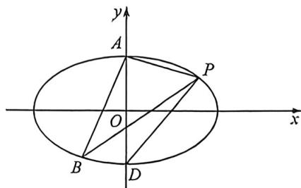

> [!faq]- 例题解析
>
> > [!success]- **【答案】** B
>
> > [!note]- **【解析】**
> > 解析 (1)依题意， $\left\{ \begin{array}{l} \frac{9}{b^2} = 1 \\ \frac{9}{a^2} + \frac{9}{b^2} = 1 \end{array} \right.$ ，解得 $\left\{ \begin{array}{l} a^2 = 12 \\ b^2 = 9 \end{array} \right.$ ，则离心率 $e = \sqrt{1 - \frac{b^2}{a^2}} = \sqrt{1 - \frac{9}{12}} = \frac{1}{2}$ ;
> >
> > 
> >
> > (2)由(1)可知,椭圆C的方程为 $\frac{x^{2}}{12}+\frac{y^{2}}{9}=1$ ,当直线l的斜率不存在时,直线l的方程为x=3,易知此时 $B\left(3,-\frac{3}{2}\right)$ ,点A到直线PB的距离为3,则 $S_{\triangle ABP}=\frac{1}{2}\times3\times3=\frac{9}{2}$ ,与已知矛盾;
> >
> > 法一(直接联立);当直线 l 的斜率存在时,设直线 l 的方程为 $y-\frac{3}{2}=k(x-3)$ , 即 $y=k(x-3)+\frac{3}{2}$ , 设 $P(x_{1},y_{1})$ , B $(x_{2},y_{2})$ , 联立 $\left\{\begin{aligned}y&=k(x-3)+\frac{3}{2}\\ \frac{x^{2}}{12}+\frac{y^{2}}{9}&=1\end{aligned}\right.$ , 消去 y 整理可得, $(4k^{2}+3)x^{2}-(24k^{2}-12k)x+36k^{2}-36k-27=0$ ,
> >
> > 则 $x_{1} + x_{2} = \frac{24k^{2} - 12k}{4k^{2} + 3}, x_{1}x_{2} = \frac{36k^{2} - 36k - 27}{4k^{2} + 3}$ ，由弦长公式可得， $|PB| = \sqrt{1 + k^2} \cdot \sqrt{(x_1 + x_2)^2 - 4x_1x_2} = \sqrt{1 + k^2}$
> >
> > $$
> > \cdot \sqrt {\left(\frac {2 4 k ^ {2} - 1 2 k}{4 k ^ {2} + 3}\right) ^ {2} - 4 \times \frac {3 6 k ^ {2} - 3 6 k - 2 7}{4 k ^ {2} + 3}} = \frac {4 \sqrt {3} \cdot \sqrt {1 + k ^ {2}} \cdot \sqrt {3 k ^ {2} + 9 k + \frac {2 7}{4}}}{4 k ^ {2} + 3},
> > $$
> >
> > 点 $A$ 到直线 $l$ 的距离为 $d = \frac{|3k + \frac{3}{2}|}{\sqrt{1 + k^2}}$ ，则 $\frac{1}{2} \times \frac{4\sqrt{3} \cdot \sqrt{1 + k^2} \cdot \sqrt{3k^2 + 9k + \frac{27}{4}}}{4k^2 + 3} \times \frac{|3k + \frac{3}{2}|}{\sqrt{1 + k^2}} = 9,$
> >
> > 解得 $k = \frac{1}{2}$ 或 $k = \frac{3}{2}$ ，则直线 $l$ 的方程为 $y = \frac{1}{2} x$ 或 $y = \frac{3}{2} x - 3$ .
> >
> > 法二:作 $BD \parallel AP$ 交 y 轴于点 D, 且有 $S_{\triangle ABP} = S_{\triangle ADP} = 9$ , 可得 $D(0, -3)$ , 由于 $k_{AP} = \frac{\frac{3}{2} - 3}{3 - 0} = -\frac{1}{2}$
> >
> > 设直线 $l_{BD}: y = -\frac{1}{2} x - 3$ ，联立椭圆有： $\left\{\begin{aligned}y &= -\frac{1}{2}x - 3 \\ \frac{x^2}{12} + \frac{y^2}{9} &= 1\end{aligned}\right. \Rightarrow 4x^2 + 12x = 0 \Rightarrow \left\{\begin{aligned}x_B &= 0 \\ y_B &= -3\end{aligned}\right.$ 或 $\left\{\begin{aligned}x_B &= -3 \\ y_B &= -\frac{3}{2}\end{aligned}\right.$
> >
> > 所以直线直线 $l$ 为 $y = \frac{1}{2} x$ 或 $y = \frac{3}{2} x - 3$ ，即 $3x - 2y - 6 = 0$ 或 $x - 2y = 0$ .
> >
> > 法三:(三角换元)先求得直线AP的方程为 $x+2y-6=0$ ,点B到直线AP的距离 $d=\frac{12\sqrt{5}}{5}$ ,
> >
> > 设 $B(2\sqrt{3}\cos \theta ,3\sin \theta)$ ，其中 $\theta \in [0,2\pi)$ ，则有 $\frac{|2\sqrt{3}\cos\theta + 6\sin\theta - 6|}{\sqrt{5}} = \frac{12\sqrt{5}}{5},$
> >
> > 联立 $\cos^2\theta +\sin^2\theta = 1$ ，解得 $\left\{ \begin{array}{l}\cos \theta = -\frac{\sqrt{3}}{2}\\ \sin \theta = -\frac{1}{2} \end{array} \right.$ 或 $\left\{ \begin{array}{l}\cos \theta = 0\\ \sin \theta = -1 \end{array} \right.$ ，即 $B(0, - 3)$ 或 $\left(-3, - \frac{3}{2}\right),$
> >
> > 所以直线直线 $l$ 为 $y = \frac{1}{2} x$ 或 $y = \frac{3}{2} x - 3$ ，即 $3x - 2y - 6 = 0$ 或 $x - 2y = 0$ .
> >
> > 注意 考虑数形结合, 几何法最简单, 不考虑数形结合的情况, 参数方程换元是解决弦长面积相对简单的方法, 本题更适合安排在 T18, 在 T16 还是计算量偏大, 没想到法二法三的, 考试很占据时间。
