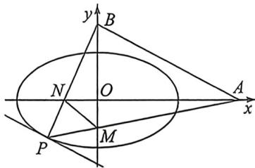

> [!faq]- 例题解析
>
> > [!success]- **【答案】** 详见解析
>
> > [!note]- **【解析】**
> > 解析 (1) 因为已知椭圆 $C: \frac{x^2}{a^2} + \frac{y^2}{b^2} = 1 (a > b > 0)$ 的焦点与短轴两个顶点所成三角形的面积为 $\sqrt{3}$ ,
> >
> > 所以 $\frac{1}{2} \cdot 2b \cdot c = \sqrt{3}$ , 因为离心率为 $\frac{\sqrt{3}}{2}$ , 所以 $\frac{c}{a} = \frac{\sqrt{3}}{2}$ , 又 $a^2 = b^2 + c^2$ , 解得 $a = 2, b = 1$ , 所以椭圆 $C$ 的方程为 $C: \frac{x^2}{4} + y^2 = 1$ .
> >
> > 
> >
> > (2)(Ⅰ)设直线AB的直线方程为： $y=kx+t$ ，代入A(4,0)，B(0,2)，得到 $\left\{\begin{aligned}0&=4k+t\\ 2=t\end{aligned}\right.$ ，解得 $\left\{\begin{aligned}k&=-\frac{1}{2}\\ t&=2\end{aligned}\right.$
> >
> > 所以直线 $AB$ 的直线方程为 $y = -\frac{1}{2} x + 2$ ，点 $P$ 是椭圆上且在第三象限内的一点，所以过 $P$ 作直线 $l // AB$ 且与椭圆相切，切点为 $P$ ，此时 $\triangle PAB$ 的面积取最大值。设过 $P$ 的直线 $l$ 的方程为 $y = -\frac{1}{2} x + m$ ，直线 $l: y = -\frac{1}{2} x + m$ 与椭圆 $C: \frac{x^2}{4} + y^2 = 1$ 联立方程组，消去 $y$ ，得到关于 $x$ 的一元二次方程 $2x^2 - 4mx + 4m^2 - 4 = 0$ ，因为直线 $l$ 与椭圆相切，所以 $\Delta = 0$ ，所以 $16m^2 - 4 \times 2(4m^2 - 4) = 0$ ，所以 $m = \pm \sqrt{2}$ ，因为 $P$ 是第三象限的点，所以 $m = -\sqrt{2}$ ，此时 $2x^2 - 4mx + 4m^2 - 4 = 0$ 的解为 $x = -\sqrt{2}$ ，代入直线 $l$ 方程为 $y = -\frac{1}{2} x + m$ ，得到 $y = -\frac{\sqrt{2}}{2}$ ，所以 $P\left(-\sqrt{2}, -\frac{\sqrt{2}}{2}\right)$ 。
> >
> > (Ⅱ)设 $x_0 = 2\cos \theta, y_0 = \sin \theta, \theta \in \left(\pi, \frac{3\pi}{2}\right), A(4,0)$ , 所以 $k_{PA} = \frac{y_0}{x_0 - 4} = \frac{\sin \theta}{2\cos \theta - 4}$ , 所以直线 $PA$ 的方程为 $y = \frac{\sin \theta}{2\cos \theta - 4}$ ( $x - 4$ ), 令 $x = 0$ , 解得 $y = \frac{-2\sin \theta}{\cos \theta - 2}$ , 所以 $M\left(0, \frac{-2\sin \theta}{\cos \theta - 2}\right). k_{PB} = \frac{\sin \theta - 2}{2\cos \theta}$ , 所以直线 $PB$ 的方程为 $y = \frac{\sin \theta - 2}{2\cos \theta} x + 2$ , 令 $y = 0$ , 解得 $x = \frac{-4\cos \theta}{\sin \theta - 2}$ , 所以 $N\left(\frac{-4\cos \theta}{\sin \theta - 2}, 0\right)$ .
> >
> > 因为 $|AN| = 4 + \frac{4\cos\theta}{\sin\theta - 2}, |BM| = 2 + \frac{2\sin\theta}{\cos\theta - 2}$ ，设四边形ABNM面积为 $S$
> >
> > 所以 $S = \frac{1}{2} \cdot |AN| \cdot |BM| = 8 - \frac{12}{\sin\theta\cos\theta - 2(\sin\theta + \cos\theta) + 4}$ , 设 $\sin\theta + \cos\theta = t, t \in [-\sqrt{2}, -1)$ , $\sin\theta \cdot \cos\theta = \frac{t^2 - 1}{2}$ ,
> >
> > 所以 $S = 8 - \frac{24}{(t - 2)^2 + 3}$ ，当 $t = -\sqrt{2}$ 时， $\sin \theta + \cos \theta = \sqrt{2} \sin \left(\theta + \frac{\pi}{4}\right) = -\sqrt{2}$ ，
> >
> > 即 $\theta = \frac{5\pi}{4}$ 时，也即 $x_0 = -\sqrt{2}, y_0 = -\frac{\sqrt{2}}{2}$ 时，四边形ABNM的面积的最大值为 $\frac{176 + 96\sqrt{2}}{49}$ .
