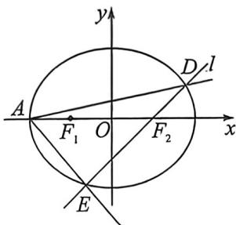

> [!faq]- 例题解析
>
> > [!success]- **【答案】** 详见解析
>
> > [!note]- **【解析】**
> > 解析 (1) 设 $F_{1}(-c,0), F_{2}(c,0), e = \frac{c}{a} = \frac{1}{2}$ , 故 $a = 2c$ , 因为点 $P\left(\frac{2\sqrt{6}}{3}, 1\right)$ 在椭圆 $C$ 上, 则 $\sqrt{\left(\frac{2\sqrt{6}}{3} + c\right)^2 + 1} + \sqrt{\left(\frac{2\sqrt{6}}{3} - c\right)^2 + 1} = 2a = 4c$ , 解得 $c = 1$ , 故 $a = 2, b = \sqrt{3}$ , 椭圆 $C$ 的方程为 $\frac{x^2}{4} + \frac{y^2}{3} = 1$ .
> >
> > (2)法一:由(1)知, $A(-2,0)$ , $F_{2}(1,0)$ ，若直线l的斜率不存在，则x=1，代入椭圆方程可得 $\frac{1}{4}+\frac{y^{2}}{3}=1$ ，故 $|y|=\frac{3}{2}$ ，
> > 此时 $S_{\triangle ADE}=\frac{1}{2}|2y||AF_{2}|=\frac{1}{2}\times3\times3\neq\frac{18\sqrt{2}}{7}$ ，故直线有斜率，直线 l 的斜率为 k，
> >
> > 
> >
> > 则 $l$ 的方程为 $y = k(x - 1)$ ，由 $\left\{ \begin{array}{l} y = k(x - 1) \\ \frac{x^2}{4} + \frac{y^2}{3} = 1 \end{array} \right.$ 消去 $y$ 得， $(4k^2 + 3)x^2 - 8k^2x + 4k^2 - 12 = 0$ ，①
> >
> > 显然 $\Delta > 0$ ，设 $D(x_{1}, y_{1}), E(x_{2}, y_{2})$ ，则 $x_{1} + x_{2} = \frac{8k^{2}}{4k^{2} + 3}, x_{1} \cdot x_{2} = \frac{4k^{2} - 12}{4k^{2} + 3}$ ，
> >
> > $$
> > S _ {\triangle A D E} = \frac {1}{2} \left| y _ {2} - y _ {1} \right| \left| A F _ {2} \right| = \frac {1}{2} \times 3 \left| k (x _ {2} - x _ {1}) \right| = \frac {3}{2} \sqrt {k ^ {2} (x _ {2} - x _ {1}) ^ {2}} = \frac {3}{2} \sqrt {k ^ {2} [ (x _ {2} + x _ {1}) ^ {2} - 4 x _ {2} x _ {1} ]}
> > $$
> >
> > $$
> > = \frac {3}{2} \sqrt {k ^ {2} \left[ \left(\frac {8 k ^ {2}}{4 k ^ {2} + 3}\right) ^ {2} - 4 \frac {4 k ^ {2} - 1 2}{4 k ^ {2} + 3} \right]} = 1 8 \sqrt {\frac {k ^ {4} + k ^ {2}}{(4 k ^ {2} + 3) ^ {2}}} = \frac {1 8 \sqrt {2}}{7},
> > $$
> >
> > 化简可得 $17k^{4} + k^{2} - 18 = 0$ ，即 $(k^2 - 1)(17k^2 + 18) = 0$ ，解得 $k = \pm 1$ ，所以直线的方程为 $y = \pm (x - 1)$ 法二（焦长公式）：设 $\angle DF_{2}x = \alpha, |DE| = \frac{2ab^{2}}{a^{2} - c^{2}\cos^{2}\alpha}$ （请用余弦定理自证）， $\triangle ADE$ 高 $h = (a + c)\sin \alpha$ ，所以 $S = \frac{1}{2} \cdot \frac{2ab^{2}}{a^{2} - c^{2}\cos^{2}\alpha} \cdot (a + c)\sin \alpha = \frac{1}{2} \cdot \frac{12 \cdot 3\sin\alpha}{4 - \cos^{2}\alpha} = \frac{18\sin\alpha}{3 + \sin^{2}\alpha} = \frac{18\sqrt{2}}{7}$ ，解得： $\sin \alpha = \frac{\sqrt{2}}{2}$ ，即 $l: y = \pm (x - 1)$ ；
> >
> > (3)由于椭圆 $C: \frac{x^2}{m^2} + \frac{y^2}{n^2} = 1, (m > n > 0)$ 上一点 $Q(x_0, y_0)$ 的切线方程为 $\frac{x_0x}{m^2} + \frac{y_0y}{n^2} = 1$ .
> >
> > 依题意, 设椭圆上的点 $Q(x_0, y_0)$ , 则过点 $Q(x_0, y_0)$ 的切线方程为 $\frac{x_0x}{4} + \frac{y_0y}{3} = 1$ , 即 $3x_0x + 4y_0y - 12 = 0$ , 原点到切线的距离为 $d^2 = \frac{144}{9x_0^2 + 16y_0^2} = \frac{144}{48 - 3x_0^2}$ 由两点间距离公式可得, $|QF_1| = \sqrt{(x_0 + c)^2 + y_0^2} = \sqrt{(x_0 + 1)^2 + 3(1 - \frac{x_0^2}{4})} = \frac{1}{2}|x_0 + 4|$ , 同理 $|QF_2| = \frac{1}{2}|x_0 - 4|$ , 本题也可以利用焦半径公式 $|QF_1| = a + ex_0, |QF_2| = a - ex_0$ . 代入数据可得: $|QF_1| \cdot |QF_2| = 16 - \frac{1}{4} x_0^2$ ,
> >
> > 则 $|QF_1||QF_2| = \frac{1}{4} |x_0^2 - 16| = \frac{1}{4}(16 - x_0^2)$ ，故 $d^2|QF_1||QF_2| = \frac{144}{48 - 3x_0^2} \times \frac{1}{4}(16 - x_0^2) = 12$ 为定值.
