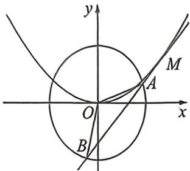

> [!faq]- 例题解析
>
> > [!success]- **【答案】** 详见解析
>
> > [!note]- **【解析】**
> > 解析 1) 由题意可得抛物线 C 的焦点为 $\left(0, \frac{p}{2}\right)$ ，因为椭圆 $E: \frac{y^{8}}{5} + \frac{x^{2}}{4} = 1$ ，则椭圆 E 的一个焦点是 $(0, 1)$ ，所以有
> >
> > $\frac{p}{2} = 1$ ，解得 $p = 2$ .故抛物线 $C$ 的方程为 $x^{2} = 4y.$
> >
> > (2)由(1)知抛物线 C 的方程为 $x^{2}=4y$ . 即 $y=\frac{x^{1}}{4}$ , 得 $y^{2}=\frac{x}{2}$ , 故抛物线 C 在点 $M(x_{0},y_{0})$ 处的切线方程为 $l:y-y_{0}=\frac{x_{0}}{2}(x-x_{0})$ , 即 $l:y=\frac{x_{0}}{2}x-\frac{x_{0}^{2}}{2}+y_{0}$ . 又因为 $x_{0}^{2}=4y_{0}$ , 所以切线方程为 $l:y=\frac{x_{0}}{2}x-y_{0}$ .
> >
> > 
> >
> > (3)设 $A(x_{1},y_{1}),B(x_{2},y_{2})$ ，令 $x_0 = 2t$ ，则 $M(2t,t^2)(t$ 不为0)，由(2)的结论可知，此时切线方程为 $l:y = tx - t^2$ ，联立 $\left\{ \begin{array}{c}y = tx - t^2\\ 4y^{2} + 5x^{2} - 20 = 0 \end{array} \right.$ ，消去 $y$ ，整理得 $(5 + 4t^{2})x^{2} - 8t^{3}x + 4t^{4} - 20 = 0$ ，则 $x_{1} + x_{2} = \frac{8t^{3}}{5 + 4t^{2}},x_{1}x_{2} = \frac{4t^{4} - 20}{5 + 4t^{2}},\Delta = 64t^{6}-$ $4(5 + 4t^2)(4t^4 -20) = 80(-t^4 +4t^2 +5) > 0,$
> >
> > 解得 $t^2 \in (0,5)$ , $|AB| = \sqrt{1 + t^2} \times \sqrt{(x_1 + x_2)^2 - 4x_1x_2} = 4\sqrt{5} \times \sqrt{1 + t^2} \times \sqrt{\frac{-t^4 + 4t^2 + 5}{(4t^2 + 5)^2}}$ , 原点 $O$ 到直线 $AB$ 的距离 $d = \frac{t^2}{\sqrt{1 + t^2}}$ , 所以 $\triangle AOB$ 的面积 $S = \frac{1}{2} |AB| d = 2\sqrt{5} \times \sqrt{\frac{(-t^4 + 4t^2 + 5)t^4}{(4t^2 + 5)^2}}$ .
> >
> > 令 $4t^{2} + 5 = u$ ，则 $5 < u < 25$ ，将 $t^{2} = \frac{u - 5}{4}, t^{4} = \left(\frac{u - 5}{4}\right)^{2}$ 代入 $S$ ，得 $S = 2\sqrt{5} \times \sqrt{\frac{1}{16u^{2}}\left[(u - 5)^{2}u - \frac{(u - 5)^{4}}{16}\right]} = \frac{\sqrt{5}}{2} \times \sqrt{\frac{(u - 5)^{2}}{u} - \frac{1}{16} \cdot \frac{(u - 5)^{4}}{u^{2}}} = \frac{\sqrt{5}}{2} \times \sqrt{u + \frac{25}{u} - 10 - \frac{1}{16}\left(u + \frac{25}{u} - 10\right)^{2}}$ ，令 $m = u + \frac{25}{u}$ ，易知其在区间(5,25)上单调递增，所以 $m \in (10,26)$ ，于是 $S = \frac{\sqrt{5}}{2} \times \sqrt{-\frac{1}{16}(m - 10)^{2} + m - 10} = \frac{\sqrt{5}}{2} \times \sqrt{-\frac{1}{16}m^{2} + \frac{9}{4}m - \frac{65}{4}} = \frac{\sqrt{5}}{8} \times \sqrt{-(m - 18)^{2} + 64}$ ，所以当 $m = 18$ 时， $S_{\text{二}} = \frac{\sqrt{5}}{8} \times 8 = \sqrt{5}$ ，此时， $t^{2} = \frac{\sqrt{14}}{2} + 1 < 5$ 。故△AOB面积的最大值为√5。
