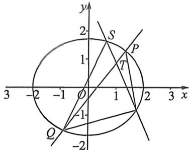

> [!faq]- 例题解析
>
> > [!success]- **【答案】** C
>
> > [!note]- **【解析】**
> > 解析 (1) 由焦距 $2c = 2$ ，即 $c = 1$ ，可知两焦点坐标分别为 $F_{1}(-1,0), F_{2}(1,0)$ ，
> >
> > 则 $2a = \sqrt{[1 - (-1)]^2 + \left(\frac{3}{2} - 0\right)^2} + \sqrt{(1 - 1)^2 + \left(\frac{3}{2} - 0\right)^2} = 4$ ，即 $a = 2, b^2 = a^2 - c^2 = 3$ ，所以 $C$ 的标准方程为 $\frac{x^2}{4} + \frac{y^2}{3} = 1$ .
> >
> > 
> >
> > (2) (1) 由于 $|NP||NQ| = |NS||NT|$ , 故 $P, Q, S, T$ 四点共圆, 令 $ST: y - \frac{\sqrt{3}}{2} = k_1(x - 1), PQ: y - \frac{\sqrt{3}}{2} = k_2(x - 1)$ , 以 $ST, PQ$ 构成的退化二次曲线方程为: $\left(k_1x - y - k_1 + \frac{\sqrt{3}}{2}\right)\left(k_2x - y - k_2 + \frac{\sqrt{3}}{2}\right) = 0$ , 则以 $ST, PQ$ 与椭圆 $\frac{x^2}{4} + \frac{y^2}{3} - 1 = 0$ 构成的圆系方程为: $\frac{x^2}{4} + \frac{y^2}{3} - 1 + \lambda \left(k_1x - y - k_1 + \frac{\sqrt{3}}{2}\right)\left(k_2x - y - k_2 + \frac{\sqrt{3}}{2}\right) = 0, xy$ 系数为 0, 所以 $\lambda (-k_1 - k_2) = 0$ , 所以 $k_1 + k_2 = 0$ . 所以 $l_1, l_2$ 的斜率之和为定值 0.
> >
> > (Ⅱ)设 $PQ$ 的参数方程为 $\left\{ \begin{array}{l}x = 1 + t\cos \alpha \\ y = \frac{\sqrt{3}}{2} +t\sin \alpha \end{array} \right.$ ，代入椭圆方程 $\frac{x^2}{4} +\frac{y^2}{3} = 1$ ，得：
> >
> > $$
> > \frac {1 + 2 t \cos \alpha + t ^ {2} \cos^ {2} \alpha}{4} + \frac {\frac {3}{4} + \sqrt {3} t \sin \alpha + t ^ {2} \sin^ {2} \alpha}{3} = 1, t ^ {2} \left(\frac {\cos^ {2} \alpha}{4} + \frac {\sin^ {2} \alpha}{3}\right) + t \left(\frac {\cos \alpha}{2} + \frac {\sqrt {3}}{3} \sin \alpha\right) - \frac {1}{2} = 0,
> > $$
> >
> > 同理，设 $ST$ 的参数方程为 $\left\{ \begin{array}{l}x = 1 + t\cos (\pi -\alpha)\\ y = \frac{\sqrt{3}}{2} +t\sin (\pi -\alpha) \end{array} \right.$ ，代入椭圆方程 $\frac{x^2}{4} +\frac{y^2}{3} = 1$ ，得：
> >
> > $$
> > t ^ {2} \left(\frac {\cos^ {2} \alpha}{4} + \frac {\sin^ {2} \alpha}{3}\right) + t \left(- \frac {\cos \alpha}{2} + \frac {\sqrt {3}}{3} \sin \alpha\right) - \frac {1}{2} = 0,
> > $$
> >
> > $$
> > S = \frac {1}{2} \left| t _ {1} - t _ {2} \right| \cdot \left| t _ {3} - t _ {4} \right| \sin 2 \alpha
> > $$
> >
> > $$
> > = \sin \alpha \cos \alpha \cdot \frac {\sqrt {\left(\frac {\cos \alpha}{2} + \frac {\sqrt {3}}{3} \sin \alpha\right) ^ {2} + 2 \left(\frac {\cos^ {2} \alpha}{4} + \frac {\sin^ {2} \alpha}{3}\right)} \cdot \sqrt {\left(- \frac {\cos 2 \alpha}{2} + \frac {\sqrt {3}}{3} \sin \alpha\right) ^ {2} + 2 \left(\frac {\cos^ {2} \alpha}{4} + \frac {\sin^ {2} \alpha}{3}\right)}}{\left(\frac {\cos^ {2} \alpha}{4} + \frac {\sin^ {2} \alpha}{3}\right) ^ {2}}
> > $$
> >
> > $$
> > = \frac {\sin \alpha \cos \alpha \sqrt {\left(\frac {3}{4} \cos^ {2} \alpha + \sin^ {2} \alpha\right) - \frac {1}{3} \sin^ {2} \alpha \cos^ {2} \alpha}}{\left(\frac {\cos^ {2} \alpha}{4} + \frac {\sin^ {2} \alpha}{3}\right) ^ {2}} = \frac {\sin \alpha \cos \alpha \sqrt {\frac {9}{1 6} \cos^ {4} \alpha + \sin^ {4} \alpha + \frac {7}{6} \sin^ {2} \alpha \cos^ {2} \alpha}}{\frac {\cos^ {4} \alpha}{1 6} + \frac {\sin^ {4} \alpha}{9} + \frac {\sin^ {2} \alpha \cos^ {2}}{6}} = \frac {\sqrt {\frac {9}{1 6 \tan^ {2} \alpha} + \tan^ {2} \alpha + \frac {7}{6}}}{\frac {1}{1 6 \tan^ {2} \alpha} + \frac {\tan^ {2} \alpha}{9} + \frac {1}{6}},
> > $$
> >
> > 令 $\frac{\tan^2\alpha}{9} +\frac{1}{16\tan^2\alpha} +\frac{1}{6} = t\geqslant \frac{1}{3},S = \frac{\sqrt{9t - \frac{1}{3}}}{t} = \sqrt{\frac{9}{t} - \frac{1}{3t^2}}\leqslant 2\sqrt{6},t = \frac{1}{3}$ 时取等.
> >
> > 所以四边形 PSQT 的面积最大值为 $2\sqrt{6}$ .
