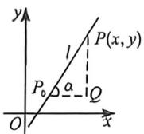
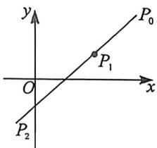
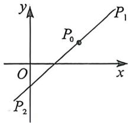

## 考点一_弦长面积与向量乘积的计算

## 一、基础计算保分 T16 类型

![[高中/总复习/二轮/2026版高中《MST新思路思维拓展》二轮复习专题/下册/板块1_不等式/考点一_弦长面积与向量乘积的计算/questions/Q00093403.md]]

## 二、平行弦面积转化的 T18 类型

![[高中/总复习/二轮/2026版高中《MST新思路思维拓展》二轮复习专题/下册/板块1_不等式/考点一_弦长面积与向量乘积的计算/questions/Q00093404.md]]
![[高中/总复习/二轮/2026版高中《MST新思路思维拓展》二轮复习专题/下册/板块1_不等式/考点一_弦长面积与向量乘积的计算/questions/Q00093405.md]]

## 三、单动点三角换元T18类型

知识点: 切线方程三角换元模型

定理一在圆锥曲线方程中，点 $P(x_0, y_0)$ 是曲线上的任意一点，以 $x_0x$ 替换 $x^2$ ，以 $\frac{x_0 + x}{2}$ 替换 $x$ ，以 $y_0y$ 替换 $y^2$ ，以 $\frac{y_0 + y}{2}$ 替换 $y$ ，即可得到点 $P(x_0, y_0)$ 的切线方程. 已知圆锥曲线 $\Gamma: Ax^2 + Cy^2 + 2Dx + 2Ey + F = 0$ ，则点 $P(x_0, y_0)$ 处的切线方程为： $l: Ax_0x + Cy_0y + D(x + x_0) + E(y + y_0) + F = 0$ .

我们尝试来求椭圆 $\frac{x^2}{a^2} +\frac{y^2}{b^2} = 1$ 上一点 $P(x_0,y_0)$ 处的切线方程，令 $\left\{ \begin{array}{l}x_0 = a\cos \theta \\ y_0 = b\sin \theta \end{array} \right.$ ，过点 $P(x_0,y_0)$ 的切线方程为 $y - b\sin \theta = k(x - a\cos \theta)$ ，代入椭圆方程联立得： $(k^{2}a^{2} + b^{2})x^{2} + 2a^{2}k(b\sin \theta -ak\cos \theta)x + a^{2}[(bsin\theta -ak\cos \theta)^{2} - b^{2}] = 0$

$\Delta = 4a^{2}b^{2}[k^{2}a^{2} + b^{2} - (b\sin \theta -ak\cos \theta)^{2}] = 0$ ，所以 $(kas\sin \theta +b\cos \theta)^{2} = 0$ ，所以 $k = -\frac{bc\cos\theta}{a\sin\theta},$

所以 $y - b\sin \theta = -\frac{b\cos\theta}{a\sin\theta} (x - a\cos \theta)$ ，所以 $y \cdot a\sin \theta + x \cdot b\cos \theta = ab$ ，即 $\frac{xx_0}{a^2} + \frac{yy_0}{b^2} = 1.$

(1)椭圆的切线参数方程: $\frac{xx_{0}}{a^{2}}+\frac{yy_{0}}{b^{2}}=1\Leftrightarrow\frac{x\cos\theta}{a}+\frac{y\sin\theta}{b}=1;$

(2)双曲线的切线参数方程: $\frac{xx_{0}}{a^{2}}-\frac{yy_{0}}{b^{2}}=1\Leftrightarrow\frac{x}{a\cos\theta}-\frac{y\tan\theta}{b}=1$

![[高中/总复习/二轮/2026版高中《MST新思路思维拓展》二轮复习专题/下册/板块1_不等式/考点一_弦长面积与向量乘积的计算/questions/Q00093406.md]]
![[高中/总复习/二轮/2026版高中《MST新思路思维拓展》二轮复习专题/下册/板块1_不等式/考点一_弦长面积与向量乘积的计算/questions/Q00093407.md]]
![[高中/总复习/二轮/2026版高中《MST新思路思维拓展》二轮复习专题/下册/板块1_不等式/考点一_弦长面积与向量乘积的计算/questions/Q00093408.md]]

## 四、焦长角度转化与三角换元综合的T18

![[高中/总复习/二轮/2026版高中《MST新思路思维拓展》二轮复习专题/下册/板块1_不等式/考点一_弦长面积与向量乘积的计算/questions/Q00093409.md]]
![[高中/总复习/二轮/2026版高中《MST新思路思维拓展》二轮复习专题/下册/板块1_不等式/考点一_弦长面积与向量乘积的计算/questions/Q00093410.md]]
![[高中/总复习/二轮/2026版高中《MST新思路思维拓展》二轮复习专题/下册/板块1_不等式/考点一_弦长面积与向量乘积的计算/questions/Q00093411.md]]

## 五、直线穿越两条二次曲线构造 T19 型

![[高中/总复习/二轮/2026版高中《MST新思路思维拓展》二轮复习专题/下册/板块1_不等式/考点一_弦长面积与向量乘积的计算/questions/Q00093412.md]]

## 六、四边形对角线面积构造 T19 型

知识点: 直线的参数方程形式与性质

直线: 经过点 $P_{0}(x_{0}, y_{0})$ ，倾斜角为 a 的直线的参数方程是 $\left\{\begin{aligned} x &= x_{0} + t \cos \alpha \\ y &= y_{0} + t \sin \alpha \end{aligned}\right.$ (t 为参数).

注意 1. 在直线的参数方程 $\left\{ \begin{array}{l} x = x_0 + t\cos \alpha \\ y = y_0 + t\sin \alpha \end{array} \right.$ ( $t$ 为参数) 中 $t$ 的几何意义是表示在直线上过定点 $P_0(x_0, y_0)$

与直线上的任一点 $P(x, y)$ 构成的有向线段 $P_0P$ 的模，且在直线上任意两点 $P_1, P_2$ 的距离为 $\left|P_1P_2\right| = \left|t_1 - t_2\right| = \sqrt{(t_1 + t_2)^2 - 4t_1t_2}$ .

2. 若直线与已知二次曲线相交于 $A, B$ 两点时，则将此直线代入二次曲线，得到两根 $t_1$ 和 $t_2$ ，则 $|AB| = |t_1 - t_2|$ .

3. 定点 $P_{0}$ 是线段 AB 的中点可得 $t_{1} + t_{2} = 0$ ; 设线段 AB 中点为 M, 则点 M 对应的参数值 $t_{M} = \frac{t_{1} + t_{2}}{2}$ (由此可求 $|AB|$ 及中点坐标).

这里的参数 $t$ 不一定是正数，关于 $\left|P_{1}P_{2}\right| = \left|t_{1} - t_{2}\right| = \sqrt{(t_1 + t_2)^2 - 4t_1t_2}$ ，如左图所示，当 $P_{0}$ 位于线段 $P_{1}P_{2}$ 外时， $t_1$ 和 $t_2$ 同号（可以都为负），当 $P_{0}$ 位于线段 $P_{1}P_{2}$ 内时， $t_1$ 和 $t_2$ 异号（一正一负）。这也是为什么，老教材区分了参数方程和极坐标，新教材虽然没有参数方程的篇章，但是三角换元这种思想一直存在于任何高考体系里，并且考场中直接用参数方程换元，是不会被扣分的。

![[高中/总复习/二轮/2026版高中《MST新思路思维拓展》二轮复习专题/下册/板块1_不等式/考点一_弦长面积与向量乘积的计算/questions/Q00093413.md]]
