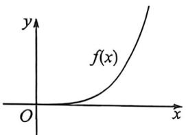
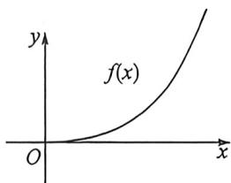
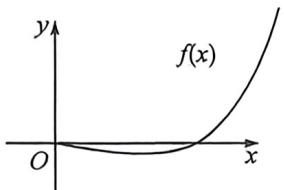
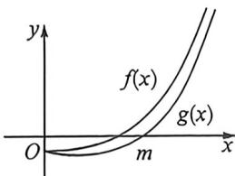

> [!faq]- 例题解析
>
> > [!success]- **【答案】** A
>
> > [!note]- **【解析】**
> > 解析 (1) 由 $f(x) = (x - 1)e^x + ax + 1$ ，得 $f'(x) = xe^x + a$ ，因为 $f(x)$ 有两个极值点，则 $f'(x) = 0$ ，即方程 $-a = xe^x$ 有两个不等实数根，令 $g(x) = xe^x$ ，则 $g'(x) = (x + 1)e^x$ ，知 $x < -1$ 时， $g'(x) < 0$ ， $g(x)$ 单调递减，
> >
> > $x > -1$ 时, $g'(x) > 0$ , $g(x)$ 单调递增, 则 $x = -1$ 时, $g(x)$ 取得极小值 $g(-1) = -\frac{1}{e}$ , 也即为最小值, 且 $x < 0$ 时,$g(x)<0,x\to-\infty$ 时， $g(x)\rightarrow0,x>0$ 时， $g(x)>0,x\rightarrow\infty$ 时， $g(x)\rightarrow+\infty$ ，故 $-\frac{1}{e}<-a<0$ ，即 $0<a<\frac{1}{e}$ 时，方程-a= $xe^{x}$ 有两个实数根，不妨设为 $x_{1},x_{2}(x_{1}<x_{2})$ .
> >
> > 可知 $x < x_{1}$ 时， $f'(x) > 0, x_{1} < x < x_{2}$ 时， $f'(x) < 0, x > x_{2}$ 时， $f'(x) > 0$
> >
> > 即 $x_{1}, x_{2}$ 分别为 $f(x)$ 的极大值和极小值点. 所以 $a$ 的取值范围是 $\left(0, \frac{1}{e}\right)$ .
> >
> > (2)令 $h(x) = (x - 1)e^{x} + ax - 2\sin x + 1$ ，即 $h(x)\geqslant 0,h^{\prime}(x) = xe^{x} + a - 2\cos x,$
> >
> > $h(0)=0,h'(0)=a-2\geqslant0$ ，即 $a\geqslant2,h''(x)=(x+1)e^{x}+2\sin x>0$ ，(分段自证， $\left(0,\frac{\pi}{2}\right),\left(\frac{\pi}{2},+\infty\right)$ )，
> >
> > $a \geqslant 2$ 时, $h'(x) \geqslant h'(0) \geqslant 0$ , 则 $h(x)$ 单调递增, $h(x) \geqslant h(0) = 0$ 恒成立, 则 $a \geqslant 2$ 符合题意.
> >
> > $$
> > a <   2
> > $$
> >
> > $$
> > h ^ {\prime} (0) <   0, h ^ {\prime} (3 - a) = (3 - a) e ^ {(3 - a)} + a - 2 \cos (3 - a) \geqslant 3 - a + a - 2 \cos (2 - a) > 0,
> > $$
> >
> > 存在 $x_0 \in (0, 3 - a)$ , 使得 $h'(x_0) = 0$ , 当 $0 < x < x_0$ 时, $h'(x) < 0$ , 则 $h(x)$ 单调递减, 所以 $h(x) < h(0) = 0$ , 矛盾, 综上所述, $a$ 的取值范围是 $[2, +\infty)$ .
> >
> > 注意 端点效应+矛盾取点成为了含参的恒成立标配,我们做一下总结:
> >
> > 若 $f(x_0) = 0$ ，则当 $x\geqslant x_0$ 时， $f(x)\geqslant 0$ 恒成立，则：
> > - **①**：当 $f'(x_{0}) \geqslant 0$ ，且 $f''(x) > 0, f'(x)$ 单调递增，（或者 $f'(x_{0}) = 0, f''(x_{0}) \geqslant 0$ ，且 $f'''(x) > 0$ ，以此类推），此时符合题意（如图）；
> >
> > 
> >
> > 
> > - **②**：当 $f'(x_0) < 0$ 且 $f''(x) > 0, f'(x)$ 单调递增，如图所示（或者 $f'(x_0) = 0, f''(x_0) < 0$ ，且 $f'''(x) > 0$ ，以此类推），此时不符合题意，需要进行矛盾取点，由于 $f(x_0) = 0$ ，故我们通常对 $f'(x)$ 进行放缩，根据零点放缩的原理，需要找一个比 $f'(x)$ 更小的函数 $g(x)$ ，当 $g(m) = 0$ 时， $f'(m) > 0$ ，所以 $\exists x_1 \in (x_0, m)$ ，使得 $f'(x_1) = 0$ ，此时 $f(x)$ 在 $(x_0, x_1)$ 单调递减， $f(x) \leqslant 0$ 恒成立，与题意不符；
> >
> > 
> >
> > 
