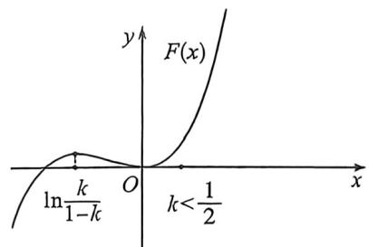
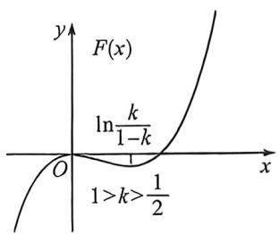
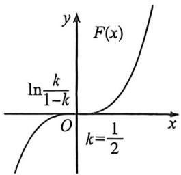

> [!faq]- 例题解析
>
> > [!success]- **【答案】** F
>
> > [!note]- **【解析】**
> > 解析 (1)由题意 $f(1) = e - 1$ ，即切点为 $(1, e - 1), f'(x) = \frac{xe^x - e^x + 1}{x^2}, k = f'(1) = 1$
> >
> > 所以曲线 $y=f(x)$ 在点 $(1,f(1))$ 处的切线方程为 $y=x-1+e-1$ ，即 $y=x+e-2$ ;
> >
> > (2) 证明: 由 $f'(x) = \frac{(x - 1)e^x + 1}{x^2}$ , 设 $g(x) = (x - 1)e^x + 1$ , 则 $g'(x) = xe^x$ ,
> >
> > 所以当 $x < 0$ 时， $g'(x) < 0, g(x)$ 单调递减，当 $x > 0$ 时， $g'(x) > 0, g(x)$ 单调递增，又 $g(0) = 0$
> >
> > 所以对于任意的 $x \neq 0$ 有 $g(x) > 0$ , 即 $f'(x) > 0$ , 因此 $f(x)$ 在 $(- \infty, 0)$ 单调递增, 在 $(0, +\infty)$ 单调递增,
> >
> > 即 $h(x) = e^{x} - x - 1$ ，则 $h^{\prime}(x) = e^{x} - 1$ ，所以 $x < 0$ 时， $h^{\prime}(x) <   0,h(x)$ 单调递减，
> >
> > 所以 $h(x) > h(0) = 0$ ，即 $e^x - 1 > x$ ，即 $\frac{e^x - 1}{x} < 1, x > 0$ 时， $h'(x) > 0, h(x)$ 单调递增，
> >
> > 所以 $h(x) > h(0) = 0$ ，即 $e^x - 1 > x$ ，即 $\frac{e^x - 1}{x} > 1$ ，所以 $f(x)$ 是其定义域上的增函数。
> >
> > (3)由(2)可知， $x < 0$ 时， $f(x) < 1$ ，所以 $a^x < 1$ ，故 $a > 1$ ，令 $a = e^{k}, k > 0$
> >
> > 法一: $F(x) = e^{(1 - k)x} - e^{-kx} - x$ , 由题意 $x < 0$ 时, $F(x) < 0, x > 0$ 时, $F(x) > 0$ , 若 $k \geqslant 1$ , 则当 $x > 1$ 时, $F(x) = e^{(1 - k)x} - e^{-kx} - x \leqslant 1 - e^{-kx} - x < 0$ , 不满足条件, 所以 $0 < k < 1$ , 而 $F'(x) = (1 - k)e^{(1 - k)x} + ke^{-kx} - 1$ ,
> >
> > $F^{\prime \prime}(x) = (1 - k)^{2}e^{(1 - k)x} - k^{2}e^{-kx} = e^{-kx}\big[(1 - k)^{2}e^{x} - k^{2}\big],$ 令 $F^{\prime \prime}(x) = 0$ ，得 $x = 2\ln \frac{k}{1 - k},$
> >
> > $F^{\prime}(x)$ 在 $\left(-\infty, 2\ln \frac{k}{1-k}\right)$ 单调递减，在 $\left(2\ln \frac{k}{1-k}, +\infty\right)$ 单调递增，
> > - **①**：若 $2 \ln \frac{k}{1 - k} < 0$ ，则当 $2 \ln \frac{k}{1 - k} < x < 0$ 时， $F'(x) < F'(0) = 0, F(x)$ 单调递减，此时 $F(x) > F(0) = 0$ ，不满足题意；
> > - **②**：若 $2 \ln \frac{k}{1 - k} > 0$ ，则当 $0 < x < 2 \ln \frac{k}{1 - k}$ 时， $F'(x) < F'(0) = 0, F(x)$ 单调递减，此时 $F(x) < F(0) = 0$ ，不满足题意；
> > - **③**：若 $2 \ln \frac{k}{1 - k} = 0$ ，则当 $x < 0$ 时， $F'(x) > F'(0) = 0, F(x)$ 单调递增，此时 $F(x) < F(0) = 0$ ，且当 $x > 0$ 时， $F'(x) > F'$
> >
> > (0)=0, $F(x)$ 单调递增，此时 $F(x)>F(0)=0$ ，满足题意，所以 $2\ln\frac{k}{1-k}=0$ ，解得 $k=\frac{1}{2}$
> >
> > 综上所述, $a=\sqrt{e}$ .
> >
> > 
> >
> > 
> >
> > 
> >
> > 注意 此题跟例 6 一样,一个是端点效应,一个是极点效应,都需要恒成立与矛盾取点.
