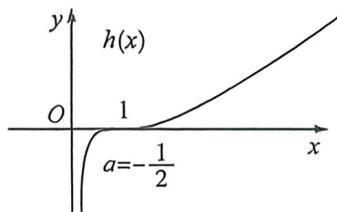
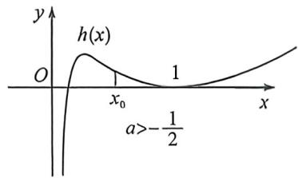
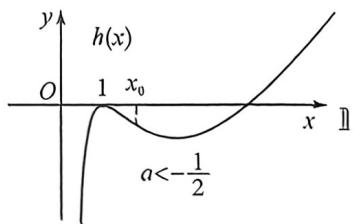

> [!faq]- 例题解析
>
> > [!success]- **【答案】** F
>
> > [!note]- **【解析】**
> > 解析 (1) $f(x)$ 的定义域为 $(0,1)\cup(1,+\infty),f'(x)=\frac{1-\frac{1}{x}-\ln x}{(x-1)^2}$ ，设 $g(x)=1-\frac{1}{x}-\ln x$
> >
> > 则 $g'(x)=\frac{1}{x^2}-\frac{1}{x}=\frac{1-x}{x^2}$ ，当 $x\in(0,1)$ 时， $g'(x)>0,g(x)$ 单调递增；当 $x\in(1,+\infty)$ 时， $g'(x)<0,g(x)$ 单调递减，所以 $g(x)_{\max}<g(1)=0$ ，即 $f'(x)<0$ 在定义域内恒成立，所以 $f(x)$ 在 $(0,1)$ 和 $(1,+\infty)$ 上单调递减，无单调增区间.
> > (2) 当 x>1 时， $f(x)<x^{a}$ 等价于 $x^{a+1}-x^{a}-\ln x>0$ ; 当 0<x<1 时， $f(x)<x^{a}$ 等价于， $x^{a+1}-x^{a}-\ln x<0$ ，
> >
> > 设 $h(x)=x^{a+1}-x^{a}-\ln x, h(1)=0$ ，则 $h'(x)=(a+1)x^{a}-ax^{a-1}-\frac{1}{x}=\frac{(a+1)x^{a+1}-ax^{a}-1}{x}, h'(1)=0$ ，这类型涉及到一边大于零，一边小于零，且原函数和一阶导都在这里等于零，一定是导函数的极点效应，本题需要求出 a 的值，还需要作矛盾取点分析，因为原函数的定义域不含有 x=1，前面例题都是包含有极点这个位置的定义域。设 $\varphi(x)=(a+1)x^{a+1}-ax^{a}-1$ ，则 $\varphi'(x)=(a+1)^{2}x^{a}-a^{2}x^{a-1}=x^{a-1}\left[(a+1)^{2}x-a^{2}\right],\varphi'(1)=(a+1)^{2}-a^{2}=2a+1,\varphi'(x)=0$ 时， $x_{0}=\frac{a^{2}}{(a+1)^{2}}$ ;
> > - **①**：当 $x_0 = \frac{a^2}{(a + 1)^2} = 1$ 时， $a = -\frac{1}{2}, \varphi(x) = \frac{1}{2} x^+ + \frac{1}{2} x^{-+} - 1 \geqslant 0$ ，所以 $h(x)$ 在 $(0, +\infty)$ 单调递增，由于 $h(0) = 0$ ，故当 $0 < x < 1$ 时， $f(x) < x^a$ ，当 $x > 1$ 时， $f(x) < x^a$ ，如左图，符合题意；
> >
> > 排除 $a \geqslant 1$ ，取 $x = \frac{1}{e}, h\left(\frac{1}{e}\right) = \left(\frac{1}{e}\right)^{a + 1} - \left(\frac{1}{e}\right)^a + 1 > 0$ ，矛盾；当 $a \leqslant -1, h(e) = e^{a + 1} - e^a + 1 < 0$ ，矛盾；
> >
> > 
> >
> > 
> >
> > 
> > - **②**：当 $x_0 = \frac{a^2}{(a + 1)^2} < 1$ ，即 $1 > a > -\frac{1}{2}$ 时，当 $x \in (x_0, 1)$ 时， $\varphi'(x) = x^{a - 1}[(a + 1)^2 x - a^2] < 0, \varphi(x)$ 单调递减，所以 $\varphi(x) < \varphi(1) = 0$ ，所以 $h'(x) < 0, h(x)$ 单调递减，所以 $h(x) > h(0) = 0$ ，如中图， $x_0$ 为 $h(x)$ 的拐点，矛盾；
> > - **③**：当 $x_0 = \frac{a^2}{(a + 1)^2} > 1$ ，即 $-1 < a < -\frac{1}{2}$ 时，当 $x \in (1, x_0)$ 时， $\varphi'(x) = x^{a-1}[(a + 1)^2 x - a^2] < 0, \varphi(x)$ 单调递减，所以 $\varphi(x) < \varphi(1) = 0$ ，所以 $h'(x) < 0, h(x)$ 单调递减，所以 $h(x) < h(0) = 0$ ，如右图， $x_0$ 为 $h(x)$ 的拐点，矛盾；所以 $a = -\frac{1}{2}$ ，故实数 $a$ 的取值集合为 $\{-\frac{1}{2}\}$ .
