## 考点一_显点效应

## 一、恒成立之端点效应

当 $x \in [m, +\infty)$ 或者 $x \in (-\infty, m]$ 时，且 $f(m) = 0$ ，我们仅以 $x \in [m, +\infty)$ 举例说明，若 $f'(m) \neq 0$ ，且 $f''(x) > 0$ 恒成立，

①当 $f'(m) \geqslant 0$ 时， $f(x) \geqslant f(m)$ 恒成立；

②当 $f^{\prime}(m) < 0$ 时， $\exists x_0 \in (m, +\infty)$ 使得 $f^{\prime}(x_0) = 0, f(x)$ 在 $(m, +\infty)$ 存在极小值点，则 $f(x) \geqslant 0$ 不成立.

举例说明: 若 $f(x)=e^{x}-ax-1 \geqslant 0$ 对 $x \in [0, +\infty)$ 恒成立, 求 a 的取值范围.

我们发现 $f(0) = 0$ ，故对 $x \in [0, +\infty), f(x) \geqslant f(0)$ 恒成立即可，由于 $f'(x) = e^x - a, f'(x)$ 单调递增， $f'(0) \geqslant 0$ 即可以满足 $f(x) \geqslant f(0)$ ，故 $a \leqslant 1$ ；

接下来同时介绍一下极点效应:此题转变为若 $f(x)=e^{x}-ax-1\geqslant0$ 对 $x\in R$ 恒成立,求a的取值范围.在这里我们同样知道 $f(0)=0$ ,同样需要 $f(x)\geqslant f(0)$ ,由于 $f'(x)=e^{x}-a,f'(x)$ 单调递增;

①当 $f'(0)=0$ ，即 a=1 时， $f(x)\geqslant f(0)$ 恒成立；

②当 $f^{\prime}(0) > 0$ 时, 此时当 $a \leqslant 0$ 时, $f^{\prime}(x) > 0$ , $f(x)$ 单调递增, $x < 0$ 时, $f(x) < 0$ , 矛盾; $0 < a < 1$ , 当 $x \in (\ln a, 0)$ 时 $f^{\prime}(x) > 0$ , 由于 $f(x)$ 单调递增, 所以 $f(x) < f(0) = 0$ , 矛盾;

③当 $f'(0) < 0$ 时，此时 $a > 1$ ，当 $x \in (0, \ln a)$ 时 $f'(x) < 0$ ，由于 $f(x)$ 单调递减，所以 $f(x) < f(0) = 0$ 矛盾.

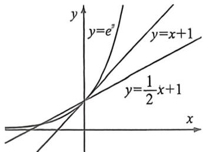

我们看图, $e^{x}\geqslant x+1$ 恒成立,此时他们的交点就是切点, $e^{x}\geqslant\frac{1}{2}x+1$ 对 $x\in[0,+\infty)$ 恒成立,但是对于R上不成立,这就是端点效应和极点效应的区别(后文还会再次论述极点效应)

![[高中/总复习/二轮/2026版高中《MST新思路思维拓展》二轮复习专题/下册/板块1_不等式/考点一_显点效应/questions/Q00093496.md]]
![[高中/总复习/二轮/2026版高中《MST新思路思维拓展》二轮复习专题/下册/板块1_不等式/考点一_显点效应/questions/Q00093497.md]]
![[高中/总复习/二轮/2026版高中《MST新思路思维拓展》二轮复习专题/下册/板块1_不等式/考点一_显点效应/questions/Q00093498.md]]

## 二、泰勒展开推导的端点效应与极点效应

根据 $e^x \geqslant \frac{1}{6} x^3 + \frac{1}{2} x^2 + x + 1, e^{-x} \geqslant -\frac{1}{6} x^3 + \frac{1}{2} x^2 - x + 1$ ，两式相加即得 $h(x) = e^x + e^{-x} - 2 - x^2 \geqslant 0$ ，当 $x = 0$ 时取“=”， $x \in \mathbb{R}$ 时恒成立；由此我们能得出一个新的总结归纳，如下：

$$
e ^ {x} \geqslant 1 + x + \frac {1}{2} x ^ {2} + \frac {1}{6} x ^ {3} + \frac {1}{2 4} x ^ {4} + \frac {1}{1 2 0} x ^ {5} ①; e ^ {- x} \geqslant 1 - x + \frac {1}{2} x ^ {2} - \frac {1}{6} x ^ {3} + \frac {1}{2 4} x ^ {4} - \frac {1}{1 2 0} x ^ {5} ②
$$

①+②得： $e^{x}+e^{-x}\geqslant2+x^{2}+\frac{1}{12}x^{4}$ ，我们综合总结归纳可得： $\frac{e^{x}+e^{-x}}{2}\geqslant1+\frac{1}{2!}x^{2}+\frac{1}{4!}x^{4}+\cdots$ ，由于 $\cosh x$

$= \frac{e^{2} + e^{-x}}{2}$ ，我们称之为双曲余弦函数，那么它的泰勒展开式我们也随即推导（如下图）

同理,我们可以得到双曲正弦函数,当 $x \geqslant 0$ , 记 $\sinh x = \frac{e^{x} - e^{-x}}{2} \geqslant x + \frac{x^{3}}{6} + \frac{x^{5}}{5!} + \cdots$ ,

令 $e^{x}=t$ ，则会有 $\frac{t}{2}-\frac{1}{2t}\geqslant\ln t+\frac{1}{6}(\ln t)^{3}+\cdots$ ，最经典的代表就是飘带函数 $\frac{1}{2}\left(t-\frac{1}{t}\right)\geqslant\ln t(t\geqslant1)$ ，同理，我们也可以推出 $t-\frac{1}{t}<2\ln t+\frac{(\ln t)^{3}}{3}(0<t<1)$

另外,由于双曲余弦函数是偶函数,双曲正弦函数是奇函数,

易知当 $x \leqslant 0$ 时, $\sinh x = \frac{e^x - e^{-x}}{2} \leqslant x + \frac{x^3}{6} + \frac{x^5}{5!} + \cdots$ (如右图), 而 $\cosh x = \frac{e^x + e^{-x}}{2} \geqslant 1 + \frac{1}{2!} x^2 + \frac{1}{4!} x^4 + \cdots$ 依然成立.

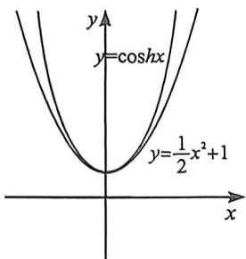

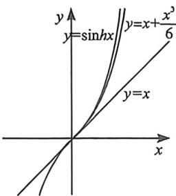

我们再来分析一下对数的泰勒展开 $\ln(1+x)=x-\frac{x^{2}}{2}+\frac{x^{3}}{3}+\cdots+(-1)^{n-1}\frac{x^{n}}{n}+o(x^{n})$ ，我们能得到 $\ln(1-x)=-x-\frac{x^{2}}{2}-\frac{x^{3}}{3}-\frac{x^{4}}{4}-\frac{x^{5}}{5}\cdots$ ，即 $\left\{\begin{aligned}\ln(1+x)>x-\frac{x^{2}}{2}(x>0)\\ \ln(1-x)<-x-\frac{x^{2}}{2}(x>0)\end{aligned}\right.$ ，两式相减得： $\ln\frac{1+x}{1-x}>2x(x>0)$ ，令 $\frac{1+x}{1-x}=t(t>1)$ ，则有 $x=\frac{t-1}{t+1}$ ，故 $\ln t>\frac{2(t-1)}{t+1}(t>1)$ ，同理也能证明 $\ln t<\frac{2(t-1)}{t+1}(0<t<1)$ ，这就是我们

经常用来放缩估值的帕德逼近 $R_{1,1}(x)$ ，我们可以进行泰勒加强，即 $\left\{\begin{aligned}\ln(1+x)>x-\frac{x^{2}}{2}+\frac{x^{3}}{3}-\frac{x^{4}}{4}(x>0)\\ \ln(1-x)<-x-\frac{x^{2}}{2}-\frac{x^{3}}{3}-\frac{x^{4}}{4}(x>0)\end{aligned}\right.$ ，两式

相减得： $\ln\frac{1+x}{1-x}>2x+\frac{2x^{3}}{3}(x>0)$ ，令 $\frac{1+x}{1-x}=t(t>1)$ ，则有 $x=\frac{t-1}{t+1}$ ，故 $\ln t>\frac{2(t-1)}{t+1}+\frac{2(t-1)^{3}}{3(t+1)^{3}}(t>1)$ ，同理也能证明 $\ln t<\frac{2(t-1)}{t+1}+\frac{2(t-1)^{3}}{3(t+1)^{3}}(0<t<1)$ 。

![[高中/总复习/二轮/2026版高中《MST新思路思维拓展》二轮复习专题/下册/板块1_不等式/考点一_显点效应/questions/Q00093571.md]]
![[高中/总复习/二轮/2026版高中《MST新思路思维拓展》二轮复习专题/下册/板块1_不等式/考点一_显点效应/questions/Q00093500.md]]
![[高中/总复习/二轮/2026版高中《MST新思路思维拓展》二轮复习专题/下册/板块1_不等式/考点一_显点效应/questions/Q00093501.md]]
![[高中/总复习/二轮/2026版高中《MST新思路思维拓展》二轮复习专题/下册/板块1_不等式/考点一_显点效应/questions/Q00093502.md]]

## 三、端点效应失效

端点效应失效,其实就是端点是零点,但不是极值点,在整个函数的定义域内会存在极值点比端点值更小(大),判断这中问题的主要依据.

例如: $f(x) = e^{x} - x^{2} - ax - 1 \geqslant 0$ 对 $x \geqslant 0$ 恒成立, 由于 $e^{x}$ 在 $x = 0$ 处的泰勒展开为 $\frac{1}{2} x^{2} + x + 1$ , 与本题当中的二次项系数不等, 故 $x = 0$ 是函数的端点, 零点, 却不是极值点,

因为 $f(0) = 0, f'(x) = e^x - 2x - a, f''(x) = e^x - 2$ ，所以 $f'(x)$ 在 $(0, \ln 2)$ 递减， $(\ln 2, +\infty)$ 递增.

$f'(x)$ 的最小值为 $f'(x)_{\min}=f'(\ln2)=2-2\ln2-a$ ，此时 $f'(x)$ 的图象可能出现多种情况：

(1)当如图1所示时, $f'(x)\geqslant0,f(x)$ 在 $[0,+\infty)$ 单调递增。显然符合题意

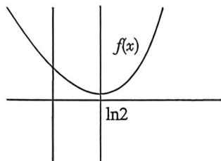
图1

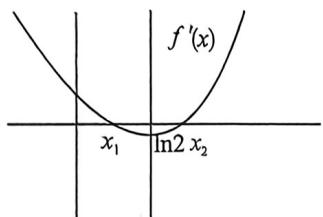
图2

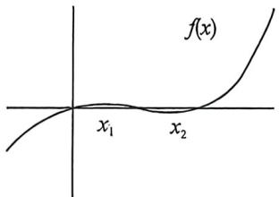
图3

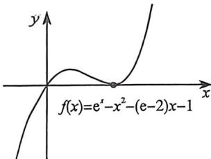
图4

(2)当如图2所示时, $f'(x)=0$ 的两个根为 $x_{1},x_{2}$ . 所以 $f(x)$ 在 $(0,x_{1})$ 递增, $(x_{1},x_{2})$ 递减, $(x_{2},+\infty)$ 递增, $f(x)$ 的正负取决于 $f(x)$ 的极小值。如图3时, $f(x_{2})<0$ , 不符合题意, 只有当 $f(x)$ 的图像如图4所示时才满足条件.

$x_{2}$ 满足的条件为 $f(x_{2}) = 0$ 且 $f^{\prime}(x_{2}) = 0$ ；即 $\left\{ \begin{array}{l} f(x_{2}) = e^{x_{2}} - x_{2}^{2} - ax_{2} - 1 = 0 \\ f^{\prime}(x_{2}) = e^{x_{2}} - 2x_{2} - a = 0 \end{array} \right.$ ，

整理得 $x_{2}^{2} + (a - 2)x_{2} + 1 - a = 0$ ，解得 $x_{2} = 1$ 或 $x_{2} = 1 - a$ ，因为 $f(x)_{\min} = f'(\ln 2)$ ，所以另一个极值点应该大于 $\ln 2$ ，所以另一个极值点为1.因为 $f(0) = 0$ ，所以只需 $f(1) = e - 2 - a\geqslant 0$ 即可.

因此 a 的范围为 $a \leqslant e - 2$ .

我们利用参变分离速解, $F(x)=\frac{e^{x}-x^{2}-1}{x}\geqslant a$ ,不难发现 $F(x)$ 由两部分组成,即 $g(x)=\frac{e^{x}}{x}$ 和 $h(x)=-\left(x+\frac{1}{x}\right)$ ,显然两函数都会在x=1处取得极值,即导函数必定形成导中切, $F'(x)=\frac{(x-1)(e^{x}-x-1)}{x^{2}}$ ,切线为 $e^{x}\geqslant x+1$ .此时 $F(1)=e-2\geqslant a$ 时,如左图, $f(x)=e^{x}-x^{2}-ax-1\geqslant0$ 恒成立,当a>e-2时,如图3,f(1)<0,矛盾.参变分离最大的优点就是不需要矛盾区间找点.

例 S (2020·全国Ⅰ卷压轴)已知函数 $f(x)=e^{x}+ax^{2}-x$ .

(1) 当 a=1 时, 讨论 $f(x)$ 的单调性;

(2) 当 $x \geqslant 0$ 时, $f(x) \geqslant \frac{1}{2} x^3 + 1$ , 求 $a$ 的取值范围.

(2)分析:令 $g(x)=e^{x}-\frac{1}{2}x^{3}+ax^{2}-x-1,g'(x)=e^{x}-\frac{3}{2}x^{2}+2ax-1,g''(x)=e^{x}-3x+2a$ ,则, $g''(x)=e^{x}-3$ 当 $x\in(0,\ln 3)$ 时, $g''(x)$ 为减函数, $x\in(\ln 3,+\infty)$ 时 $g''(x)$ 为增函数,所以 $g''(x)$ 的最小值为 $3-3\ln 3+2a$ ,因为 $g''(x)$ 含参,所以 $g'(x)$ 可能含有零点,端点效应失效.
所以,本题用 $x=0$ 失败的原因就是函数在其他地方还有一个极值点,在这种情况下,端点效应失效,我们可以进一步完善极值点也可以分参求解.
法一(极值点探路):设 $g(x)$ 的零点为 $x_{0}$ .由 $\left\{\begin{aligned}&g(x_{0})=e^{x}-\frac{1}{2}x_{0}^{3}+ax_{0}^{2}-x_{0}-1=0,\\&g'(x_{0})=e^{x}-\frac{3}{2}x_{0}^{2}+2ax_{0}-1=0,\end{aligned}\right.$ 可得, $(2a-x_{0}+1)x_{0}(x_{0}-2)=0$ ,解得 $x_{0}=0$ 或 $x_{0}=2$ .令 $f(0)\geqslant0,f(2)\geqslant0\Rightarrow a\geqslant\frac{7-e^{2}}{4}$ ,当 $a\geqslant\frac{7-e^{2}}{4}$ 时, $f(x)=e^{x}+ax^{2}-x\geqslant e^{x}+\frac{7-e^{2}}{4}\cdot x^{2}-x$ .只需证明 $e^{x}+\frac{7-e^{2}}{4}x^{2}-x\geqslant\frac{1}{2}x^{3}+1(x\geqslant0)$ ①式成立.
①式 $\Leftrightarrow\frac{(e^{2}-7)x^{2}+4x+2x^{3}+4}{e^{x}}\leqslant4$ ,令 $h(x)=\frac{(e^{2}-7)x^{2}+4x+2x^{3}+4}{e^{x}}(x\geqslant0)$ , $h'(x)=\frac{(13-e^{2})x^{2}+2(e^{2}-9)x-2x^{3}}{e^{x}}=\frac{-x[2x^{2}-(13-e^{2})x-2(e^{2}-9)]}{e^{x}}=-x(x-2)[2x+(e^{2}-9)]$ ,所以当 $x\in\left[0,\frac{9-e^{2}}{2}\right]$ 时, $H(x)<0,h(x)$ 单调递减;当 $x\in\left(\frac{9-e^{2}}{2},2\right),h'(x)>0,h(x)$ 单调递增;当 $x\in(2,+\infty),h'(x)<0,h(x)$ 单调递减.从而 $[h(x)]_{\max}=\max(h(0),h(2))=4$ ,即 $h(x)\leqslant4$ ,①式成立.所以当 $a\geqslant\frac{7-e^{2}}{4}$ 时, $f(x)\geqslant\frac{1}{2}x^{3}+1$ 恒成立.综上 $a\geqslant\frac{7-e^{2}}{4}$ .
法二(参变分离构造导中切):由 $f(x)\geqslant\frac{1}{2}x^{3}+1$ 得, $e^{x}-\frac{1}{2}x^{3}+ax^{2}-x-1\geqslant0$ ,其中 $x\geqslant0$ ,
当 $x=0$ 时,显然成立,符合题意;当 $x>0$ 时,分离参数 $a$ 得, $a\geqslant-\frac{e^{x}-\frac{1}{2}x^{3}-x-1}{x^{2}}=h(x)$ , $h'(x)=\frac{(2-x)e^{x}+\left(\frac{1}{2}x^{3}-x-2\right)}{x^{3}}=\frac{(2-x)e^{x}+\left(\frac{1}{2}x^{3}-x^{2}\right)+(x^{2}-x-2)}{x^{3}}=\frac{(2-x)e^{x}+\frac{1}{2}x^{2}(x-2)+(x-2)(x+1)}{x^{3}}=\frac{(2-x)\left(e^{x}-\frac{1}{2}x^{2}-x-1\right)}{x^{3}}$ ,设 $m(x)=e^{x}-\frac{1}{2}x^{2}-x-1,m'(x)=e^{x}-x-1,m''(x)=e^{x}-1$ ,由 $x>0$ ,可得 $m''(x)>0$ 恒成立,可得 $m'(x)$ 在 $(0,+\infty)$ 单调递增,所以 $m'(x)>m'(0)=0$ ,即 $m'(x)>0$ 恒成立,即 $m(x)$ 在 $(0,+\infty)$ 递增,所以 $m(x)>m(0)=0$ ,再令 $h'(x)=0$ ,可得 $x=2$ ,当 $0<x<2$ 时, $h'(x)>0,h(x)$ 在 $(0,2)$ 递增; $x>2$ 时, $h'(x)<0,h(x)$ 在 $(2,+\infty)$ 递减,所以 $h(x)_{\max}=h(2)=\frac{7-e^{2}}{4}$ ,所以 $a\geqslant\frac{7-e^{2}}{4}$ ,综上可得 $a$ 的取值范围是 $\left[\frac{7-e^{2}}{4},+\infty\right)$ .

## 四、极点效应

极值点和零点在同一个 $x=x_{0}$ 处取得, 就是极点效应, 定义域区间为开区间时, 我们可以理解为开区间的最值一定出现在极值点处, 通常探路探出 $x_{0}$ , 再证明.

$f(x) \geqslant 0$ 在区间 $x \in D$ 恒成立, 其实就是找到 $x_0 \in D$ , 使得 $f(x)_{\min} = f(x_0) \geqslant 0$ 恒成立, 这个 $x_0$ 是可以提前进行预判和假设的, 提前找到这个 $x_0$ , 将解答题转化为证明题, 叫做极值点探路法, 解答题中一定需要进行充分性证明.

![[高中/总复习/二轮/2026版高中《MST新思路思维拓展》二轮复习专题/下册/板块1_不等式/考点一_显点效应/questions/Q00093503.md]]
![[高中/总复习/二轮/2026版高中《MST新思路思维拓展》二轮复习专题/下册/板块1_不等式/考点一_显点效应/questions/Q00093504.md]]
![[高中/总复习/二轮/2026版高中《MST新思路思维拓展》二轮复习专题/下册/板块1_不等式/考点一_显点效应/questions/Q00093505.md]]
![[高中/总复习/二轮/2026版高中《MST新思路思维拓展》二轮复习专题/下册/板块1_不等式/考点一_显点效应/questions/Q00093506.md]]

## 五、导函数极点效应

根据泰勒展开, $e^{x}=1+x+\frac{x^{2}}{2!}+\cdots+\frac{x^{n}}{n!}+o(x^{n})$ ，泰勒展开到奇数阶的时候，是恒成立，比如 $e^{x}\geqslant x+1,e^{x}\geqslant\frac{x^{3}}{6}+\frac{x^{2}}{2}+x+1$ ，当泰勒展开到偶次阶的时候，就是半成立，即切点两边一边大，一边小，我们仅以泰勒展开二阶为例，构造函数 $f(x)=e^{x}-\frac{x^{2}}{2}-x-1$ ，如图所示，

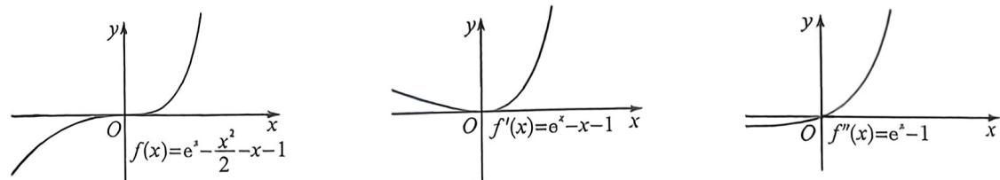

构造 $f'(x)=e^{x}-x-1$ ，易知 $f'(x)_{\min}=f'(0)=0$ ，所以 x=0 是 $f'(x)$ 极小值，原因来自 $f''(0)=0$ ，也是最小值，这就是极点效应，通过作图和分析得知，x=0 不是 $f(x)$ 极值点，整个函数是单调递增的， $\left\{\begin{aligned}e^{x}&\leqslant\frac{x^{2}}{2}+x+1(x\leqslant0)\\ e^{x}&\geqslant\frac{x^{2}}{2}+x+1(x\geqslant0)\end{aligned}\right.$ ，可以理解为一个函数导函数在 $x=x_{0}$ 处满足极点效应时，一定有 $\left\{\begin{aligned}f''(x_{0})&=0\\ f(x) &\text{单调}\end{aligned}\right.$

所以一个超越函数,比如指数对数这类,我们可以利用导函数极点效应来构造其二次切线,具体操作如下,当 $y_{0}=f(x_{0})$ , 构造此处的二次切线可以构造 $h(x)=f(x)-m(x-x_{0})^{2}-y_{0}$ , 当且仅当 $\left\{\begin{aligned}h'(x_{0})&=0\\ h''(x_{0})&=0\end{aligned}\right.$ , 且 $x_{0}$ 是 $h''(x)$ 穿越零点 (不符合 $h''(x)$ 的极点效应), 即构造此处的二次切线, 原函数也是一个纯单调函数, 利用这个原理就有了几个重要的导数不等式, 比如飘带和帕德.

![[高中/总复习/二轮/2026版高中《MST新思路思维拓展》二轮复习专题/下册/板块1_不等式/考点一_显点效应/questions/Q00093507.md]]

## 六、极点效应失效分析

我们参考函数 $f(x) = e^{x} - ex - a(x - 1)^{2} \geqslant 0$ ，这里 $f(1) = 0, f'(1) = 0$ ，按道理说，产生极点效应与参数 $a$ 无关，所以 $x = 1$ 是函数的零点，也是函数的极值点，但是当 $f''(1) = 0$ 时，即 $a = \frac{e}{2}$ 时， $f'(x) \geqslant f'(1) = 0$ ，所以 $f(x)$ 单调递增，此时极点效应失效。

如图,如果要探路 $f(x)=e^{x}-ex-a(x-1)^{2}\geqslant0$ 对 $x\geqslant0$ 恒成立,无论如何函数均满足 $\left\{\begin{aligned}f(1)&=0\\ f'(1)&=0\end{aligned}\right.$ ,但是我们看这三个图,虽然x=1是 $f(x)$ 的极值,但未必是极小值,也就未必成为最小值,当a=1是临界条件.此时满足 $\left\{\begin{aligned}f(0)\geqslant0\\ f_{(x)}&=f(1)\geqslant0\end{aligned}\right.$ ,对此,我们在介绍端点效应失效时也提到了这个.

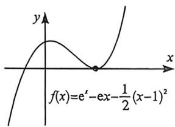

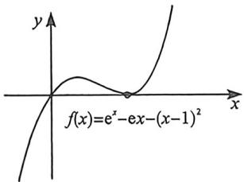

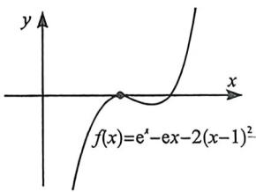

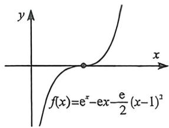

当 $f''(1) = e - 2a = 0$ 时, $a = \frac{e}{2}$ , 此时 $f'(x) \geqslant 0$ 恒成立, $f(x)$ 单调递增, 这也是我们在后续一些极值点偏移中经常要去构造的单调函数类型, 也是极点效应的失效类型, 也属于导函数极点效应的原型.

关于导函数极点效应失效, 就是当 $F''(0) = 0$ 时, $F''(0) = 0$ , $F'(0) = 0$ , 此时会产生二阶导的极点效应, 如图, 所以 $F''(0) = 0$ 并不能保证 $F'(x)$ 产生极点效应, 一定要符合 $F''(0) \neq 0$ , 这样 $F''(0) = 0$ 才是一个穿越零点. 所以, 探路一定要多求一次导, 而这些就是泰勒展开多项式给到的启发.

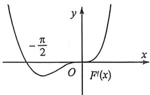

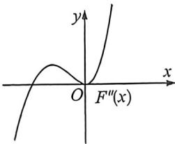

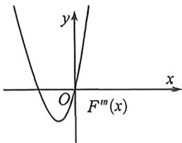

例(2025·河南安阳·一模T18)已知函数 $f(x)=\frac{x+1}{e^{x}}$

(1)若当 x > -1 时， $f(x) \geqslant 1 - ax^{2}$ ，求实数 a 的取值范围；

$\text{假设} a > 0$ ，否则由开口方向，不可能恒成立，设 $g(x) = \frac{x + 1}{e^x} - 1 + ax^2, g'(x) = \frac{-x}{e^x} + 2ax,$

$g(0)=0, g'(0)=0$ , 故极点效应失效, 如下图:

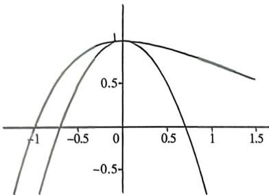

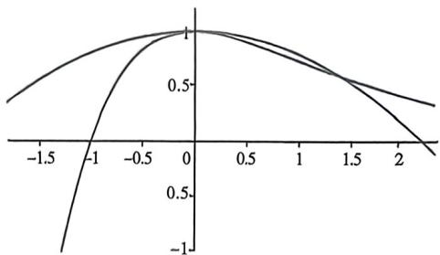

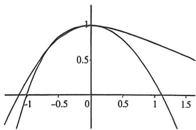

分析:由 $g(x)=\frac{x+1}{e^{x}}-1+ax^{2}$ 在0的邻域内故此时需满足 $g''(0)\geqslant0$ ，否则如左图，不满足题意，

除此之外,还需要保证 $g(-1)=-1+a\geqslant0$ ,否则如中图.

故 $g''(x) = \frac{x - 1}{e^x} + 2a, g''(0) = 2a - 1 \geqslant 0, a \geqslant \frac{1}{2}, g(-1) = -1 + a \geqslant 0 \Rightarrow a \geqslant 1$ ，当然，写到这一步其实我们也发现了，如果数感足够强，直接选择端点探路即可。下证，当 $a \geqslant 1, x \geqslant -1, g(x) = \frac{x + 1}{e^x} - 1 + ax^2 \geqslant \frac{x + 1}{e^x} - 1 + x^2 = (x + 1)(x - 1 + e^{-x}) = (x + 1)(-(-x) - 1 + e^{-x})$ ，显然成立，得证！综上 $a \geqslant 1$ .

![[高中/总复习/二轮/2026版高中《MST新思路思维拓展》二轮复习专题/下册/板块1_不等式/考点一_显点效应/questions/Q00093508.md]]
![[高中/总复习/二轮/2026版高中《MST新思路思维拓展》二轮复习专题/下册/板块1_不等式/考点一_显点效应/questions/Q00093509.md]]
