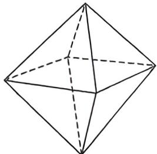

<!-- question-source:start -->
例 8 (2025·广东月念)如图为一个正八面体,用事件 A 表示“从正八面体的所有顶点中任取 4 个点,这 4 个点恰好共面”,若事件 B 满足, $P(\overline{A}B)=P(\overline{A}\overline{B})+3P(\overline{B}),P(A+B)=\frac{9}{10}$ ,则 $P(B|\overline{A})=$ \_\_\_\_.

<!-- question-source:end -->

![[高中/总复习/二轮/2026版高中《MST新思路思维拓展》二轮复习专题/下册/板块1_不等式/考点一_条件概率与贝叶斯公式/questions/answers/Q00093461A1.md]]
