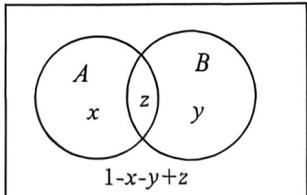

> [!faq]- 例题解析
>
> > [!success]- **【答案】** BCD
>
> > [!note]- **【解析】**
> > 解析 法一: 对 A 选项, 由 $P(A|B) + P(B|A) = 1$ , 又 $P(A|B) = \frac{P(AB)}{P(B)}, P(B|A) = \frac{P(AB)}{P(A)}$ , 所以 $\frac{P(AB)}{P(B)} + \frac{P(AB)}{P(A)} = 1$ , 即 $P(AB)\left(\frac{1}{P(B)} + \frac{1}{P(A)}\right) = 1$ , 所以 $P(AB) = \frac{P(A)P(B)}{P(A) + P(B)}$ , 又 $A, B$ 是一个随机试验中的两个事件, 所以 $P(A) + P(B) \leqslant 1$ , 所以 $P(AB) = \frac{P(A)P(B)}{P(A) + P(B)} \geqslant P(A)P(B)$ , 所以事件 $A, B$ 不一定相互独立, 所以 A 选项错误; 对 B 选项, 因为 $P(A \cup B) = P(A) + P(B) - P(AB) = \frac{3}{4}$ , 若 $P(AB) = \frac{1}{8}$ , 则 $P(A) + P(B) = \frac{3}{4} + \frac{1}{8} = \frac{7}{8}$ , 又由 A 选项分析可知 $P(AB) = \frac{P(A)P(B)}{P(A) + P(B)} = \frac{1}{8}$ , 所以 $P(A)P(B) = \frac{1}{8}[P(A) + P(B)] = \frac{1}{8} \times \frac{7}{8} = \frac{7}{64}$ , 所以 $|P(A) + P(B)| = \sqrt{[P(A) + P(B)]^2 - 4P(A)P(B)} = \sqrt{\left(\frac{7}{8}\right)^2 - 4 \times \frac{7}{64}} = \frac{\sqrt{21}}{8}$ , 所以 B 选项正确; 对 C 选项, 因为 $P(\overline{A}\overline{B}) = P(\overline{A \cup B}) = 1 - P(A \cup B) = 1 - [P(A) + P(B) - P(AB)] = P(AB) + 1 - [P(A) + P(B)]$ , 又 $A, B$ 是一个随机试验中的两个事件, 所以 $P(A) + P(B) \leqslant 1$ , 所以 $1 - [P(A) + P(B)] \geqslant 0$ , 所以 $P(\overline{A}\overline{B}) = P(AB) + 1 - [P(A) + P(B)] \geqslant P(AB)$ , 所以 C 选项正确; 对 D 选项, 若 $P(A|\overline{B}) = P(\overline{A}|B)$ , 则因为 $P(A|\overline{B}) = P(\overline{A}|B)$ , 所以 $\frac{P(\overline{A}\overline{B})}{P(\overline{B})} = \frac{P(\overline{A}\overline{B})}{P(B)}$ ,
> >
> > 所以 $\frac{P(A) - P(AB)}{1 - P(B)} = \frac{P(B) - P(AB)}{P(B)}$ ，又 $P(A) + P(B) - P(AB) = \frac{3}{4}$ ，所以 $\frac{\frac{3}{4} - P(B)}{1 - P(B)} = \frac{\frac{3}{4} - P(A)}{P(B)}$ ①，又 $P(AB) = \frac{P(A)P(B)}{P(A) + P(B)} = P(A) + P(B) - \frac{3}{4}$ ②，联立 ① ② 解得 $P(A) = P(B) = \frac{1}{2}$ ，所以 D 选项正确，法二:如图,设 $P(A)=x,P(B)=y,P(AB)=x$ , 故 $P(\overline{A}\overline{B})=1-x-y+x$ , 由于 $P(A|B)+P(B|A)=1$ , 则 $\frac{z}{x}+\frac{z}{y}=1$ , 所以 $\frac{1}{x}+\frac{1}{y}=\frac{1}{x}$ ①, $P(A\cup B)=x+y-x=\frac{3}{4}$ , 所以 $x+y=\frac{3}{4}+z$ ②, 由①②得: $(x+y)\left(\frac{1}{x}+\frac{1}{y}\right)\geqslant4$ , 即 $\left(\frac{3}{4}+z\right)\cdot\frac{1}{x}\geqslant4$ , 所以 $z\leqslant\frac{1}{4}, P(AB)\leqslant P(\overline{A}\overline{B})=\frac{1}{4}$ , 所以 C 正确;
> >
> > 
> >
> > 对于 A, 若事件 A, B 相互独立, 则需要满足 $xy = z$ , $\frac{1}{x} + \frac{1}{y} = \frac{x + y}{xy} = \frac{\frac{3}{4} + z}{z} = \frac{1}{z}$ , 所以 $z = \frac{1}{4}$ 时成立, 但不是恒成立, A 错误;
> >
> > 对于 B, $z=\frac{1}{8}$ ，则 $\frac{1}{x}+\frac{1}{y}=8, x+y=\frac{7}{8}$ ，所以 $xy=\frac{7}{64}, |x-y|^{2}=\sqrt{(x+y)^{2}-4xy}=\sqrt{\left(\frac{7}{8}\right)^{2}-4\times\frac{7}{64}}=\frac{\sqrt{21}}{8}$ ，B 正确；
> >
> > 对于 $D, P(A|\bar{B}) = P(\bar{A}|B)$ ，则 $\frac{P(\bar{A}\bar{B})}{P(\bar{B})} = \frac{P(\bar{A}B)}{P(B)}$ ，若 $P(A) = P(B)$ ，则 $P(\bar{A}\bar{B}) = P(\bar{A}B)$ ，即一定满足
> >
> > $P(B) = P(\overline{B}) = \frac{1}{2}$ , 则 $\left\{ \begin{array}{l} x = \frac{1}{2} \\ y = \frac{1}{2}, \text{且 } z \text{ 取到最大值, 故仅有唯一解, 则 } D \text{ 正确;} \\ z = \frac{1}{4} \end{array} \right.$
> >
> > 注意: $P(\overline{A}B)=P(\overline{A}B)\Leftrightarrow P(A)=P(B)$ 这个恒等式经常作为一些高端局使用的.
> >
> > 对于D,也可以直接列式子 $\frac{x-z}{\frac{1}{4}+x-z}=\frac{y-z}{y}$ ，结合①②，若x=y，则 $\left\{\begin{aligned}x&=\frac{1}{2}\\ y&=\frac{1}{2}\\ z&=\frac{1}{4}\end{aligned}\right.$ ，由于 $z\leqslant\frac{1}{4}$ ，此三元二次方程的z取到最
> >
> > 大值时,一定是唯一解,故 D 正确;
> >
> > 故选 **BCD**.
