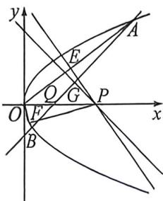

<!-- question-source:start -->
例53 (2026 届浙江 Z20 十名校联盟联考·T18) 已知抛物线 $C: y^{2} = 2px (p > 0)$ 过点 $Q(2,0)$ 的直线 $l$ 交 $C$ 于 $A, B$ 两点， $O$ 为坐标原点，当 $l$ 与 $x$ 轴垂直时， $|AB| = 4\sqrt{2}$ .

(1)求抛物线 C 的解析式；

(2) 若 $\cos \angle AOB = -\frac{\sqrt{13}}{13}$ , 过 $x$ 轴上一点 $P$ 作直线 $OA, OB, AB$ 的垂线, 垂足分别为 $E, F, G$ , 且满足 $E, F, G$ 三点共线.

(1) 求直线 l 的方程;

(Ⅱ)求 P 点的坐标,

<!-- question-source:end -->

![[高中/总复习/二轮/2026版高中《MST新思路思维拓展》二轮复习专题/下册/板块1_不等式/考点七_新增平面几何定理/questions/answers/Q00093453A1.md]]
