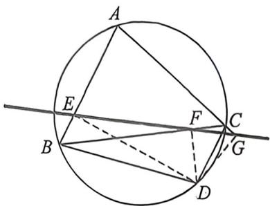

## 考点七_新增平面几何定理

知识点:西摩松定理与逆定理

西摩松线定理(Simson'stheorem)是平面几何中的核心定理

定理内容:对于任意三角形 ABC 及其外接圆上的点 D(D 不与三角形顶点重合),从 D 向三边或其延长线作垂线,所得三个垂足必然共线,这条直线称为点 P 关于三角形 ABC 的西摩松线。

定理证明：

由题意可知, $BDFE$ 四点共圆, 则 $\angle EFB = \angle EDB$ , 同理, 由 $DFCG$ 四点共圆可知, $\angle CFG = \angle CDG$ , 由 $ABCD$ 四点共圆, 则 $\angle ABD = \angle DCG$ , 所以 $\angle EDB = \angle CDG$ , 所以 $\angle EFB = \angle CFG$ .

逆定理: 若一点 P 在三角形三边所在直线上的垂足共线, 则 P 必位于该三角形的外接圆上。

逆定理证明反推即可

西摩松线定理在几何学中衍生出多个扩展定理,深化了其应用范围:

①斯坦纳定理: 点 D 的西摩松线必通过三角形垂心 H 与 P 连线的中点, 且该中点位于九点圆上。

②安宁定理:对于圆周上任意四点A、B、C、D,以其中三点(如A、B、C)构造三角形,第四点D关于该三角形的西摩松线,与其他类似构造的西摩松线(如A关于△BCD的西摩松线)必定交于同一点(称为“安宁点”)。

③朗古来定理:在圆周上取四点 A、B、C、D,任选三点构造三角形,并在圆周上另取一点 P 作其西摩松线,再从 P 向这些西摩松线引垂线,所得垂足共线。

④与九点圆相关联:若外接圆上两点 P、Q 的西摩松线互相垂直,则其交点必位于三角形 ABC 的九点圆上。

![[高中/总复习/二轮/2026版高中《MST新思路思维拓展》二轮复习专题/下册/板块1_不等式/考点七_新增平面几何定理/questions/Q00093453.md]]
