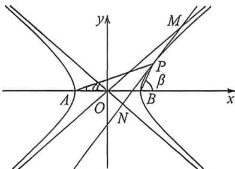

<!-- question-source:start -->
例31 (石家庄一中2026届高三摸底·T10)已知双曲线 $C: \frac{x^2}{a^2} - \frac{y^2}{b^2} = 1 (a > 0, b > 0)$ 的左，右焦点分别为 $F_1$ ， $F_2$ ，左、右顶点分别为 $A, B, P(x_0, y_0)$ 为双曲线 $C$ 在第一象限上的点，设 $PA, PB$ 的斜率分别为 $k_1$ ， $k_2$ ，且 $k_1 \cdot k_2 = \frac{3}{4}$ . 过点 $P$ 作双曲线 $C$ 的切线与双曲线的渐近线交于 $M, N$ 两点，则（）A. $\frac{|PA|}{|PB|}$ 的值随着 $x_0$ 的增大而减小 B. 双曲线 $C$ 的离心率为 $\frac{\sqrt{7}}{2}$ C. $k_1 + k_2 \leqslant \sqrt{3}$ D. $|PM| = |PN|$

<!-- question-source:end -->

![[高中/总复习/二轮/2026版高中《MST新思路思维拓展》二轮复习专题/下册/板块1_不等式/考点三_双曲线渐近线的退化二次曲线属性/questions/answers/Q00093384A1.md]]
