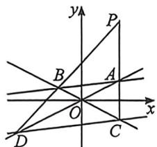
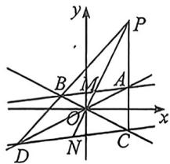

<!-- question-source:start -->
例33 (2025·浙江期中)已知双曲线 $C: \frac{x^2}{a^2} - \frac{y^2}{b^2} = 1 (a > 0, b > 0)$ , 斜率为 $\frac{1}{8}$ 的直线与曲线 $C$ 的两条渐近线分别交于 $A, B$ 两点, 点 $P$ 的坐标为 $(1, 2)$ , 直线 $AP, BP$ 分别与渐近线交于 $C, D$ , 若直线 $CD$ 的斜率也为 $\frac{1}{8}$ , 则双曲线的离心率为 \_\_\_\_.

<!-- question-source:end -->

![[高中/总复习/二轮/2026版高中《MST新思路思维拓展》二轮复习专题/下册/板块1_不等式/考点三_双曲线渐近线的退化二次曲线属性/questions/answers/Q00093386A1.md]]
