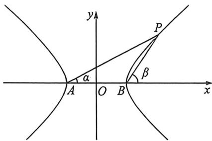

> [!faq]- 例题解析
>
> > [!success]- **【答案】** ABD
>
> > [!note]- **【解析】**
> > 解析 对于 A, 双曲线 $\frac{x^{2}}{a^{7}} - \frac{y^{2}}{b^{2}} = 1 (a > 0, b > 0)$ ，令 $\angle PAB = \alpha, \angle PBx = \beta$ ，在 $\triangle PAB$ 中，由正弦定理可知 $\frac{|PA|}{|PB|} = \frac{\sin(\pi - \beta)}{\sin\alpha} = \frac{\sin\beta}{\sin\alpha}$ ，显然 $\beta, \alpha$ 均为锐角且随着 $x_{0}$ 的增大分别减小与增大，即 $\sin\beta, \sin\alpha$ 随着 $x_{0}$ 的增大分别减小与增大且均为正数，所以 $\frac{|PA|}{|PB|}$ 的值随着 $x_{0}$ 的增大而减小，故 A 正确；
> >
> > 对于B，由第三定义得 $k_{1}k_{2} = \frac{b^{2}}{a^{2}} = \frac{3}{4}$ 所以 $\frac{b}{a} = \frac{\sqrt{3}}{2}, e = \frac{\sqrt{7}}{2}$ ，故B正确；
> >
> > 对于 C, 显然 $k_{1}, k_{2} > 0$ 且 $k_{1} \neq k_{2}$ , 所以 $k_{1} + k_{2} > 2\sqrt{k_{1}k_{2}} = \sqrt{3}$ , 故 C 错误;
> >
> > 对于D,可设双曲线 $C: \frac{x^2}{4k} - \frac{y^2}{3k} = 1 (k > 0)$ , 在点 $P$ 处的切线方程为 $\frac{x_0x}{4k} - \frac{y_0y}{3k} = 1$ , 渐近线方程为 $\frac{x^2}{4k} - \frac{y^2}{3k} = 0$ , 联立
> >
> > $\left\{ \begin{array}{l} \frac{x^2}{4k} - \frac{y^2}{3k} = 0 \\ \frac{x_0x}{4k} - \frac{y_0y}{3k} = 1 \end{array} \right.$ 所以 $(4y_0^2 - 3x_0^2)x^2 + 24kx_0x - 48k^2 = 0$ ，易知 $\frac{x_0^2}{4} - \frac{y_0^2}{3} = k$ ，则 $x_M + x_N = \frac{-24kx_0}{4y_0^2 - 3x_0^2} = \frac{-24kx_0}{-12k} = 2x_0$ ，所以
> >
> > 点 P 为线段 MN 的中点，即 $\left|PM\right|=\left|PN\right|$ ，故 D 正确；故选：ABD.
> >
> > 关于 $\left|\frac{PA}{PB}\right|$ ，在定性分析也涉及定量计算，令 $\angle PAB=\alpha,\angle PBA=\beta$ ，利用三角换元 $P\left(\frac{a}{\cos\theta},b\tan\theta\right)$ ， $k_{PA}=\frac{b\tan\theta}{\frac{a}{\cos\theta}+a}=\frac{b}{a}\tan\frac{\theta}{2}=\frac{b}{a}t=\tan\alpha,k_{PB}=\frac{b\tan\theta}{\frac{a}{\cos\theta}-a}=\frac{b}{a\tan\frac{\theta}{2}}=\frac{b}{at}=\tan\beta,$ 所以 $\left|\frac{AP}{BP}\right|=\frac{\frac{y_{P}}{\sin\alpha}}{\frac{y_{P}}{\sin\beta}}=\frac{\sin\beta}{\sin\alpha}$
> >
> > 
> >
> > 如图，所以利用直角三角形性质： $\sin \alpha = \frac{bt}{\sqrt{a^2 + b^2t^2}},\sin \beta = \frac{b}{\sqrt{a^2t^2 + b^2}}$ ，所以 $\left|\frac{AP}{BP}\right| = \frac{\sqrt{a^2 + b^2t^2}}{t\sqrt{a^2t^2 + b^2}}.$
