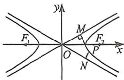
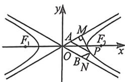
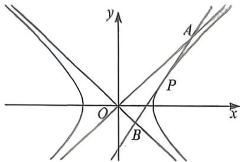
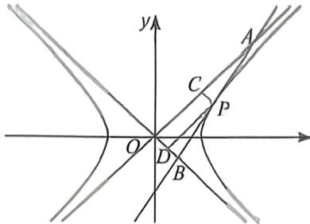
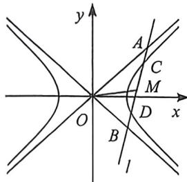

## 考点三_双曲线渐近线的退化二次曲线属性

## 一、渐近线隐藏的面积和向量积定值

①双曲线 $C: \frac{x^2}{a^2} - \frac{y^2}{b^2} = 1$ 上的任意点 $P$ 到双曲线 $C$ 的两条渐近线的距离的乘积是一个常数 $\frac{a^2b^2}{c^2}$ (左图);

证明: 设 $P(x_{1}, y_{1})$ 是双曲线上任意一点, 该双曲线的两条渐近线方程分别是 bx - ay = 0 和 bx + ay = 0, 点 $P(x_{1}, y_{1})$ 到两条渐近线的距离分别是 $\frac{|bx_{1} - ay_{1}|}{\sqrt{a^{2} + b^{2}}}$ , $\frac{|bx_{1} + ay_{1}|}{\sqrt{a^{2} + b^{2}}}$ 乘积 $\frac{|bx_{1} + ay_{1}|}{\sqrt{a^{2} + b^{2}}}$ 。 $\frac{|bx_{1} - ay_{1}|}{\sqrt{a^{2} + b^{2}}} = \frac{b^{2}x_{1}^{2} - a^{2}y_{1}^{2}}{c^{2}} = \frac{a^{2}b^{2}}{c^{2}}$

②过双曲线 $C_{1}\frac{x^{2}}{a^{2}} -\frac{y^{2}}{b^{2}} = 1$ 上的任意点 $P$ 作双曲线 $C$ 的两条渐近线的平行线，分别交渐近线于 $A,B$ 两点，则 $\vert PA\vert \vert PB\vert$ 是一个常数 $\frac{c^2}{4},S_{\text{四边形}AOBP} = \frac{ab}{2},\overrightarrow{OA}\cdot \overrightarrow{OB} = \frac{a^2 - b^2}{4}$ （右图）；

证明:如右图,过点P作 $PM\perp l_{1}$ 于点M, $PN\perp l_{2}$ 于点N, $\angle MAP=\angle NBP=\angle AOB=2\alpha$ ,其中 $\tan\alpha=\frac{b}{a}$ ,则 $\sin2\alpha=2\sin\alpha\cos\alpha=\frac{2ab}{c^{2}}$ , $|PA||PB|=\frac{|PM||PN|}{\sin^{2}2\alpha}=\frac{a^{2}b^{2}}{c^{2}}\cdot\frac{c^{4}}{4a^{2}b^{2}}=\frac{c^{2}}{4}$ ;

$$
S _ {\text {四边形} A O B P} = \frac {| P M | | P N |}{\sin 2 \alpha} = \frac {a ^ {2} b ^ {2}}{c ^ {2}} \frac {c ^ {2}}{2 a b} = \frac {a b}{2}; \overrightarrow {O A} \cdot \overrightarrow {O B} = | O A | | O B | \cos 2 \alpha = | P A | | P B | (2 \times \frac {a ^ {2}}{c ^ {2}} - 1) = \frac {a ^ {2} - b ^ {2}}{4}
$$

![[高中/总复习/二轮/2026版高中《MST新思路思维拓展》二轮复习专题/下册/板块1_不等式/考点三_双曲线渐近线的退化二次曲线属性/questions/Q00093383.md]]

## 二、渐近切线三角形面积与向量积问题

定理: 过双曲线 $\frac{x^{2}}{a^{2}} - \frac{y^{2}}{b^{2}} = 1 (a > 0, b > 0)$ 上一点 $P(x_{0}, y_{0})$ ，作双曲线的切线交两渐近线于 $A(x_{1}, y_{1})$ 。

$B(x_{\perp},y_{\perp})$ 两点，则称 $\triangle AOB$ 为双曲线的切线渐近三角形，双曲线的切线渐近三角形有如下性质1

(1) 点 $P$ 处的切线方程为 $\frac{x_0x}{a^2} - \frac{y_0y}{b^2} = 1$ , 即 $k_{OP} \cdot k_{AU} = \frac{b^2}{a^2} = a^2 - 1$ .

(2) 点 P 是线段 AB 的中点, 即 $\left|PA\right| = \left|PB\right|$ .

(3)①渐近三角形的面积为定值，即 $S_{\triangle AOB} = ab$ ；② $\overrightarrow{OA} \cdot \overrightarrow{OB} = a^2 - b^2, |OA| \cdot |OB| = a^2 + b^2$

证明:(1)和(2)都可以按照中点弦的极限原理理解,比较好记忆,关于(3)我们仅仅需要过P作两渐近线的平行线交于C、D两点,易知 $S_{AOB}=2S_{OCPD}=ab$ ,同理 $\overrightarrow{OA}\cdot\overrightarrow{OB}=2\overrightarrow{OC}\cdot\overrightarrow{2OD}=a^{2}-b^{2},|OA|\cdot|OB|=2|OC|\cdot2|OD|=a^{2}+b^{2}$ ;

![[高中/总复习/二轮/2026版高中《MST新思路思维拓展》二轮复习专题/下册/板块1_不等式/考点三_双曲线渐近线的退化二次曲线属性/questions/Q00093384.md]]
![[高中/总复习/二轮/2026版高中《MST新思路思维拓展》二轮复习专题/下册/板块1_不等式/考点三_双曲线渐近线的退化二次曲线属性/questions/Q00093385.md]]

## 三、渐近线退化二次曲线联立

定理:如左图,作双曲线割线 CD 并交渐近线于 A,B 两点,则 $\left|AC\right|=\left|BD\right|$ . 我们也给出以下推论:若 M 是 CD 中点,则一定也是 AB 中点,反之亦然;

证明: 法一: 设直线为 $x = ty + m$ , 代入双曲线方程 $b^{2}x^{2} - a^{2}y^{2} = a^{2}b^{2}$ 得: $(b^{2}t^{2} - a^{2})y^{2} + 2b^{2}tmy + b^{2}m^{2} - a^{2}b^{2} = 0$

代入双曲线渐近线的退化二次曲线方程 $b^{2}x^{2}-a^{2}y^{2}=0$ 得： $(b^{2}t^{2}-a^{2})y^{2}+2b^{2}tmy+b^{2}m^{2}=0$ ，所以 AB 中点坐标和 CD 中点坐标重合，所以 $|AM|=|BM|, |CM|=|DM|$ .

法二：设 $M(x_0,y_0),AB$ 与双曲线交于 $C(x_{3},y_{3})$ 和 $D(x_{4},y_{4}),A(x_{1},y_{1}),B(x_{2},y_{2})$ ，先进行双曲线中点等差法， $\left\{ \begin{array}{l} \frac{x_3^2}{a^2} -\frac{y_3^2}{b^2} = 1\\ \frac{x_4^2}{a^2} -\frac{y_4^2}{b^2} = 1 \end{array} \right.$ ，两式相减可得： $\frac{y_4 - y_3}{x_4 - x_3} = \frac{b^2}{a^2}\frac{y_4 + y_3}{x_4 + x_3},k_{OM}k_{CD} = \frac{b^2}{a^2},$

再进行渐近线退化二次曲线点差， $\left\{ \begin{array}{l} \frac{x_1^2}{a^2} -\frac{y_1^2}{b^2} = 0\\ \frac{x_2^2}{a^2} -\frac{y_2^2}{b^2} = 0 \end{array} \right.$ ，两式相减可得： $\frac{(x_1 - x_2)(x_1 + x_2)}{a^2} -\frac{(y_1 - y_2)(y_1 + y_2)}{b^2}$ $= 0$ ，所以 $\frac{y_2 - y_1}{x_2 - x_1} = \frac{y_4 - y_3}{x_4 - x_3} = \frac{b^2}{a^2}\frac{y_2 + y_1}{x_2 + x_1} = \frac{b^2}{a^2}\frac{y_4 + y_3}{x_4 + x_3},k_{OM}k_{AB} = k_{OM}k_{CD} = \frac{b^2}{a^2}$ ，所以 $|AM| = |BM|$ $|CM| = |DM|$

![[高中/总复习/二轮/2026版高中《MST新思路思维拓展》二轮复习专题/下册/板块1_不等式/考点三_双曲线渐近线的退化二次曲线属性/questions/Q00093386.md]]
![[高中/总复习/二轮/2026版高中《MST新思路思维拓展》二轮复习专题/下册/板块1_不等式/考点三_双曲线渐近线的退化二次曲线属性/questions/Q00093387.md]]
