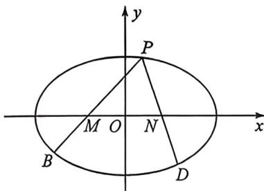

<!-- question-source:start -->
例19 (2025 广州零模·T17)已知椭圆 $C: \frac{x^2}{a^2} + \frac{y^2}{b^2} = 1 (a > b > 0)$ 的左、右焦点分别为 $F_1, F_2$ , 离心率为 $\frac{\sqrt{3}}{2}$ , 长轴长与短轴长之和为 6.

(1)求椭圆 C 的方程;

(2)已知 $M(-1,0), N(1,0)$ , 点 $P$ 为椭圆 $C$ 上一点, 设直线 $PM$ 与椭圆 $C$ 的另一个交点为点 $B$ , 直线 $PN$ 与椭圆 $C$ 的另一个交点为点 $D$ . 设 $\overrightarrow{PM} = \lambda_1 \overrightarrow{MB}, \overrightarrow{PN} = \lambda_2 \overrightarrow{ND}$ , 求证: 当点 $P$ 在椭圆 $C$ 上运动时, $\lambda_1 + \lambda_2$ 为定值.

<!-- question-source:end -->

![[高中/总复习/二轮/2026版高中《MST新思路思维拓展》二轮复习专题/下册/板块1_不等式/考点三_定比点差与蝴蝶定理背景的隐藏关系/questions/answers/Q00093421A1.md]]
