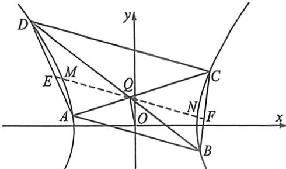

<!-- question-source:start -->
例21 (2025 广东省中学生数学奥林匹克竞赛一试第 9 题) 已知双曲线 $G: \frac{x^2}{a^2} - \frac{y^2}{b^2} = 1 (a > 0, b > 0)$ ，斜率为

$-\frac{1}{2}$ 的直线 l 与 G 的左右两支分别交于 A, B 两点，点 Q(-1,2) 不在 l 上，直线 AQ、BQ 分别交 G 于

另一点 C、D，若 $CD \parallel l$ ，则 G 的离心率为 \_\_\_\_.

<!-- question-source:end -->

![[高中/总复习/二轮/2026版高中《MST新思路思维拓展》二轮复习专题/下册/板块1_不等式/考点三_定比点差与蝴蝶定理背景的隐藏关系/questions/answers/Q00093423A1.md]]
