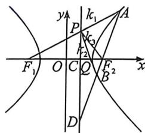

<!-- question-source:start -->
例18 (24 武汉二调·T18)已知双曲线 $E: \frac{x^2}{a^2} - \frac{y^2}{b^2} = 1$ 的左右焦点为 $F_1, F_2$ , 其右准线为 $l$ , 点 $F_2$ 到直线 $l$ 的距离为 $\frac{3}{2}$ , 过点 $F_2$ 的动直线交双曲线 $E$ 于 $A, B$ 两点, 当直线 $AB$ 与 $x$ 轴垂直时, $|AB| = 6$ .

(1)求双曲线 E 的标准方程;

(2)设直线 $AF_{1}$ 与直线 l 的交点为 P，证明：直线 PB 过定点.

<!-- question-source:end -->

![[高中/总复习/二轮/2026版高中《MST新思路思维拓展》二轮复习专题/下册/板块1_不等式/考点三_定比点差与蝴蝶定理背景的隐藏关系/questions/answers/Q00093567A1.md]]
