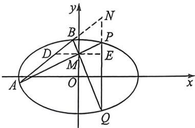

> [!faq]- 例题解析
>
> > [!success]- **【答案】** $\sqrt{2}$
>
> > [!note]- **【解析】**
> > 解析 过 $Q$ 作 $EF \parallel AB \parallel CD$ 分别交 $AD$ 和 $BC$ 于 $E$ 和 $F$ , $EF$ 交双曲线于 $M$ 和 $N$ 两点, 如图所示, 根据调和梯形性质可知 $QE = QF$ (也可以利用相似证明 $\frac{QE}{CD} = \frac{AE}{AD} = \frac{QF}{CD} = \frac{BF}{BC}$ ), 再根据蝴蝶定理可知, 当 $QE = QF$ 时, 一定有 $QM = QN$ , 根据中点弦性质 $k_{\alpha Q} \cdot k_{MN} = \frac{b^2}{a^2} = 1$ , 所以 $e = \sqrt{2}$ . 故答案为: $\sqrt{2}$ .
> >
> > 例(2016·山东)已知椭圆 $C: \frac{x^2}{a^2} + \frac{y^2}{b^2} = 1 (a > b > 0)$ 的长轴长为4，焦距为 $2\sqrt{2}$ .
> >
> > (1)求椭圆 C 的方程;
> >
> > (2) 过动点 $M(0, m)$ (m > 0) 的直线交 x 轴与点 N，交 C 于点 A， $P(P$ 在第一象限），且 M 是线段 PN 的中点。过点 P 作 x 轴的垂线交 C 于另一点 Q，延长 QM 交 C 于点 B。
> > - **①**：设直线 $PM, QM$ 的斜率分别为 $k_{1}, k_{2}$ , 证明 $\frac{k_{2}}{k_{1}}$ 为定值;
> > - **②**：求直线 $AB$ 的斜率的最小值.
> >
> > 解析 (1) 设椭圆的半焦距为 $c$ . 由题意知 $2a = 4, 2c = 2\sqrt{2}$ ,
> >
> > 所以 $a = 2, b = \sqrt{a^2 - c^2} = \sqrt{2}$ . 所以椭圆 $C$ 的方程为 $\frac{x^2}{4} + \frac{y^2}{2} = 1$ .
> >
> > (2)证明:①设 $P(x_{0},y_{0})(x_{0}>0,y_{0}>0)$ ，由 $M(0,m)$ ，可得 $P(x_{0},2m), Q(x_{0},-2m)$ 。所以直线 PM 的斜率 $k_{1}=\frac{2m-m}{x_{0}}=\frac{m}{x_{0}}$ ，直线 QM 的斜率 $k_{2}=\frac{-2m-m}{x_{0}}=-\frac{3m}{x_{0}}$ ，此时 $\frac{k_{2}}{k_{1}}=-3$ 。所以 $\frac{k_{2}}{k_{1}}$ 为定值 -3。
> >
> > 
> > - **②**：极点极线背景:延长AB和QP交于N,易知M与N调和共轭,即 $y_{M}y_{N}=2$ ,故 $y_{N}=\frac{2}{m}$ ,过M作x轴平行线交AB于D,交PQ于E,根据蝴蝶定理知MD=ME,故 $k_{AB}=\frac{y_{H}-y_{M}}{2x_{0}}=\frac{\frac{2}{m}-m}{2x_{0}}$ ,由于 $P(x_{0},2m)$ 在椭圆上,故令 $\left\{\begin{aligned}x_{0}&=2\cos\theta\\ 2m&=\sqrt{2}\sin\theta\end{aligned}\right.$ ,故 $k=\frac{2\sqrt{2}-\frac{\sqrt{2}}{2}\sin^{2}\theta}{4\sin\theta\cos\theta}=\frac{\sqrt{2}(3\sin^{2}\theta+4\cos^{2}\theta)}{8\sin\theta\cos\theta}=\frac{\sqrt{2}}{8}\left(3\tan\theta+\frac{4}{\tan\theta}\right)\geqslant\frac{\sqrt{6}}{2}$ ,当且仅当 $\tan\theta=\frac{2\sqrt{3}}{3}$ 时等号成立.
> >
> > 法一(定比点差): 设 $A(x_{1}, y_{1}), B(x_{2}, y_{2}), \overrightarrow{AM} = \lambda \overrightarrow{MB}, \overrightarrow{BM} = \mu \overrightarrow{MQ}$ ，根据定比点差法 $\left\{\begin{aligned} x_{1} + \lambda x_{0} &= 0 \\ x_{2} + \mu x_{0} &= 0 \end{aligned}\right.$
> >
> > $$
> > \left\{ \begin{array}{l l} { y _ {1} = \frac {m + \frac {2}{m}}{2} + \frac {m - \frac {2}{m}}{2} \lambda} \\ { y _ {2} = \frac {m + \frac {2}{m}}{2} + \frac {m - \frac {2}{m}}{2} \mu} \end{array} , k = \frac {y _ {2} - y _ {1}}{x _ {2} - x _ {1}} = - \frac {m - \frac {2}{m}}{2 x _ {0}}, \text {令} \left\{ \begin{array}{l l} x _ {0} = 2 \cos \theta \\ 2 m = \sqrt {2} \sin \theta \end{array} , \text {故} k = - \frac \frac {\sqrt {2}}{2} \sin^ {2} \theta - 2 \sqrt {2} \right. \right.
> > $$
> >
> > $k = \frac{\sqrt{2}(3\sin^2\theta + 4\cos^2\theta)}{8\sin\theta\cos\theta} = \frac{\sqrt{2}}{8}\left(3\tan\theta + \frac{4}{\tan\theta}\right) \geqslant \frac{\sqrt{6}}{2}$ , 当且仅当 $\tan\theta = \frac{2\sqrt{3}}{3}$ 时等号成立.
> >
> > 法二(曲线系): 设 AB: $y=kx+n$ , 故我们只需要求出 k 的关系式;
> >
> > $$
> > P A: y = k _ {1} x + m
> > $$
> >
> > 已知 $QB: y = -3k_{1}x + m$ 因为椭圆过二次曲线 $PA \cdot QB$ 与二次曲线 $AB \cdot PQ$ 的四个交点 $A, B, P, Q$ , 有 $PQ: x - x_{0} = 0$
> >
> > $(x - x_0)(kx - y + n) + \mu (y - k_1x - m)(y + 3k_1x - m) = \lambda \left(\frac{x^2}{4} +\frac{y^2}{2} -1\right)$ ，对比两边 $xy$ 项系数，得 $-1 + 2k_{1}\mu = 0①$ 对比两边 $x^{2}$ 项系数，得 $k - 3k_1^2\mu = \frac{\lambda}{4} ②$ ，对比两边 $y^{2}$ 项系数，得 $\mu = \frac{\lambda}{2} ③$
> >
> > 综合①②③得 $k = \frac{3k_1}{2} +\frac{1}{4k_1}\geqslant \frac{\sqrt{6}}{2}$ 当仅当 $k_{1} = \frac{\sqrt{6}}{6}$ 时等号成立.
