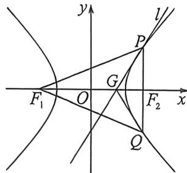

> [!faq]- 例题解析
>
> > [!success]- **【答案】** 详见解析
>
> > [!note]- **【解析】**
> > 解析 (1)由题知 $F_{1}(-3,0), F_{2}(3,0)$ , 因为 $PF_{2} \perp x$ 轴, $P$ 在第一象限, 所以 $x_{0}=3$ , 将 $x_{0}=3$ 代入双曲线方程可得 $y_{0}=\frac{5}{2}$ , 所以直线 $l$ 方程为 $\frac{3x}{4}-\frac{\frac{5}{2}y}{5}=1$ , 整理可得 $3x-2y-4=0$ ,
> >
> > (2) 因为 $F_{1}(-3,0), F_{2}(3,0), |PF_{1}| = \sqrt{(x_{0} + 3)^{2} + y_{0}^{2}} = \sqrt{(x_{0} + 3)^{2} + 5\left(\frac{x_{0}^{3}}{4} - 1\right)} = \frac{3}{2} x_{0} + 2,$
> >
> > $|PF_{2}|=\sqrt{(x_{0}-3)^{2}+y_{0}^{2}}=\sqrt{(x_{0}-3)^{2}+5\left(\frac{x_{0}^{2}}{4}-1\right)}=\frac{3}{2}x_{0}-2$ ，又直线 $l_{1}\frac{x_{0}x}{4}-\frac{y_{0}y}{5}=1$ ，所以 $G\left(\frac{4}{x_{0}},0\right)$ ，则 $|GF_{1}|=3+\frac{4}{x_{0}},|GF_{2}|=3-\frac{4}{x_{0}}$ ，所以 $\left|\frac{PF_{1}}{PF_{2}}\right|=\frac{\frac{3}{2}x_{0}+2}{\frac{3}{2}x_{0}-2}=\frac{3x_{0}+4}{3x_{0}-4},\left|\frac{GF_{1}}{GF_{2}}\right|=\frac{3+\frac{4}{x_{0}}}{3-\frac{4}{x_{0}}}=\frac{3x_{0}+4}{3x_{0}-4}$ ，所以 $\left|\frac{PF_{1}}{PF_{2}}\right|=\left|\frac{GF_{1}}{GF_{2}}\right|$ 在 $\triangle PGF_{1}$ 中， $\frac{|PF_{1}|}{\sin\angle PGF_{1}}=\frac{|GF_{1}|}{\sin\angle GPF_{1}}①$ ，在 $\triangle PGF_{2}$ 中， $\frac{|PF_{2}|}{\sin\angle PGF_{2}}=\frac{|GF_{2}|}{\sin\angle GPF_{2}}②$
> >
> > 又 $\angle PGF_{1} + \angle PGF_{2} = \pi$ ，联立①②可得 $\sin \angle GPF_{1} = \sin \angle GPF_{2}$ ，因为 $\angle GPF_{1} + \angle GPF_{2} = \angle F_{1}PF_{2}\in (0,\pi)$ 所以 $\angle GPF_{1} = \angle GPF_{2}$ ，所以直线 $l$ 为 $\angle F_1PF_2$ 的角平分线.
> >
> > 
> >
> > (3)令 $\overrightarrow{PF_2} = \lambda \overrightarrow{F_2Q}$ , 设 $P(x_1, y_1), Q(x_2, y_2)$ , 根据定比点差 (自证) 可知 $\left\{ \begin{array}{l} x_1 = \frac{3 + \frac{4}{3}}{2} + \frac{3 - \frac{4}{3}}{2}\lambda \\ x_2 = \frac{3 + \frac{4}{3}}{2} + \frac{3 - \frac{4}{3}}{2\lambda} \end{array} \right.$ ,
> >
> > $\frac{S_{\triangle PGF_1}}{S_{\triangle QGF_t}} = \frac{|PF_1|}{|PF_2|} \cdot \frac{|PF_2|\sin\alpha}{|QF_2|\sin\alpha} = \frac{|PF_1|}{|QF_2|} = \frac{ex_1 + a}{ex_2 - a} = \frac{\frac{3}{2}\left(\frac{13}{6} + \frac{5\lambda}{6}\right) + 2}{\frac{3}{2}\left(\frac{13}{6} + \frac{5}{6\lambda}\right) - 2} = \frac{16}{11}$ , 所以 $55\lambda^2 + 151\lambda - 80 = 0$ , 所以 $(5\lambda + 16)(11\lambda - 5) = 0$ , 所以 $\lambda = \frac{5}{11}$ 或 $\lambda = -\frac{16}{5}$ (交于两支, 舍去), 解得 $x_1 = \frac{28}{11}$ ,
> >
> > 代入双曲线，则 $y_{1} = \frac{5\sqrt{15}}{11}, y_{2} = -\sqrt{15}, x_{2} = 4$ ，所以 $k_{l} \cdot k_{QF_{1}} = \frac{5x_{0}}{4y_{0}} \cdot \frac{y_{1}}{x_{1} + 3} = \frac{5}{4} \times \frac{28}{5\sqrt{15}} \times \frac{-\sqrt{15}}{7} = -1.$
