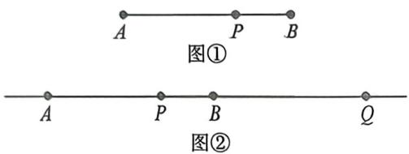
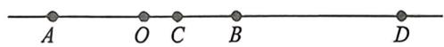
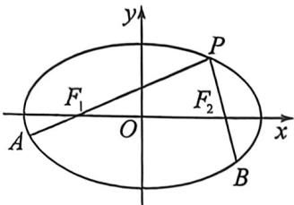
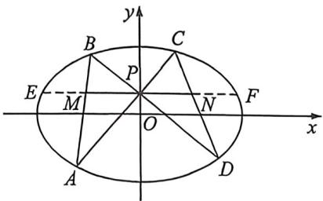
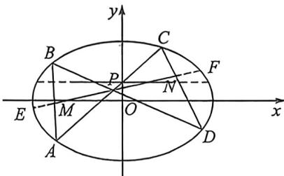
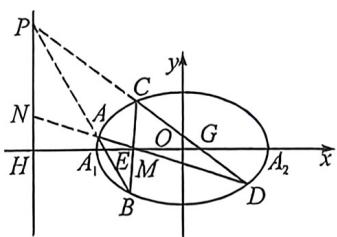

## 考点三_定比点差与蝴蝶定理背景的隐藏关系

知识点介绍:调和点列与定比点差

1. 调和点列的概念

如下图①, 点 $P$ 在线段 $AB$ 上, 则满足 $\frac{|\overrightarrow{AP}|}{|\overrightarrow{PB}|} = \lambda (\lambda > 0)$ 的点 $P$ 是唯一存在的. 但是, 如果将线段 $AB$ 改为直线 $AB$ , 此时, 满足 $\frac{|\overrightarrow{AP}|}{|\overrightarrow{PB}|} = \lambda$ 的点有两个, 如下图②, 不妨记另一个点为 $Q$ , 则 $\frac{AP}{PB} = \frac{AQ}{QB} = \lambda (\lambda \neq 1)$ , 在此种情况下, 我们称点 $A、P、B、Q$ 为调和点列, 或者称点 $P、Q$ 调和分割点 $A、B$ . 按照交比的调和比解释, 就是 $(AB, PQ) = -1$

特别的, 当 $\lambda=1$ 时, 即点 P 为 AB 的中点, 则 Q 为无穷远点.

## 2. 调和点列的性质

如下图所示:对于线段AB的内分点C和外分点D满足C、D调和分割线段AB,即 $\frac{AC}{CB}=\frac{AD}{DB}$ ,设O为线段AB的中点,则有以下结论成立:

①点 A、B 也调和分割 C、D，即 $\frac{CA}{AD} = \frac{CB}{BD}$ ;

② $\frac{2}{AB}=\frac{1}{AC}+\frac{1}{AD}$ (AB 是 AC 与 AD 的调和平均数).

3. 定比分点和调和分点支配下的圆锥曲线

在椭圆或双曲线中, 设 $A, B$ 为椭圆或双曲线上的两点, 若存在 $P, Q$ 两点, 满足 $\overrightarrow{AP} = \lambda \overrightarrow{PB}, \overrightarrow{AQ} = -\lambda \overrightarrow{QB}$ , 则一定有: $\frac{x_P x_Q}{a^2} \pm \frac{y_P y_Q}{b^2} = 1$

证明若 $A(x_{1},y_{1}),B(x_{2},y_{2})$ ，且 $\overrightarrow{AP} = \lambda \overrightarrow{PB}$ ，则 $P\left(\frac{x_1 + \lambda x_2}{1 + \lambda},\frac{y_1 + \lambda y_2}{1 + \lambda}\right)$ ；若 $\overrightarrow{AQ} = -\lambda \overrightarrow{QB}$ ，则

$Q\left(\frac{x_1 - \lambda x_2}{1 - \lambda},\frac{y_1 - \lambda y_2}{1 - \lambda}\right)$ ，有 $\begin{cases} \frac{x_1^2}{a^2}\pm \frac{y_1^2}{b^2} = 1(1)\\ \frac{\lambda^2x_2^2}{a^2}\pm \frac{\lambda^2y_2^2}{b^2} = \lambda^2 (2) \end{cases}$

(1)一(2)可得:

$\frac{(x_1 + \lambda x_2)(x_1 - \lambda x_2)}{a^2} \pm \frac{(y_1 + \lambda y_2)(y_1 - \lambda y_2)}{b^2} = 1 - \lambda^2$ 即得: $\frac{1}{a^2} \cdot \frac{x_1 + \lambda x_2}{1 + \lambda} \cdot \frac{x_1 - \lambda x_2}{1 - \lambda} \pm \frac{1}{b^2} \cdot \frac{y_1 + \lambda y_2}{1 + \lambda} \cdot \frac{y_1 - \lambda y_2}{1 - \lambda} = 1$ , 故 $\frac{x_P x_Q}{a^2} \pm \frac{y_P y_Q}{b^2} = 1$ .

定比点差的原理谜题解开,就是两个互为调和的定比分点坐标满足圆锥曲线的特征方程.

4. 定点(极点)在坐标轴上的定比点差

若出现 $y_{P}=0$ (或者 $y_{Q}=0$ )，则 $x_{P}x_{Q}=a^{2}$ ，此时 $x_{P}=m, x_{Q}=\frac{a^{2}}{m}$ ；若出现 $x_{P}=0$ (或者 $x_{Q}=0$ )，则 $y_{P}y_{Q}=b^{2}$ ，此时 $y_{P}=n, y_{Q}=\frac{b^{2}}{n}$ 。对于公式中，成对出现的“m， $\frac{a^{2}}{m}$ ”或者“n， $\frac{b^{2}}{n}$ ”，由于公式的背景和极点极线有关，不妨可以称它们为“调和共轭数”。

类型一: 定点(极点)在 x 轴

过定点 $P(x_{P},0)$ 的直线与椭圆 $\frac{x^2}{a^2} +\frac{y^2}{b^2} = 1(a > b > 0)$ 相交于 $A,B$ 两点，设 $\overrightarrow{AP} = \lambda \overrightarrow{PB} (\lambda \neq \pm 1),A(x_1,$ $y_{1}),B(x_{2},y_{2})$ ，则在直线 $AB$ 上一定存在点 $Q$ 满足 $\overrightarrow{AQ} = -\lambda \overrightarrow{QB}$ ，根据定比点差法可知 $x_{Q} = \frac{a^{2}}{x_{P}}.$

一定有 $\left\{ \begin{array}{l}x_{1} = \frac{x_{P} + x_{Q}}{2} +\frac{x_{P} - x_{Q}}{2}\cdot \lambda \\ x_{2} = \frac{x_{P} + x_{Q}}{2} +\frac{x_{P} - x_{Q}}{2\lambda}\\ y_{1} + \lambda y_{2} = 0 \end{array} \right.$ 证明： $\left\{ \begin{array}{l}\frac{x_1 + \lambda x_2}{1 + \lambda} = x_p\\ \frac{x_1 - \lambda x_2}{1 - \lambda} = x_Q\Rightarrow \left\{ \begin{array}{l}x_1 + \lambda x_2 = x_p(1 + \lambda)\\ x_1 - \lambda x_2 = x_Q(1 - \lambda)\Rightarrow \\ y_1 + \lambda y_2 = 0 \end{array} \right.\end{array} \right.\left\{ \begin{array}{l}x_{1} = \frac{x_{p} + x_{Q}}{2} +\frac{x_{p} - x_{Q}}{2}\lambda \\ x_{2} = \frac{x_{p} + x_{Q}}{2} +\frac{x_{p} - x_{Q}}{2\lambda}\\ y_{1} + \lambda y_{2} = 0 \end{array} \right.$

类型二: 定点(极点)在 y 轴

过定点 $P(0, y_{p})$ 的直线与椭圆 $\frac{x^{2}}{a^{2}} + \frac{y^{2}}{b^{2}} = 1 (a > b > 0)$ 相交于 A、B 两点，设 $\overrightarrow{AP} = \lambda \overrightarrow{PB} (\lambda \neq \pm 1)$ ， $A(x_{1}, y_{1}), B(x_{2}, y_{2})$ ，则在直线 AB 上一定存在点 Q 满足 $\overrightarrow{AQ} = -\lambda \overrightarrow{QB}$ ，根据定比点差法可知 $y_{Q} = \frac{b^{2}}{y_{P}}$ 。同理： $\begin{cases} y_{1} = \frac{y_{P} + y_{Q}}{2} + \frac{y_{P} - y_{Q}}{2} \cdot \lambda \\ y_{2} = \frac{y_{P} + y_{Q}}{2} + \frac{y_{P} - y_{Q}}{2\lambda} \\ x_{1} + \lambda x_{2} = 0 \end{cases}$

由于在考试当中我们经常要拿出这三个等式,故我们称之为:“三炮齐鸣,天下太平”

## 一、轴点弦常规构造定点定值T18类型

![[高中/总复习/二轮/2026版高中《MST新思路思维拓展》二轮复习专题/下册/板块1_不等式/考点三_定比点差与蝴蝶定理背景的隐藏关系/questions/Q00093419.md]]
![[高中/总复习/二轮/2026版高中《MST新思路思维拓展》二轮复习专题/下册/板块1_不等式/考点三_定比点差与蝴蝶定理背景的隐藏关系/questions/Q00093567.md]]

## 二、隐藏的焦弦常数构造 T18 类型

焦弦常数:设点 P 为椭圆或双曲线上任一点,过焦点 $F_{1}$ 、 $F_{2}$ 分别作弦 PA、PB,设 $\overrightarrow{PF_{1}}=\lambda\overrightarrow{F_{1}A},\overrightarrow{PF_{2}}=\mu\overrightarrow{F_{2}B}$ ,则 $\lambda+\mu=\frac{2(a^{2}+c^{2})}{a^{2}-c^{2}}=\frac{2(1+e^{2})}{1-e^{2}}$ .证明过程参考例题.

推广:如果将焦点 $F_{1}$ 、 $F_{2}$ 换成 $M_{1}(-m,0)$ 、 $M_{2}(m,0)$ ，则 $\lambda+\mu=\frac{2(a^{2}+m^{2})}{a^{2}-m^{2}}$ .

证明：对 $\left\{ \begin{array}{l} \overrightarrow{PM_1} = \lambda \overrightarrow{M_1A} \\ \overrightarrow{PM_2} = \mu \overrightarrow{M_2A} \end{array} \right.$ ，利用定比点差法易得： $\left\{ \begin{array}{l} 2x_p = -m - \frac{a^2}{m} + (-m + \frac{a^2}{m})\lambda ① \\ 2x_p = m + \frac{a^2}{m} + (m - \frac{a^2}{m})\mu ② \end{array} \right.$

①-②得： $\lambda +\mu = \frac{2(a^2 + m^2)}{a^2 - m^2}.$

![[高中/总复习/二轮/2026版高中《MST新思路思维拓展》二轮复习专题/下册/板块1_不等式/考点三_定比点差与蝴蝶定理背景的隐藏关系/questions/Q00093421.md]]
![[高中/总复习/二轮/2026版高中《MST新思路思维拓展》二轮复习专题/下册/板块1_不等式/考点三_定比点差与蝴蝶定理背景的隐藏关系/questions/Q00093422.md]]

## 三、蝴蝶定理与坎迪定理隐藏的定点定值T18类型

知识点: 蝴蝶定理

如左图所示, $P$ 为 $y$ 轴上一点, 若 $AC$ 与 $BD$ 交于 $P$ , 过 $P$ 作与 $x$ 轴平行的直线交 $AB$ 和 $CD$ 于 $MN$ , 交椭圆 $\Gamma$ 于 $EF$ , 则 $|PM| = |PN|$ . 如右图, 若 $P$ 为弦 $EF$ 中点, 则 $P$ 一定为 $MN$ 中点, 即 $|PM| = |PN|$ , 我们把这种蝴蝶型的共中点定理叫做蝴蝶定理.

坎迪定理

如图，A、B、C、D都是椭圆上的动点，已知 $M(m,0),H\left(\frac{a^2}{m},0\right),AD$ 与BC交于点 $M$ ，则一定有：① $\frac{k_{AB}}{k_{CD}} = \frac{MG}{ME} = \frac{HG}{HE}$ ，② $\frac{1}{MG} -\frac{1}{ME} = \frac{1}{MA_2} -\frac{1}{MA_1}.$

由于考试过程中都不能直接使用蝴蝶定理和坎迪定理,都需要利用定比点差或者曲线系证明,故本定理的证明过程,大家不妨参考一下我们的圆锥曲线专题书,这里限于篇幅就不证明了。

![[高中/总复习/二轮/2026版高中《MST新思路思维拓展》二轮复习专题/下册/板块1_不等式/考点三_定比点差与蝴蝶定理背景的隐藏关系/questions/Q00093423.md]]
![[高中/总复习/二轮/2026版高中《MST新思路思维拓展》二轮复习专题/下册/板块1_不等式/考点三_定比点差与蝴蝶定理背景的隐藏关系/questions/Q00093424.md]]

## 四、面积比值与定比点差焦半径综合 T18 类型

![[高中/总复习/二轮/2026版高中《MST新思路思维拓展》二轮复习专题/下册/板块1_不等式/考点三_定比点差与蝴蝶定理背景的隐藏关系/questions/Q00093425.md]]
