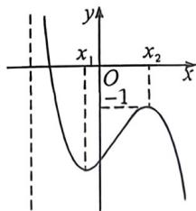

> [!faq]- 例题解析
>
> > [!success]- **【答案】** F
>
> > [!note]- **【解析】**
> > 解析 (1) $f'(x)=\cos x+\frac{1}{\cos^{2}x}-2=\frac{\cos^{3}x-2\cos^{2}x+1}{\cos^{2}x}=\frac{(\cos x-1)(\cos^{2}x-\cos x-1)}{\cos^{2}x}$
> >
> > 由 $x \in \left(0, \frac{\pi}{2}\right)$ , 则 $\cos x \in (0,1)$ , 故 $\cos^2 x - \cos x - 1 = \left(\cos x - \frac{1}{2}\right)^2 - \frac{5}{4} \in \left[-\frac{5}{4}, -1\right), \cos x - 1 < 0$ ,
> >
> > 故 $f^{\prime}(x) > 0$ 在 $x\in \left(0,\frac{\pi}{2}\right)$ 上恒成立，故 $f(x)$ 在 $\left(0,\frac{\pi}{2}\right)$ 上单调递增；
> >
> > (2)由题意知 $f^{\prime}(x_0) = \frac{\cos^3 x_0 - 2\cos^2 x_0 + 1}{\cos^2 x_0} = \frac{\sqrt{2}}{2},$
> >
> > 则 $\cos^3 x_0 - \left(2 + \frac{\sqrt{2}}{2}\right)\cos^2 x_0 + 1 = \left(\cos x_0 - \frac{\sqrt{2}}{2}\right)(\cos^2 x_0 - 2\cos x_0 - \sqrt{2}) = 0,$
> >
> > 故 $\cos x_0 - \frac{\sqrt{2}}{2} = 0$ 或 $\cos^2 x_0 - 2\cos x_0 - \sqrt{2} = 0$
> >
> > 由 $\cos^2 x_0 - 2\cos x_0 - \sqrt{2} = (\cos x_0 - 1)^2 -\sqrt{2} -1\in (-\sqrt{2} -1, - \sqrt{2})$
> >
> > 故 $\cos^{2}x_{0}-2\cos x_{0}-\sqrt{2}=0$ 无解；
> >
> > 则 $\cos x_0 - \frac{\sqrt{2}}{2} = 0$ ，即 $\cos x_0 = \frac{\sqrt{2}}{2}$ ，又 $x \in \left(0, \frac{\pi}{2}\right)$ ，故 $x_0 = \frac{\pi}{4}$ ；
> >
> > (3)由 $x \in \left(0, \frac{\pi}{2}\right)$ , 则 $\sin x \in (0,1), \tan x > 0$ ,
> >
> > 要证 $\sqrt{\sin x} +\sqrt{\tan x} >2\sqrt{x}$ ，只需证 $(\sqrt{\sin x} +\sqrt{\tan x})^2 >(2\sqrt{x})^2$
> >
> > 即只需证 $\sin x + \tan x + 2\sqrt{\sin x\cdot\tan x} >4x$ ，由(1)知 $f(x)$ 在 $\left(0,\frac{\pi}{2}\right)$ 上单调递增，
> >
> > 故 $f(x) > f(0) = \sin 0 + \tan 0 - 2 \times 0 = 0$ ，即 $\sin x + \tan x > 2x$
> >
> > 故只需证 $2\sqrt{\sin x\cdot\tan x} > 2x$ ，即只需证 $2\sqrt{\sin x\cdot\tan x} > 2x,$
> >
> > 即只需证 $\sin x\cdot \tan x - x^2 >0$ ，令 $g(x) = \sin x\cdot \tan x - x^2,x\in \left(0,\frac{\pi}{2}\right),$
> >
> > $$
> > g ^ {\prime} (x) = \cos x \cdot \tan x + \sin x \cdot \frac {1}{\cos^ {2} x} - 2 x = \sin x + \frac {\sin x}{\cos^ {2} x} - 2 x,
> > $$
> >
> > 由 $\sin x + \frac{\sin x}{\cos^2x} \geqslant 2\sqrt{\sin x \cdot \frac{\sin x}{\cos^2x}} = 2\tan x$ ，当且仅当 $\cos^2 x = 1$ 时等号成立，
> >
> > 由 $\cos x\in (0,1)$ ，故不能取等，即有 $\sin x + \frac{\sin x}{\cos^2x} >2\tan x$ ，则 $g^{\prime}(x) = \sin x + \frac{\sin x}{\cos^2x} -2x > 2\tan x - 2x = 2(\tan x - x)$ ，令
> >
> >
> > $h(x)=\tan x-x,x\in\left(0,\frac{\pi}{2}\right)$ ，则 $h'(x)=\frac{1}{\cos^{2}x}-1=\frac{1-\cos^{2}x}{\cos^{2}x}>0$ ，故 $h(x)$ 在 $\left(0,\frac{\pi}{2}\right)$ 上单调递增，则 $h(x)>h(0)=0$ ，即 $g'(x)>0$ ，故 $g(x)$ 在 $\left(0,\frac{\pi}{2}\right)$ 上单调递增，则 $g(x)>g(0)=0$ ，即有 $\sin x*\tan x-x^{2}>0$ ，即得证。
> >
> > 例(2026 圈成邻石宜摸底 T19)已知函数 $f(x)=ae^{-x}-\ln(x+1), a \in \mathbb{R}$ .
> >
> > (1) 若函数 $f(x)$ 在 x=0 处的切线经过 $(-2,0)$ ，求 a 的值；
> >
> > (2)若函数 $f(x)$ 存在两个极值点, 求 a 的取值范围;
> >
> > (3) 若 $m, n \in \mathbb{R}$ 满足 $f(m) = f(n) + \frac{1}{e} > 0$ ，证明： $|n - m| < 1$ .
> >
> > 解： $f(0)=-\frac{a}{e^{x}}-\frac{1}{x+1}$ ，由题意 $f(0)=a,f'(0)=-a-1$
> >
> > 因此函数 $f(x)$ 在 $x = 0$ 处的切线为 $y = (-a - 1)x + a$ ，令 $x = -2, y = 0$ 有 $a = -\frac{2}{3}$ .
> >
> > (2) $f'(x)=\frac{-a}{e^x}-\frac{1}{x+1}=\frac{-a(x+1)-e^x}{e^x(x+1)}, x\in(-1,+\infty)$ ，即 $g(x)=e^{x}+a(x+1)=0$ 有两个解， $g'(x)=e^{x}+a$ ，若 $a\geqslant0,g'(x)>0,g(x)$ 单调递增，至多一个极值点，矛盾； $a<0,g'(x)=0\Rightarrow x=\ln(-a)$ ，若 $\ln(-a)\leqslant-1\Rightarrow-1\Rightarrow-a\leqslant\frac{1}{e}\Rightarrow a\geqslant-\frac{1}{e}$ ，此时， $x\in(-1,+\infty),g'(x)>0,g(x)$ 单调递增，至多一个极值点，矛盾；
> >
> > 当 $a < -\frac{1}{e}, \left\{ \begin{array}{l} x \in (-1, \ln(-a)), g'(x) < 0, g(x) \text{单调递减} \\ x \in (\ln(-a), +\infty), g'(x) > 0, g(x) \text{单调递增} \end{array} \right.$
> >
> > 所以 $g(x)_{\min} = g(\ln (-a)) = -a + a(\ln (-a) + 1) < 0$ ，所以 $a\ln (-a) < 0$ ，所以 $\ln (-a) > 0 \Rightarrow a < -1$
> >
> > 当 $a < -1$ 时， $\left\{ \begin{array}{l} g(-1) = e^{-1} > 0 \\ g(2\ln (-a) + 1) > 0 \text{(利用极值点偏移找点自证)} \end{array} \right.$ ，故存在唯一 $x_{1} \in (-1, \ln (-a))$ ， $x_{2} \in (\ln (-a)$ ， $2\ln (-a) + 1$ ，使 $g(x_{1}) = g(x_{2}) = 0$ ，所以 $f(x)$ 有两个极值点；
> >
> > (3)当 $a \geqslant -1$ ，由(2)可知 $f(x)$ 单调递减；即 $f(m) - f(n) = \frac{1}{e}, m < n$ ，即证 $n - m < 1, n < m + 1$ ，由图可构造 $g(m) = f(m) - f(m + 1), f(m) > 0$ 时，证明 $g(m) > \frac{1}{e}, f(m) = \frac{a}{e^m} - \ln(m + 1) - \frac{a}{e^{m + 1}} + \ln(m + 2)$ ，显然得消 $a$ ，即证： $\frac{a}{e^m}\left(1 - \frac{1}{e}\right) + \ln \frac{m + 2}{m + 1} > \frac{1}{e}$ ，即 $[\ln(m + 1)] \cdot \frac{e - 1}{e} + \ln(m + 2) - \ln(m + 1) > \frac{1}{e}$ ，即 $\ln(m + 2) - \frac{1}{e} \ln(m + 1) > \frac{1}{e}$ （求导自证），当 $a < -1$ 时，由(2)图像如图，
> >
> > 
> >
> > 由 $f(m) > 0, f(n) > -\frac{1}{e}$ ，故 $m, n$ 同在左边减区间，
> >
> > 即证 $f(x_{2}) > -\frac{1}{e}$ , 由(2) $f(x_{2}) = 0 \Rightarrow e^{x_{1}} = -a(x_{2} + 1), f(x_{2}) = \frac{a}{e^{x_{1}}} - \ln (x_{3} + 1) = -\frac{1}{x_{2} + 1} + \ln \frac{1}{x_{3} + 1} < -1 < -\frac{1}{e}$ 成立, 故易知 $m, n \in (0, x_{1})$ , 故同理可证: $f(m) - f(n) > f(m) - f(m + 1) = \frac{1}{e}$ , 所以 $|m - n| < 1$ 得证!
