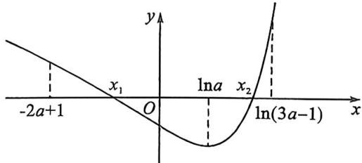

> [!faq]- 例题解析
>
> > [!success]- **【答案】** F
>
> > [!note]- **【解析】**
> > 解析 $(1)f'(x)=2e^{2x}-(2a-1)e^{x}-a=(2e^{x}+1)(e^{x}-a)$ .
> >
> > 若 $a \leqslant 0, f'(x) > 0, f(x)$ 在 $(- \infty, +\infty)$ 为增函数；
> >
> > 若 $a > 0$ ，令 $f^{\prime}(x) = 0$ ，得 $x = \ln a$ 当 $x\in (-\infty ,\ln a)$ 时， $f^{\prime}(x) <   0,f(x)$ 为减函数，当 $x\in (\ln a, + \infty)$ 时， $f^{\prime}(x) > 0,$ $f(x)$ 为增函数.综上所述，当 $a\leqslant 0$ 时， $f(x)$ 在 $(-\infty , + \infty)$ 单调递增；当 $a > 0$ 时， $f(x)$ 在 $(-\infty ,\ln a)$ 单调递减，在 $(\ln a, + \infty)$ 单调递增.
> >
> > (2)当 $a \leqslant 0$ 时, $f(x)$ 在 $(-\infty, +\infty)$ 单调递增, 不可能有两个零点, 不符合题意.
> >
> > 当 $a > 0$ 时， $f(x)$ 在 $(- \infty, \ln a)$ 单调递减，在 $(\ln a, + \infty)$ 单调递增，因为 $f(x)$ 有两个零点，必有 $f(x)_{\min} = f(\ln a) = a(1 - a - \ln a) < 0$ ，因为 $a > 0$ ，所以 $1 - a - \ln a < 0$ .
> >
> > 令 $g(a) = 1 - a - \ln a, a > 0, g'(a) = -1 - \frac{1}{a} < 0$ ，所以 $g(a)$ 在 $(0, +\infty)$ 单调递减，而 $g(1) = 0$
> >
> > 所以当 $a > 1$ 时， $g(a) < 0$ ，即 $f(x)_{\min} < 0$ .
> >
> > 左边取点方案一: $f(-1)=\frac{1}{e^{2}}-(2a-1)\frac{1}{e}+a=\frac{1}{e^{2}}+\frac{1}{e}+a\left(1-\frac{2}{e}\right)>0,$
> >
> > 左边取点方案二： $f(x)=e^{2x}-(2a-1)e^{x}-ax>-(2a-1)e^{x}-ax>-(2a-1)a-ax=0$ ，取 $x=-2a+1$ ;
> >
> > 故 $f(x)$ 在 $(-2a+1,\ln a)$ 有1个零点(如图);
> >
> > 
> >
> > 右边取点: 当 $x > \ln a$ 时, $f(x) = e^{x} \left( e^{x} - (2a - 1) - a \frac{x}{e^{x}} \right) > e^{x} \left( e^{x} - (2a - 1) - a \frac{1}{e} \right)$ , 解得 $x = \ln \left[ \left( 2 + \frac{1}{e} \right) a - 1 \right]$ , 取整得 $x = \ln(3a - 1)$ , $f(x)$ 在 $(\ln a, \ln(3a - 1))$ 有 1 个零点.
> >
> > 综上所述,当 $f(x)$ 有两个零点时,a的取值范围是 $(1,+\infty)$ .
