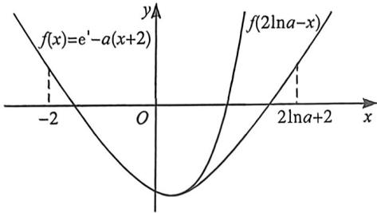

> [!faq]- 例题解析
>
> > [!success]- **【答案】** F
>
> > [!note]- **【解析】**
> > 解析 $a \leqslant 0$ 时， $f'(x) = e^{x} - a > 0$ 恒成立， $f(x)$ 在 $(-∞, +∞)$ 上单调递增，不合题意；
> > - **②**：当 $a > 0$ 时，令 $f'(x) = 0$ ，解得 $x = \ln a$ ，当 $x \in (-\infty, \ln a)$ 时， $f'(x) < 0$ ， $f(x)$ 单调递减，当 $x \in (\ln a, +\infty)$ 时， $f'(x) > 0$ ， $f(x)$ 单调递增。所以 $f(x)_{\min} = f(\ln a) = a - a(\ln a + 2) = -a(1 + \ln a)$ 。要使 $f(x)$ 有两个零点，则一定要满足 $f(\ln a) < 0$ ，则 $a > \frac{1}{e}$ ，由于 $f(-2) = e^{-2} > 0$ $\exists x_1 \in (-2, \ln a)$ ，使 $f(x_1) = 0$ ，
> >
> > 
> >
> > (极值点偏移取点): 由于 $f'''(x)=e^{x}>0$ ，故会出现极值点右偏的情况，
> >
> > 即 $x > \ln a$ 时， $f(x) > f(2\ln a - x)$ ，则利用对称性，当左边出现 $f(-2) > 0$ 时，右边一定存在 $f(2\ln a + 2) > 0$
> >
> > 即 $f(2\ln a + 2) = (ea)^2 - 2a(\ln a + 2) = e^2a^2\left(1 - 2\frac{\ln e^2a}{e^2a}\right) > 0$ ，故 $\exists x_2 \in (\ln a, 2\ln a + 2)$ ，使 $f(x_2) = 0$
> >
> > 综上, 若 $f(x)$ 有两个零点, 则 a 的取值范围是 $\left(\frac{1}{e}, +\infty\right)$ .
