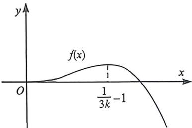
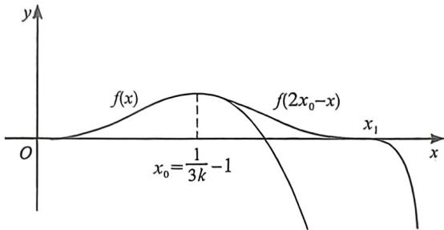

> [!faq]- 例题解析
>
> > [!success]- **【答案】** F
>
> > [!note]- **【解析】**
> > 解析 (1)由题意可知 $f'(x)=\frac{1}{1+x}-1+x-3kx^{2}=\frac{1-1-x+x+x^{2}-3kx^{2}-3kx^{3}}{1+x}=\frac{x^{2}[1-3k(x+1)]}{1+x},x>0$ 时, $\frac{x^{2}}{1+x}>0,\Delta k\in\left(0,\frac{1}{3}\right)$ ，故 $g(x)=1-3k(x+1)$ 单调递减，且当 $x\in\left(0,\frac{1}{3k}-1\right)$ 时 $g(x)>0$ ，即 $f'(x)>0$ ，故 $f(x)$ 单调递增； $x\in\left(\frac{1}{3k}-1,+\infty\right)$ 时 $g(x)<0$ ，即 $f'(x)<0,f(x)$ 单调递减，故 $f(x)$ 有唯一极值点 $\frac{1}{3k}-1$ ，
> >
> > 
> >
> > 又 $f(0) = 0$ ，故 $x \in \left(0, \frac{1}{3k} - 1\right)$ 时， $f(x) > f(0) = 0, x \in \left(\frac{1}{3k} - 1, +\infty\right)$ 时， $f\left(\frac{1}{2k}\right) = \ln \left(1 + \frac{1}{2k}\right) - \frac{1}{2k} < 0$ ，故存在唯一 $x_0 \in \left(\frac{1}{3k} - 1, \frac{1}{2k}\right)$ 满足 $f(x_0) = 0$ ，故 $f(x)$ 在 $(0, +\infty)$ 存在唯一极值点和唯一零点；
> >
> > 注意: 放缩取点, 由于 $\ln (1 + x) - x < 0$ , 利用 $f(x) = \ln (1 + x) - x + \frac{1}{2} x^2 - kx^3 < \frac{1}{2} x^2 - kx^3 = x^2\left(\frac{1}{2} - kx\right) = 0$ , 取 $x = \frac{1}{2k}$ ;
> >
> > 利用 $f(x) = \ln (1 + x) - x + \frac{1}{2} x^2 - kx^3 < \ln (1 + x) + \frac{1}{2} x^2 - kx^3 = x^2\left[\frac{\ln(1 + x)}{x^2} + \left(\frac{1}{2} - kx\right)\right] < x^2\left(\frac{3}{2} - kx\right) = 0$ ，取 $x = \frac{3}{2k}$ ，取点放缩方法很多种，但你需要养成放缩取点的习惯。
> >
> > 
> >
> > (2)(|)因为 $g(t)=f(x_{1}+t)-f(x_{1}-t)$ ，所以 $g'(t)=f'(x_{1}+t)+f'(x_{1}-t)$
> >
> > $= (x_{1} + t)^{2}\left(\frac{1}{1 + x_{1} + t} -3k\right) + (x_{1} - t)^{2}\left(\frac{1}{1 + x_{1} - t} -3k\right)$ （注意到 $3k = \frac{1}{x_1 + 1}$ ，代入）
> >
> > $$
> > = (x _ {1} + t) ^ {2} \left(\frac {1}{x _ {1} + 1 + t} - \frac {1}{x _ {1} + 1}\right) + (x _ {1} - t) ^ {2} \left(\frac {1}{x _ {1} + 1 - t} - \frac {1}{x _ {1} + 1}\right) = \frac {- t (x _ {1} + t) ^ {2}}{(x _ {1} + 1) ^ {2} + t (x _ {1} + 1)} + \frac {t (x _ {1} - t) ^ {2}}{(x _ {1} + 1) ^ {2} - t (x _ {1} + 1)}
> > $$
> >
> > $= -\frac{t}{x_1 + 1}\left[\frac{(x_1 + t)^2}{x_1 + 1 + t} -\frac{(x_1 - t)^2}{x_1 + 1 - t}\right] = -\frac{t}{x_1 + 1}\cdot \frac{2t(x_1^2 - t^2 + 2x_1)}{(x_1 + 1)^2 - t^2},$ 其中 $0 <   t <   x_{1},t$ 为正数， $x_{1}$ 为正数， $x_{1} + 1 > t > 0$ 显
> >
> > $$
> > (x _ {1} + 1) ^ {2} - t ^ {2} > 0
> > $$
> >
> > $$
> > g ^ {\prime} (t) <   0
> > $$
> >
> > $$
> > g (t)
> > $$
> >
> > $$
> > t \in (0, x _ {1})
> > $$
> >
> > (Ⅱ) $2x_{1}>x_{2}$ ，证明如下：由(Ⅰ)得， $g(t)$ 在 $t\in(0,x_{1})$ 上单调递减，所以 $g(x_{1})<g(0)$ ，所以 $g(x_{1})<0$ ，
> >
> > 即 $f(2x_{1}) - f(0) < f(x_{1}) - f(x_{1}) = 0, f(2x_{1}) < 0$ ，因为 $x_{2}$ 是 $f(x)$ 的零点，所以 $f(x_{2}) = 0$ ，所以 $f(2x_{1}) < f(x_{2})$ ，又因为 $x_{2} > x_{1}, 2x_{1} > x_{1}$ ，且 $f(x)$ 在 $(x_{1}, +\infty)$ 上单调递减，所以 $2x_{1} > x_{2}$ .
