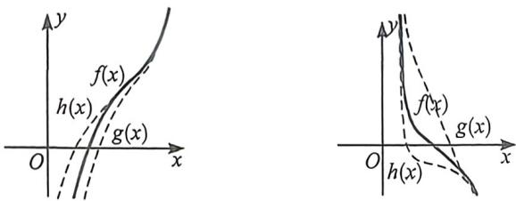
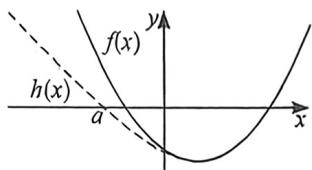
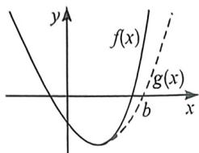
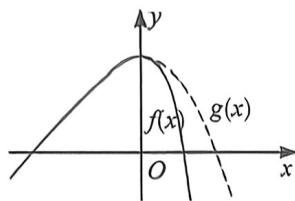
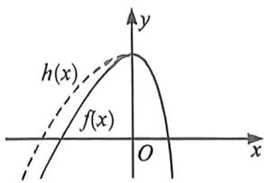
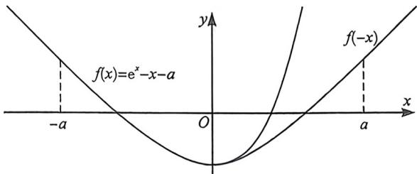
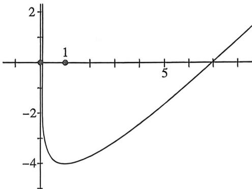
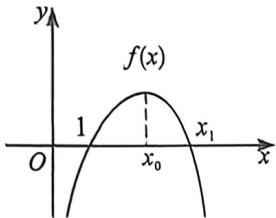
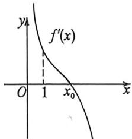
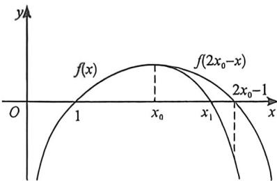

## 考点三_点个数与放缩取点

## 取点原理

物理学电磁感应有一个重要的定理叫做“楞次定理”，其中最重要的一句口诀叫做“增反减同”，这个原理也能应用在找点上，就是单调递增的函数 $f(x)$ ，需要找到 $x_{1} \in (m, n)$ ，使 $f(x_{1}) = 0$ ，我们在找大点的时候需要一个更小的函数 $g(x)$ ，使 $g(n) = 0$ ；取小点则需要构造一个更大的函数 $h(x)$ ，使 $h(m) = 0$ ，我们将此叫做“增反”，即增函数找大点构造小函数，找小点构造大函数，当然 $g(x)$ 以及 $h(x)$ 都是我们上面介绍的那五个可求出零点的函数；

减函数则满足“减同”，即减函数找大点构造大函数，取小点构造小函数(图右)，这类“增反减同”的找点法原理我们叫做楞次找点原理.

同理,我们来研究有极值点的函数取点原理,当函数极大值大于零或者极小值小于零,通常会有两个零点,高考中一旦需要我们去找这两个零点时,我们也可以根据楞次取点法进行分析,两边都构造放缩函数,得到可解方程。我们通常将零点当中的较小零点用 $x_{1}$ 表示,较大零点用 $x_{2}$ 表示。若 $f(x_{0})$ 为函数唯一极小值点,那么我们需要找到 $x_{1} \in (a, x_{0}), x_{2} \in (x_{0}, b)$ ,我们可以利用不同的范围来进行放缩,当 $x < x_{0}$ 时,构造 $f(x) > h(x)$ ,当 $h(a) = 0$ 时,一定有 $f(a) > 0$ (如下图左);同理当 $x > x_{0}$ 时,构造 $f(x) > g(x)$ ,当 $g(b) = 0$ 时,一定有 $f(b) > 0$ (如下图右);当然 $h(x)$ 和 $g(x)$ 通常都是零点易求的函数。由于 $h(x)$ 和 $g(x)$ 不是唯一的,我们有多种构造方法和构造选择,故我们把这类型极小值小于零的两个零点问题的放缩找点类型称为“众星捧月”.

同样,在极大值大于零的两个零点问题时,则需要构造“仙女散花”的模型(如下图)

## 一、分析主客体进行放缩取点

主客体定义:主体的寻找针对两点,一个就是题干要求找大于0的点,那么此时我们的主体为正,而且变化速率比较快的那个部分

例： $f(x)=e^{x}-ax-ax^{2},a>0,x>0$ ，在区间 $(0,+\infty)$ 取一个点使得 $f(x)$ 函数值为正.

分析: 主体: $e^{x}$ , 当 x > 0 时, $f(x) = e^{x} - ax - ax^{2} = e^{\frac{x}{2}} \left( e^{\frac{x}{2}} - \frac{ax}{e^{\frac{x}{2}}} - \frac{ax^{2}}{e^{\frac{x}{2}}} \right) = e^{\frac{x}{2}} \left( e^{\frac{x}{2}} - \frac{2a\frac{x}{2}}{e^{\frac{x}{2}}} - \frac{16a\left(\frac{x}{4}\right)^{2}}{(e^{\frac{x}{4}})^{2}} \right) > e^{\frac{x}{2}} \left( e^{\frac{x}{2}} - \frac{2a}{e} - \frac{16a}{e^{2}} \right) = 0$ , 取 $x = 2\ln \left( \frac{2a}{e} + \frac{16a}{e^{2}} \right)$ , 主客体找点的本质就是把一个无界函数构造成有界函数.

当然，本题可以进一步放缩， $f(x) = e^{x} - ax(x + 1) = e^{\frac{x}{2}}\left[e^{\frac{x}{2}} - \frac{ax(x + 1)}{e^{\frac{x}{2}}}\right] > e^{\frac{x}{2}}\left[e^{\frac{x}{2}} - \frac{a(x + 1)^{2}}{e^{\frac{x}{2}}}\right] = e^{\frac{x}{2}}$ $\left[e^{\frac{x}{2}} - 16\sqrt{ea}\cdot \frac{(x + 1)^2}{\frac{4}{(e^{\frac{x + 1}{4}})^2}}\right] > e^{\frac{x}{2}}\left[e^{\frac{x}{2}} - 16e^{\frac{3}{2}}a\right] = 0,$

取 $x = 3 + 8\ln 2 + 2\ln a.$

![[高中/总复习/二轮/2026版高中《MST新思路思维拓展》二轮复习专题/下册/板块1_不等式/考点三_点个数与放缩取点/questions/Q00093521.md]]
![[高中/总复习/二轮/2026版高中《MST新思路思维拓展》二轮复习专题/下册/板块1_不等式/考点三_点个数与放缩取点/questions/Q00093522.md]]
![[高中/总复习/二轮/2026版高中《MST新思路思维拓展》二轮复习专题/下册/板块1_不等式/考点三_点个数与放缩取点/questions/Q00093523.md]]

## 二、利用极值点偏移取点指数型与对数型

如果函数 $y = f(x)$ 的满足 $f'(x_0) = 0$ ，且在 $x = x_0$ 处左右两侧 $f'(x)$ 异号，则 $f(x)$ 在 $x = x_0$ 取得极值点，所有的函数，除了二次函数（和型对称）和对勾函数（积型对称），都会产生极值点偏移，所以我们可以利用极值点偏移，进行放缩取点。

比如最简单的 $f(x)=e^{x}-x-a$ 有两个零点,求a取值范围,并进行放缩取点.

如图, $f'(x)=e^{x}-1=0,x=0$ , 易知 x<0, $f'(x)<0$ , $f(x)$ 单调递减; x>0, $f'(x)>0$ , $f(x)$ 单调递增; $f(x)_{\text{极小}}=f(0)=1-a<0$ , 则 a>1 时, 会有两个零点, 接下来进行放缩取点, 先对函数再作分析: $f''(x)=e^{x}>0$ , 函数为凹函数, $f'''(x)=e^{x}>0$ , 故极小值出现右偏, 即 x>0 时, $f(x)>f(-x)$ , 很容易证明, 构造 $F(x)=f(x)-f(-x)=e^{x}-e^{-x}-2x$ , 典型的双曲正弦函数, $F'(x)=e^{x}+e^{-x}-2>0$ , 所以 $F(x)$ 单调递增, $F(x)>F(0)=0$ , 所以 $f(x)>f(-x)$ ;

在这个极值点偏移的 buff 加成下, 取点则简单很多, x<0 时, $f(x)=e^{x}-x-a>-x-a=0$ , 取 x=-a, 则 $f(-a)>0$ , 由于 x>0 时, $f(x)>f(-x)$ , 故一定有取 x=a, $f(a)=e^{a}-2a=e^{a}\left(1-\frac{2a}{e^{a}}\right)>e^{a}\left(1-\frac{2}{e}\right)>0$ ;

所以,合理利用极值点偏移进行放缩取点,很多题根本无需计算即可得出.

如简单的 $g(x)=x-\ln x-a$ 有两个零点，求a取值范围，并进行放缩取点.

显然极值点为 $1, a > 1$ ，左边为了消掉参数带来的影响，可以将客体和参数消掉，令 $x_1 = e^{-a}$ ，右边符合极值点乘积型 $x_1 x_2 < 1$ ，故 $x_1 x_2 < 1$ ，取 $x_0 = e^a$ ，则 $x_0 x_1 = 1 > x_1 x_2$ ，取 $x_2 \in (1, e^a)$ ，即证 $g(e^a) = e^a - 2a > 0$ ，显然成立，得证！

![[高中/总复习/二轮/2026版高中《MST新思路思维拓展》二轮复习专题/下册/板块1_不等式/考点三_点个数与放缩取点/questions/Q00093524.md]]
![[高中/总复习/二轮/2026版高中《MST新思路思维拓展》二轮复习专题/下册/板块1_不等式/考点三_点个数与放缩取点/questions/Q00093525.md]]

## 例3 (2019·天津)设函数 $f(x)=\ln x-a(x-1)e^{x}$ ，其中 $a\in R$ .

(I) 若 $a \leqslant 0$ , 讨论 $f(x)$ 的单调性;

(Ⅱ)若 $0 < a < \frac{1}{e}$ ,

(1)证明 $f(x)$ 恰有两个零点；

(Ⅱ)设 $x_{0}$ 为 $f(x)$ 的极值点， $x_{1}$ 为 $f(x)$ 的零点，且 $x_{1}>x_{0}$ ，证明： $3x_{0}-x_{1}>2$ .

目析 $f'(x)=\frac{1}{x}-[ae^{x}+a(x-1)e^{x}]=\frac{1-ax^{2}e^{x}}{x}, x\in(0,+\infty), a\leqslant 0$ 时， $f'(x)>0$ ，所以函数 $f(x)$ 在 $x\in(0,+\infty)$ 上单调递增。

(Ⅱ)本题有一个特殊条件, 就是显点 $f(1)=0$ , 且 $f'(1)=1-ae>0$ , $f''(x)=-\frac{1}{x^2}-a(x+1)e^x<0$ , 故 $f'(x)$ 单调递减, 所以在 $x \in (1,+\infty)$ , 会以此出现两个隐点, 分别是极值点 $x_0$ 和零点 $x_1$ , 这里涉及双变量处理的方法, 极值点构造隐零点方程代换, 零点则需要进行放缩取点, 从而证明最后一问的不等式, 我们将这种由显点效应构造的极值点零点不等式称为“极隐零放”.

证明：(Ⅰ)由(Ⅰ)可知： $f'(x)=\frac{1-ax^{2}e^{x}}{x},x\in(0,+\infty)$ . 令 $g(x)=1-ax^{2}e^{x},g'(x)=-a(x^{2}+2x)e^{x}$

因为 $0 < a < \frac{1}{e}$ , 可知: $g(x)$ 在 $x \in (0, +\infty)$ 上单调递减, 又 $g(1) = 1 - ae > 0$ . 导函数的零点不可求, 我们就需要先对导函数放缩取点, 对此需要采用等效零点分析, 具体操作如下:

由于 $g(x)=x^{2}\left(\frac{1}{x^{2}}-ae^{x}\right)$ ，我们发现 $\frac{1}{x^{2}}\in(0,1)$ ，属于客体部分， $-ae^{x}\in(-\infty,-ae)$ ，属于导致 $g(x)<0$ 的主体部分，
所以 $g(x)=x^{2}\left(\frac{1}{x^{2}}-ae^{x}\right)<x^{2}(1-ae^{x})=0$ ，取 $x=\ln\frac{1}{a}$ ， $g\left(\ln\frac{1}{a}\right)=1-\left(\ln\frac{1}{a}\right)^{2}<0$ ，所以 $g(x)$ 存在唯一零点 $x_{0}\in$ $\left(1,\ln\frac{1}{a}\right)$ . 即函数 $f(x)$ 在 $(0,x_{0})$ 上单调递增，在 $(x_{0},+\infty)$ 单调递减， $x_{0}$ 是函数 $f(x)$ 的唯一极值点.

分析完导函数零点,也是函数的极值点之后,下面进入原函数放缩取点,如下:

由于 $f(1) = 0, f(x_0) > f(1) = 0, f(x) = \ln x - a(x - 1)e^x$ ，由于 $\ln x \in (0, +\infty)$ ，为客体部分， $-a(x - 1)e^x \in (-\infty, 0)$ ，为导致 $f(x) < 0$ 主体部分，但是出现了两个无穷大，所以这种情况下我们需要进行等效零点转化， $f(x) = (x - 1)\left(\frac{\ln x}{x - 1} - ae^x\right) < (x - 1)(1 - ae^x) = 0$ ，取 $x = \ln \frac{1}{a}, f\left(\ln \frac{1}{a}\right) < 0$ ，所以 $\exists x_1 \in \left(1, \ln \frac{1}{a}\right)$ ，使得 $f(x_1) = 0$ 。

(Ⅱ)方案一:由题意可得: $f'(x_0)=0, f(x_1)=0$ , 即 $ax_0^2 e^{x_0}=1 \Rightarrow a=\frac{1}{x_0^2 e^{x_0}}$ ①, $\ln x_1=a(x_1-1)e^{x_1} \Rightarrow a=\frac{\ln x_1}{(x_1-1)e^{x_1}}$ ②, 我们通过(Ⅰ)的找点操作发现虽然 $x_0 \in \left(1, \ln \frac{1}{a}\right), x_1 \in \left(1, \ln \frac{1}{a}\right)$ , 但是 $x_1 > x_0$ , 要证明 $3x_0 - x_1 > 2$ , 只需证 $3x_0 > 2 + \ln \frac{1}{a} > 2 + x_1$ , 根据①得: 只需 $3x_0 > 2 + \ln x_0^2 e^{x_0}$ , 即证 $3x_0 > 2 + \ln x_0^2 e^{x_0} = 2 + 2\ln x_0 + x_0$ , 只需证 $x_0 > \ln x_0 + 1$ , 由于 $x_0 \in \left(1, \ln \frac{1}{a}\right)$ , 故命题得证.

方案二(极值点偏移取点):如图, $g(x)$ 存在唯一零点 $x_{0}\in\left(1,\ln\frac{1}{a}\right)$ .即函数 $f(x)$ 在 $(0,x_{0})$ 上单调递增,在 $(x_{0},+\infty)$ 单调递减, $x_{0}$ 是函数 $f(x)$ 的唯一极值点,易知 $f^{\prime\prime}(x)<0$ ,故极大值右偏(三阶导大于零,极小值右偏,极大值则想反),构造 $F(x)=f(x)-f(2x_{0}-x)=\ln x-a(x-1)e^{x}+\ln\frac{1}{2x_{0}-x}+a(2x_{0}-x-1)e^{2x_{0}-x}$ ,

易证 $F'(x)=\frac{1}{x}-axe^{x}+\frac{1}{2x_{0}-x}-a(2x_{0}-x)e^{2x_{0}-x}<0$ （考试无需证明，这仅仅是一个探路的思路），要证明 $3x_{0}-x_{1}>2$ ，只需证 $3x_{0}>x_{1}+2$ ，根据极值点偏移可知 $x_{1}<2x_{0}-1$ ，故只需证 $3x_{0}>2x_{0}-1+2=2x_{0}+1$ ，显然成立，所以本题的关键就是取点证 $f(2x_{0}-1)<0$ ，由于 $ax_{0}^{2}e^{x_{0}}=1\Rightarrow a=\frac{1}{x_{0}^{2}e^{x_{1}}}$

$$
f (2 x _ {0} - 1) = \ln (2 x _ {0} - 1) - a (2 x _ {0} - 1) e ^ {2 x _ {1} - 1} = \ln (2 x _ {0} - 1) - \frac {2 x _ {0} - 1}{x _ {0} ^ {2}} e ^ {x _ {1} - 1}, \text {令} t = 2 x _ {0} - 1 > 1,
$$

$f(t) = \ln t - \frac{4t}{(t + 1)^2} e^{\text{奇}} = t\left[\frac{\ln t}{t} -\frac{4e^{\text{奇}}}{(t + 1)^2}\right] = t\left[\frac{\ln t}{t} -\frac{1}{4e}\cdot \frac{(e^{\text{奇}})^2}{\left(\frac{t + 1}{4}\right)^2}\right] <   t\left(\frac{1}{e} -\frac{e}{4}\right) <   0,$ 所以存在 $x_{1}\in (x_{0},2x_{0} - 1)$ ，符

合题意.

注意 搞定了极值点偏移取点,很多问题的放缩和构造,本质就是偏移问题和偏移精度构造的问题。

![[高中/总复习/二轮/2026版高中《MST新思路思维拓展》二轮复习专题/下册/板块1_不等式/考点三_点个数与放缩取点/questions/Q00093526.md]]

## 例35 (2025江苏盐城二模T18)已知函数 $f(x)=xe^{x}+a\sin x$ .

(1)当 $a = 0$ 时，求证： $\frac{f(x)}{x} >x + 1;$

(2)若 $f(x)>0$ 对于 $x\in(0,\pi)$ 恒成立,求a的取值范围;

(3)若存在 $x_{1}, x_{2} \in (0, \pi)$ , 使得 $f(x_{1}) = f'(x_{2}) = 0$ , 求证: $x_{1} < 2x_{2}$ .

解析 (1) $a = 0$ 时, $\frac{f(x)}{x} = e^{x} > x + 1 (x \neq 0)$ ;

(2) 因为 $f(x) > 0$ 对于 $x \in (0, \pi)$ 恒成立，即 $f(x) = xe^x + a\sin x > 0, f'(x) = (x + 1)e^x + a\cos x, f''(x) = (x + 2)e^x - a\sin x$ ，当 $a \geqslant -1, f''(x) = (x + 2)e^x - a\sin x > 0, f'(x)$ 单调递增， $f'(x) > f'(0) \geqslant 0, f(x)$ 单调递增， $f(x) > f(0) = 0$ 成立，当 $a < -1$ 时， $f'(0) = 1 - a < 0, f'\left(\frac{\pi}{2}\right) = \left(\frac{\pi}{2} + 1\right)e^\dagger > 0$ ，存在唯一 $x_2 \in \left(0, \frac{\pi}{2}\right)$ 使得 $f'(x_2) = 0 (a\cos x$ 单调递增， $(x + 1)e^x$ 单调递增），即

$x \in (0, x_2), f'(x) < 0, f(x)$ 单调递减， $x \in (x_2, \pi), f'(x) > 0, f(x)$ 单调递增，且 $f(0) = 0$ ，故存在唯一 $x_1 \in (x_2, \pi), f(x_1) = 0, x \in (0, x_1), f(x) < 0$ ，矛盾！

综上所述: $a \geqslant -1$ ;

(3)由(2)得 $a < -1, \begin{cases} f(x_1) = x_1 e^{x_1} + a \sin x_1 = 0 \\ f'(x_2) = (x_2 + 1)e^{x_1} + a \cos x_2 = 0 \end{cases}$ , 故 $\frac{x_1 e^{x_1}}{(x_2 + 1)e^{x_1}} = \frac{\sin x_1}{\cos x_2} \Rightarrow e^{x_1 - x_1} = \frac{(x_2 + 1)\sin x_1}{x_1 \cos x_2} < \frac{(x_2 + 1)}{\cos x_2}$ ,

$e^{x_{1}-2x_{1}}<\frac{(x_{2}+1)}{e^{x_{1}}\cos x_{0}}$ ，显然做到这一步，我们发现 $\frac{(x_{2}+1)}{e^{x_{1}}\cos x_{0}}$ 与1的大小关系无法确定，故本题常规消参失效，我们可以结合单调性，利用找点思想，判断 $f(2x_{0})$ 符号即可。即 $f(2x_{0})=2x_{2}e^{2x_{1}}+a\sin2x_{2}=2x_{2}e^{2x_{2}}-\frac{(x_{2}+1)e^{x_{2}}}{\cos x_{2}}\sin2x_{2}=2e^{x_{2}}(x_{2}e^{x_{2}}-\sin x_{2}(x_{2}+1))>0$ ，注 $(x>\sin x,e^{x}>x+1)$ 故结合单调性可知， $x_{1}<2x_{2}$ 得证！本题的命题背景为极值点偏移，本题图像为极值点右偏，故有 $0+x_{1}<2x_{2}$ ，

## 三、平方式 $e^x - ax^2 = (e^\dagger + \sqrt{ax})(e^\dagger - \sqrt{ax})$ 零点转化

![[高中/总复习/二轮/2026版高中《MST新思路思维拓展》二轮复习专题/下册/板块1_不等式/考点三_点个数与放缩取点/questions/Q00093527.md]]
![[高中/总复习/二轮/2026版高中《MST新思路思维拓展》二轮复习专题/下册/板块1_不等式/考点三_点个数与放缩取点/questions/Q00093528.md]]
![[高中/总复习/二轮/2026版高中《MST新思路思维拓展》二轮复习专题/下册/板块1_不等式/考点三_点个数与放缩取点/questions/Q00093529.md]]
