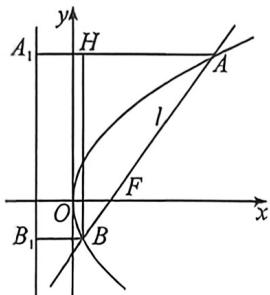

<!-- question-source:start -->
例19 (重庆市巴蜀中学 2026 届高三 9 月月考·T13) 已知抛物线 $E: y^{2} = 4x$ , 过点 $F(1,0)$ 的直线 $l$ 与抛物线 $E$ 交于 $A, B$ 两点, 且 $\overrightarrow{AF} = \frac{5}{2}\overrightarrow{FB}$ , 则直线 $l$ 的斜率为 \_\_\_\_.

<!-- question-source:end -->

![[高中/总复习/二轮/2026版高中《MST新思路思维拓展》二轮复习专题/下册/板块1_不等式/考点二_圆锥曲线焦长公式与焦比定理应用/questions/answers/Q00093372A1.md]]
