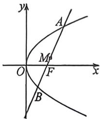

<!-- question-source:start -->
例30 (2026 届浙商名校联盟十月联考·T10)过抛物线 $C: y^{2} = 2px (p > 0)$ 的焦点 $F$ 的直线 $l$ 交 $C$ 于 $A, B$ 两点, 其中 $M$ 是 $AB$ 的中点, 点 $M$ 到 $y$ 轴的最短距离为 $\frac{1}{2}, O$ 为坐标原点, 则下列命题正确的是 (A. 若直线 $l$ 的方程为 $2x - 2y - 1 = 0$ , 则 $M\left(\frac{3}{2}, 1\right)$ B. $|AF| + |BF| = |AF| \cdot |BF|$ C. 点 $M$ 的轨迹方程是 $y^{2} = x - \frac{1}{2}$ D. $|AB|^{2} = 4 |OM|^{2} + 3$

<!-- question-source:end -->

![[高中/总复习/二轮/2026版高中《MST新思路思维拓展》二轮复习专题/下册/板块1_不等式/考点二_圆锥曲线焦长公式与焦比定理应用/questions/answers/Q00093373A1.md]]
