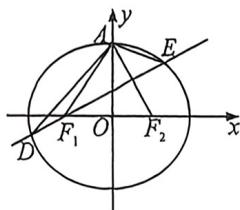

<!-- question-source:start -->
例21 (2022·新高考1)已知椭圆 $C: \frac{x^2}{a^2} + \frac{y^2}{b^2} = 1 (a > b > 0), C$ 的上顶点为 $A$ , 两个焦点为 $F_1, F_2$ , 离心率为 $\frac{1}{2}$ , 过 $F_1$ 且垂直于 $AF_2$ 的直线与 $C$ 交于点 $D, E$ 两点, $|DE| = 6$ , 则 $\triangle ADE$ 的周长是 \_\_\_\_.

<!-- question-source:end -->

![[高中/总复习/二轮/2026版高中《MST新思路思维拓展》二轮复习专题/下册/板块1_不等式/考点二_圆锥曲线焦长公式与焦比定理应用/questions/answers/Q00093374A1.md]]
