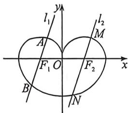

<!-- question-source:start -->
例2 (2026 届高三长沙雅礼中学月考·T7)如图所示,曲线 C 是由半椭圆 $C_{1}:\frac{x^{2}}{4}+\frac{y^{2}}{3}=1(y<0)$ , 半圆 $C_{2}:(x-1)^{2}+y^{2}=1(y\geqslant0)$ 和半圆 $C_{3}:(x+1)^{2}+y^{2}=1(y\geqslant0)$ 组成, 过 $C_{1}$ 的左焦点 $F_{1}$ 作直线 $l_{1}$ 与曲线 C 仅交于 A, B 两点, 过 $C_{1}$ 的右焦点 $F_{2}$ 作直线 $l_{2}$ 与曲线 C 仅交于 M, N 两点, 且 $l_{1}//l_{2}$ , 则 $|AB|+|MN|$ 的最小值为

A. 3 B. 4 C. 5 D. 6
<!-- question-source:end -->

![[高中/总复习/二轮/2026版高中《MST新思路思维拓展》二轮复习专题/下册/板块1_不等式/考点二_圆锥曲线焦长公式与焦比定理应用/questions/answers/Q00093375A1.md]]
