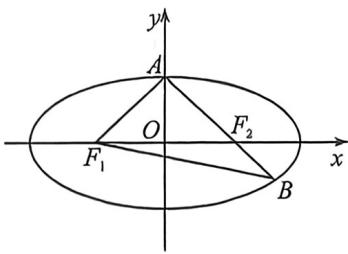

<!-- question-source:start -->
例23 (2026届江西乡校联考·T11)已知椭圆 $C: \frac{x^2}{a^2} + \frac{y^2}{b^2} = 1 (a > b > 0)$ 的左、右焦点分别为 $F_1, F_2$ ，上顶点为 $A$ ，直线 $AF_2$ 与 $C$ 的另一个交点为 $B$ ，下列结论正确的是（）
A. 若 $|AF_2| = 2 |BF_2|$ ，则 $C$ 的离心率为 $\frac{\sqrt{3}}{3}$ B. 若 $|BF_1| = 3 |BF_2|$ ，则 $C$ 的离心率为 $\frac{\sqrt{3}}{3}$ C. 若 $|AB| = |BF_1|$ ，则 $C$ 的离心率为 $\frac{\sqrt{6}}{3}$ D. 若 $AF_1 \perp BF_1$ ，则 $C$ 的离心率为 $\frac{\sqrt{5}}{5}$

<!-- question-source:end -->

![[高中/总复习/二轮/2026版高中《MST新思路思维拓展》二轮复习专题/下册/板块1_不等式/考点二_圆锥曲线焦长公式与焦比定理应用/questions/answers/Q00093376A1.md]]
