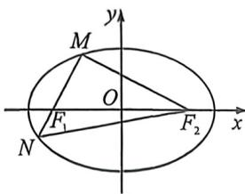

<!-- question-source:start -->
例27 (2026 届长沙市一中 10 月高三月考·T7)已知 $F_{1}$ 与 $F_{2}$ 分别是椭圆 $C: \frac{x^{2}}{a^{2}} + \frac{y^{2}}{b^{2}} = 1 (a > b > 0)$ 的左、右焦点, $M, N$ 是椭圆 $C$ 上两点, 且 $\overrightarrow{MF_{1}} = 2\overrightarrow{F_{1}N}, \overrightarrow{MF_{2}} \cdot \overrightarrow{MN} = 0$ , 则椭圆 $C$ 的离心率为 ( )

A. $\frac{3}{4}$ B. $\frac{2}{3}$ C. $\frac{\sqrt{5}}{3}$ D. $\frac{\sqrt{7}}{4}$

<!-- question-source:end -->

![[高中/总复习/二轮/2026版高中《MST新思路思维拓展》二轮复习专题/下册/板块1_不等式/考点二_圆锥曲线焦长公式与焦比定理应用/questions/answers/Q00093377A1.md]]
