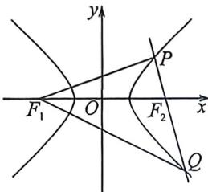

<!-- question-source:start -->
例25 (2026届浙江Z20十名校联盟联考·T14)已知双曲线 $x^{2} - \frac{y^{2}}{b^{2}} = 1$ 的左右焦点分别为 $F_{1}, F_{2}$ , 过 $F_{2}$ 作直线交双曲线 $C$ 的右半支于 $P, Q$ 两点, 满足 $PF_{1} \perp PQ$ , 且 $\triangle QF_{1}F_{2}$ 面积是 $\triangle PF_{1}F_{2}$ 面积的两倍, 则双曲线 $C$ 的离心率为 \_\_\_\_.

<!-- question-source:end -->

![[高中/总复习/二轮/2026版高中《MST新思路思维拓展》二轮复习专题/下册/板块1_不等式/考点二_圆锥曲线焦长公式与焦比定理应用/questions/answers/Q00093378A1.md]]
