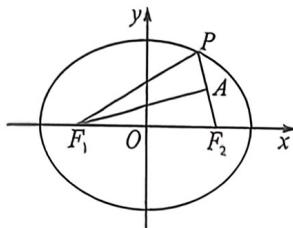

<!-- question-source:start -->
例2 (云南师大附中 2026 届高三月考三, T7) 已知 $F_{1}, F_{2}$ 分别为椭圆 $C: \frac{x^{2}}{a^{2}} + \frac{y^{2}}{b^{2}} = 1 (a > b > 0)$ 的左、右焦点, 在椭圆 $C$ 上存在点 $P$ , 满足 $|PF_{1}| = |F_{1}F_{2}|$ , 且点 $F_{1}$ 到直线 $PF_{2}$ 的距离为 $\sqrt{3}b$ . 则该椭圆的离心率为
A. $\frac{2}{3}$ B. $\frac{1}{3}$ C. $\frac{5}{7}$ D. $\frac{3}{4}$

因为点 P 在椭圆 C 上，所以 $\left|PF_{1}\right| + \left|PF_{2}\right| = 2a$ ，又因为 $\left|PF_{1}\right| = \left|F_{1}F_{2}\right| = 2c$ ，所以 $\left|PF_{0}\right| = 2a - 2c$ ，

在等腰三角形 $\triangle PF_{1}F_{2}$ 中， $|PF_{1}| = |F_{1}F_{2}| = 2c$ ，底边 $|PF_{2}| = 2a - 2c$ ，过 $F_{1}$ 作 $F_{1}A \perp PF_{2}$ ，垂足为 $A$
<!-- question-source:end -->

![[高中/总复习/二轮/2026版高中《MST新思路思维拓展》二轮复习专题/下册/板块1_不等式/考点二_圆锥曲线焦长公式与焦比定理应用/questions/answers/Q00093381A1.md]]
