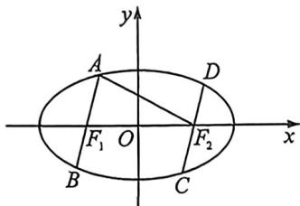

<!-- question-source:start -->
例29 (2025·江西模拟·T8)如图,椭圆 $M: \frac{x^2}{a^2} + \frac{y^2}{b^2} = 1 (a > b > 0)$ 的左、右焦点分别为 $F_1, F_2$ , 两平行直线 $l_1, l_2$ 分别过 $F_1, F_2$ 交 $M$ 于 $A, B, C, D$ 四点, 且 $AF_2 \perp DF_2$ , $|AF_2| = 4 |DF_2|$ , 则 $M$ 的离心率为

A. $\frac{1}{2}$ B. $\frac{\sqrt{3}}{2}$ C. $\frac{2}{3}$ D. $\frac{\sqrt{5}}{3}$
<!-- question-source:end -->

![[高中/总复习/二轮/2026版高中《MST新思路思维拓展》二轮复习专题/下册/板块1_不等式/考点二_圆锥曲线焦长公式与焦比定理应用/questions/answers/Q00093382A1.md]]
