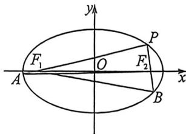

> [!faq]- 例题解析
>
> > [!success]- **【答案】** D
>
> > [!note]- **【解析】**
> > 解析 由题设，令 $\angle PF_{1}F_{2} = \theta$ ，故 $|PF_{1}| = 2c\cos \theta, |PF_{2}| = 2c\sin \theta$ ，所以 $|PF_{1}| + |PF_{2}| = 2c(\cos \theta + \sin \theta) = 2a$ ，故 $e(\sin \theta + \cos \theta) = 1①$
> >
> > 
> >
> > 由 $\left|\frac{F_{1}A}{F_{2}B}\right|=\frac{2}{3}$ ，焦长公式可知 $\left|F_{1}A\right|=\frac{b^{2}}{a+c\cos\theta},\left|F_{2}B\right|=\frac{b^{2}}{a+c\sin\theta}$ ，整理得 $2e\cos\theta-3e\sin\theta=1②$ ，
> > 联立①②，得 $e\cos\theta=\frac{4}{5}$ , $e\sin\theta=\frac{1}{5}$ ，故 $\tan\theta=\frac{1}{4}$ ，即 $\sin\theta=\frac{1}{\sqrt{17}}$ ，所以 $e=\frac{\sqrt{17}}{5}$ 。
> >
> > 故选 **D**.
