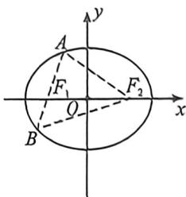
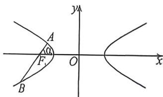
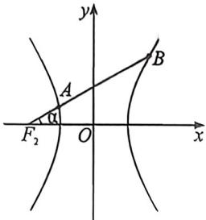
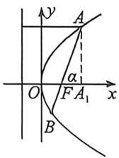
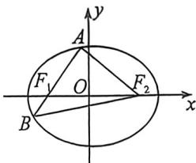
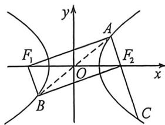

## 考点二_圆锥曲线焦长公式与焦比定理应用

1. 椭圆的焦比定理

A 是椭圆 $\frac{x^{2}}{a^{2}}+\frac{y^{2}}{b^{2}}=1(a>b>0)$ 上一点， $F_{1}$ 、 $F_{2}$ 是左、右焦点， $\angle AF_{1}F_{2}$ 为 $\alpha$ ，AB 过 $F_{1}$ ，c 是椭圆半焦距，
如图，则 $\left|AF_{1}\right|=\frac{b^{2}}{a-c\cos\alpha}$ ①； $\left|BF_{1}\right|=\frac{b^{2}}{a+c\cos\alpha}$ ②； $\left|AB\right|=\frac{2ab^{2}}{a^{2}-c^{2}\cos^{2}\alpha}=\frac{2ab^{2}}{b^{2}+c^{2}\sin^{2}\alpha}$ ③.

焦比定理: 过椭圆 $\frac{x^{2}}{a^{2}} + \frac{y^{2}}{b^{2}} = 1$ 的左焦点 $F_{1}$ 的弦, 令 $\left|AF_{1}\right| = \lambda \left|F_{1}B\right|$ , $\frac{b^{2}}{a - c\cos\alpha} = \frac{\lambda b^{2}}{a + c\cos\alpha} \Rightarrow e\cos\alpha = \frac{\lambda - 1}{\lambda + 1}$ ④,代入焦长公式①可得 $\left|AF_{1}\right|=\frac{(\lambda+1)b^{2}}{2a},\left|BF_{1}\right|=\frac{(\lambda+1)b^{2}}{2\lambda a}$ ⑤.

这样组合①②③④⑤,焦点弦问题才能形成闭环.

2. 双曲线焦比定理之交一支类型

A、B 是双曲线 $\frac{x^{2}}{a^{2}} - \frac{y^{2}}{b^{2}} = 1$ 左支上两点， $F_{1}$ 是左焦点， $\angle AF_{1}O$ 为 $\alpha, AB$ 过 $F_{1}, c$ 是双曲线半焦距，如图，则 $\left|AF_{1}\right| = \frac{b^{2}}{a + c\cos\alpha}$ ①； $\left|BF_{1}\right| = \frac{b^{2}}{a - c\cos\alpha}$ ②；(根据长减短加判断符号) $\left|AB\right| = \frac{2ab^{2}}{a^{2} - c^{2}\cos^{2}\alpha}$ ③.

令 $|AF_{1}|=\lambda|F_{1}B|$ ，即 $\frac{b^{2}}{a+c\cos\alpha}=\frac{\lambda b^{2}}{a-c\cos\alpha}\Rightarrow e\cos\alpha=\frac{1-\lambda}{\lambda+1}(0<\lambda<1)$ ④（如果 $\lambda>1$ ，有 $e\cos\alpha=\frac{\lambda-1}{\lambda+1}$ ），代入弦长公式可得 $|AF_{1}|=\frac{(\lambda+1)b^{2}}{2a},|BF_{1}|=\frac{(\lambda+1)b^{2}}{2\lambda a}$ ⑤（与椭圆一致）.

3. 双曲线焦比定理之交两支类型

A 是双曲线 $\frac{x^{2}}{a^{2}} - \frac{y^{2}}{b^{2}} = 1$ 左支上一点，B 是双曲线右支上一点， $F_{1}$ 是左焦点， $\angle AF_{1}O$ 为 $\alpha, AB$ 过 $F_{1}, c$ 是双曲线半焦距，如图，由于交两支时，有 $|k| < \frac{b}{a}$ ，平方得： $\tan^{2}\alpha < \frac{b^{2}}{a^{2}}$ ，即 $\cos\alpha > \frac{a}{c}$ ，故 $a - c\cos\alpha < 0$

$\left|AF_{1}\right| = \frac{b^{2}}{a + c\cos\alpha} ①; \left|BF_{1}\right| = \frac{b^{2}}{c\cos\alpha - a} ②; (\text{根据长减短加判断符号})\left|AB\right| = \frac{2ab^{2}}{c^{2}\cos^{3}\alpha - a^{2}} ③.$

令 $\left|BF_{1}\right|=\lambda\left|AF_{2}\right|$ ，即 $\frac{b^{2}}{c\cos\alpha-a}=\frac{\lambda b^{2}}{a+c\cos\alpha}\Rightarrow e\cos\alpha=\frac{\lambda+1}{\lambda-1}(\lambda>1)$ ④

代入弦长公式可得 $|BF_{1}|=\frac{(\lambda-1)b^{2}}{2a},|AF_{1}|=\frac{(\lambda-1)b^{2}}{2\lambda a}$ ⑤.

4. 抛物线焦点弦: $x_{A} + x_{B} + p = \frac{p}{1 - \cos \alpha} + \frac{p}{1 + \cos \alpha} = \frac{2p}{\sin^{2} \alpha} (\alpha \neq 0)$ ; 特殊地, 当 $\alpha = \frac{\pi}{2}$ 时, 为通径 $2p$ .

证明:如图,作 $AA_{1} \perp x$ 轴于 $A_{1}$ , $|AF| = x_{A} + \frac{p}{2}$ , $\cos\alpha = \frac{|FA_{1}|}{|AF|}$ 所以 $\cos\alpha = \frac{x_{A} - \frac{p}{2}}{x_{A} + \frac{p}{2}} = 1 - \frac{p}{x_{A} + \frac{p}{2}} = 1 - \frac{p}{|AF|}$ 所以 $|AF| = \frac{p}{1 - \cos\alpha}$ , 同理 $|BF| = \frac{p}{1 + \cos\alpha}$ . $|AB| = |AF| + |BF| = \frac{p}{1 - \cos\alpha} + \frac{p}{1 + \cos\alpha} = \frac{2p}{\sin^{2}\alpha}$ .

## 一、常规的焦长焦比速算

![[高中/总复习/二轮/2026版高中《MST新思路思维拓展》二轮复习专题/下册/板块1_不等式/考点二_圆锥曲线焦长公式与焦比定理应用/questions/Q00093372.md]]
![[高中/总复习/二轮/2026版高中《MST新思路思维拓展》二轮复习专题/下册/板块1_不等式/考点二_圆锥曲线焦长公式与焦比定理应用/questions/Q00093373.md]]
![[高中/总复习/二轮/2026版高中《MST新思路思维拓展》二轮复习专题/下册/板块1_不等式/考点二_圆锥曲线焦长公式与焦比定理应用/questions/Q00093374.md]]
![[高中/总复习/二轮/2026版高中《MST新思路思维拓展》二轮复习专题/下册/板块1_不等式/考点二_圆锥曲线焦长公式与焦比定理应用/questions/Q00093375.md]]
![[高中/总复习/二轮/2026版高中《MST新思路思维拓展》二轮复习专题/下册/板块1_不等式/考点二_圆锥曲线焦长公式与焦比定理应用/questions/Q00093376.md]]

## 二、 $\angle F_{1}AF_{2}=90^{\circ}$ 的策略

1. 计算比值型

如左图所示,椭圆若 $AF_{2} \perp AB$ , 且 $\overrightarrow{AF_1} = \lambda \overrightarrow{F_1B}, \angle AF_1F_2 = \alpha$ , 我们可以借助公式 $e\cos \alpha = \frac{|\lambda - 1|}{\lambda + 1}$ 可得 $\frac{c}{a} \cdot \frac{\lambda + 1}{2} \cdot \frac{b^2}{a} \cdot \frac{1}{2c} = \frac{\lambda - 1}{\lambda + 1}$ 来求出 $a$ 和 $b$ 的关系, 由于 $\lambda > 1$ , 从而求出离心率.

如右图所示, 若 $BF_{2} \perp AC, AB$ 过原点, 且 $\overrightarrow{AF_2} = \lambda \overrightarrow{F_2C} (0 < \lambda < 1)$ , 通过补全矩形, 可得 $AF_{1} \perp AC$ , $|AF_{2}| = \frac{\lambda + 1}{2} \cdot \frac{b^{2}}{a}$ , 借助公式 $e\cos \alpha = \frac{|\lambda - 1|}{\lambda + 1}$ 可得 $\frac{c}{a} \cdot \frac{\lambda + 1}{2} \cdot \frac{b^{2}}{a} \cdot \frac{1}{2c} = \frac{1 - \lambda}{\lambda + 1}$ 来求出 $a$ 和 $b$ 的关系, 从而求出离心率.

注意 若直线 $AB$ 交双曲线两支于 $A, B$ 两点， $|\overrightarrow{AF}| = \lambda |\overrightarrow{FB}| (\lambda > 1)$ ，则 $|\overrightarrow{AF}| = \frac{\lambda - 1}{2} \frac{b^2}{a}, \angle AFF' = \alpha$ 时， $e \cos \alpha = \frac{\lambda + 1}{\lambda - 1}$

![[高中/总复习/二轮/2026版高中《MST新思路思维拓展》二轮复习专题/下册/板块1_不等式/考点二_圆锥曲线焦长公式与焦比定理应用/questions/Q00093377.md]]
![[高中/总复习/二轮/2026版高中《MST新思路思维拓展》二轮复习专题/下册/板块1_不等式/考点二_圆锥曲线焦长公式与焦比定理应用/questions/Q00093378.md]]
![[高中/总复习/二轮/2026版高中《MST新思路思维拓展》二轮复习专题/下册/板块1_不等式/考点二_圆锥曲线焦长公式与焦比定理应用/questions/Q00093379.md]]

## 2. 计算角度型

当 $PF_{1}$ 和 $PF_{2}$ 上不共线的两段出现了比值时, 则需要计算角度, 本类模型隐藏了 $\left|PF_{1}\right| = 2c\cos \alpha$ , $\left|PF_{2}\right| = 2c\sin \alpha, 2c(\sin \alpha + \cos \alpha) = 2a.$

![[高中/总复习/二轮/2026版高中《MST新思路思维拓展》二轮复习专题/下册/板块1_不等式/考点二_圆锥曲线焦长公式与焦比定理应用/questions/Q00093380.md]]
![[高中/总复习/二轮/2026版高中《MST新思路思维拓展》二轮复习专题/下册/板块1_不等式/考点二_圆锥曲线焦长公式与焦比定理应用/questions/Q00093381.md]]
![[高中/总复习/二轮/2026版高中《MST新思路思维拓展》二轮复习专题/下册/板块1_不等式/考点二_圆锥曲线焦长公式与焦比定理应用/questions/Q00093382.md]]
