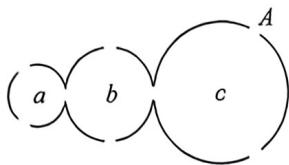

<!-- question-source:start -->
例31 (2026 届广东肇庆开学考试 T14) 若一个等比数列 $\langle a_n \rangle$ 有无穷多项, 并且它的公比 $q$ 满足 $|q| < 1$ , 则

称 $\{a_{n}\}$ 为无穷递缩等比数列. 研究发现: 当 $n \to +\infty$ 时, 无穷递缩等比数列 $\{a_{n}\}$ 的前 $n$ 项和 $S_{n} \approx \frac{a_{1}}{1 - q}$ (其中 $a_{1}$ 为首项, $q$ 为公比). 下图为一个容器的轴截面, 该容器由 $a, b, c$ 三个球形容器构成, 其中球 $a, c$ 各有 3 个出口, 球 $b$ 有 4 个出口, 且球 $a$ 的 3 个出口中 1 个与 $b$ 相连, 球 $b$ 的 4 个出口中 1 个与 $a$ 相连、1 个与 $c$ 相连, 球 $c$ 的 3 个出口中 1 个与 $b$ 相连, 一个小球在容器内做无规律随机运动, 当小球运动到容器外时, 运动停止. 已知该小球的起始位置在球 $a$ 内, 则当运动停止时, 小球位于 $A$ 出口外的概率约为 \_\_\_\_.

<!-- question-source:end -->

![[高中/总复习/二轮/2026版高中《MST新思路思维拓展》二轮复习专题/下册/板块1_不等式/考点二_概率小题压轴计算/questions/answers/Q00093480A1.md]]
