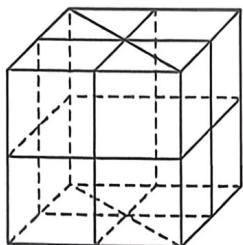

> [!faq]- 例题解析
>
> > [!success]- **【答案】** $\frac{758}{1001}$
>
> > [!note]- **【解析】**
> > 解析 从14个点中取4个点,共有 $C_{14}^{1}=1001$ 种取法,四点共面分下面四种情况:
> > - **①**：正方体的6个面:每个面包含4个顶点和1个中心点,此时共有 $6C_{d}=30$ 种;
> > - **②**：3个中间平面:每个平面包含4个点,此时共有 $3C_{1}=3$ 种;
> > - **③**：6个对角面:每个对角面包含4个顶点和2个中心点,此时共有 $6C_{0}^{1}=90$ 种;
> > - **④**：8个斜切面(三条面对角线形成的):每个面包含3个顶点和3个中心点,此时共有 $8C_{6}^{*}=120$ 种;所以四个点不共面共有1001-30-3-90-120=758种,所以所求概率 $P=\frac{758}{1001}$ .故答案为: $\frac{758}{1001}$ .
> >
> > 
