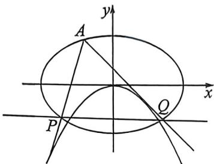

<!-- question-source:start -->
例4 $\frac{x^2}{4} +\frac{y^2}{3} = 1$ 上一点 $A\left(-1,\frac{3}{2}\right)$ ，过 $A$ 作两直线与 $y = tx^{2}(t <   0)$ 相切，分别交椭圆于 $P,Q$ 两点，求证 $PQ$ 过定点.

<!-- question-source:end -->

![[高中/总复习/二轮/2026版高中《MST新思路思维拓展》二轮复习专题/下册/板块1_不等式/考点二_隐藏斜率和积关系的齐次化类型/questions/answers/Q00093416A1.md]]
