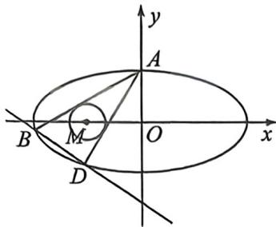

<!-- question-source:start -->
例16 (2025 届宣庆寅坪中学期中·T19)如图,已知椭圆 $C: \frac{x^{2}}{a^{2}} + \frac{y^{2}}{b^{2}} = 1 (a > b > 0)$ 的上顶点为 $A(0,3)$ ,离心

率为 $\frac{\sqrt{3}}{2}$ , 若过点 $A$ 作圆 $M: (x + 3)^2 + y^2 = r^2 (0 < r < 3)$ 的两条切线分别与椭圆 $C$ 相交于点 $B, D$ (不同于点 $A$ ).

(1)求椭圆 C 的方程;

(2)设直线 AB 和 AD 的斜率分别为 $k_{1}, k_{2}$ ，求证： $k_{1} \cdot k_{2}$ 为定值；

(3)求证:直线 BD 过定点.
<!-- question-source:end -->

![[高中/总复习/二轮/2026版高中《MST新思路思维拓展》二轮复习专题/下册/板块1_不等式/考点二_隐藏斜率和积关系的齐次化类型/questions/answers/Q00093418A1.md]]
